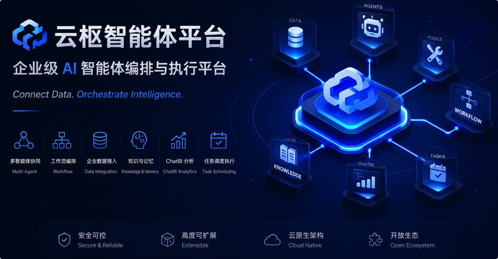
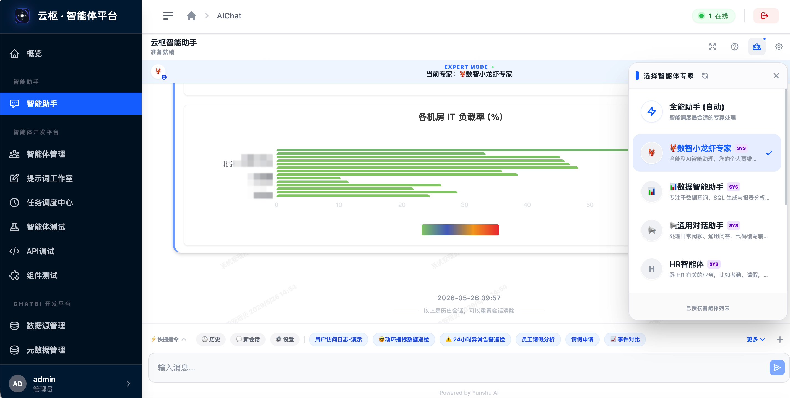
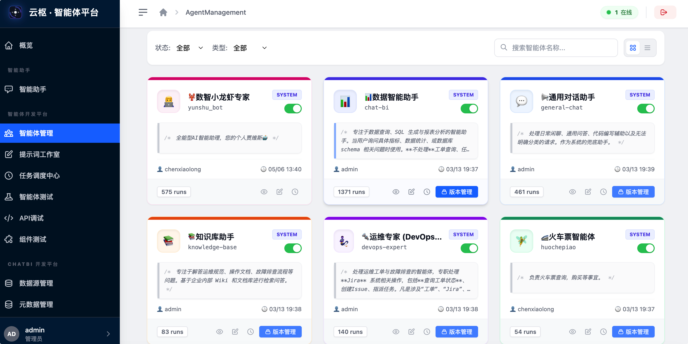
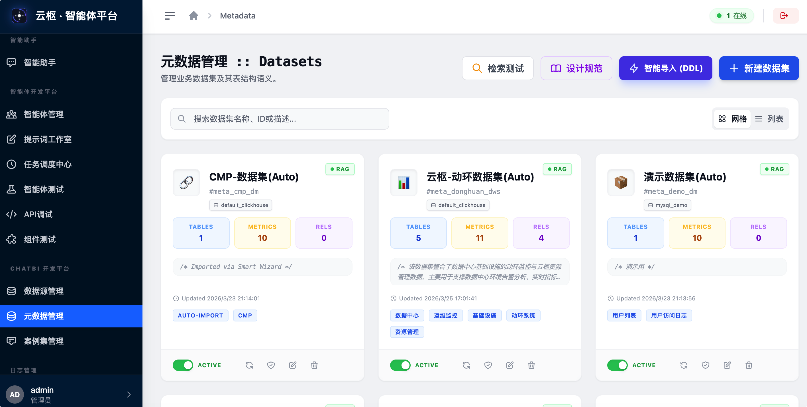
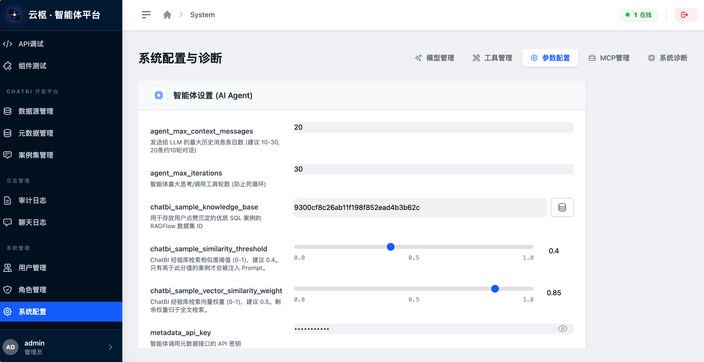

# Yunshu AI Agent Platform (云枢 · 智能体平台)

[简体中文](README.md) | **English**

> **Enterprise-grade AI Agent Orchestration and Execution Platform**  
> *Connect Data. Orchestrate Intelligence.*

[](https://www.python.org/) [](https://fastapi.tiangolo.com/) [](https://vuejs.org/) [](https://tailwindcss.com/) [](https://clickhouse.com/) [](https://redis.io/) [](https://modelcontextprotocol.org/) [](https://opensource.org/licenses/MIT)



**Yunshu AI Agent Platform** is an AI intelligence center purpose-built for complex enterprise scenarios.

The platform revolves around the following core capability matrix:
*   💬 **Deep Interactive Dialogue**: Provides high-performance streaming chat, supporting complex intent resolution and multi-agent synthesis.
*   🔌 **Flexible Embedded Integration**: Supports fast embedment into existing enterprise portals via our custom Chat SDK, seamlessly binding with local user authentication systems to ensure strict security and tenant isolation.
*   📊 **Native Enterprise ChatBI**: Built-in visual data source management, metadata synchronization, and a core "Case Dataset" module. Powered by dynamic Few-Shot injection and SQL self-healing to yield highly accurate Text-to-SQL results.
*   🤝 **Out-of-the-Box Ecosystem Integration**: Native connection to **RAGFlow managed agents and knowledge bases** for unstructured semantic search and citations; deep integration with the **OpenClaw🦞 LLM Security Gateway** to secure model traffic and enforce tenant boundary validation.
*   🛠️ **Full-Link Online Debug & Trace**: Provides visual tracking of the AI's step-by-step reasoning, tool call histories, and SQL execution plans, allowing developers to debug and optimize model logic in real-time.
*   ⚙️ **Robust APIs & Distributed Scheduling**: Exposes standard, production-ready backend APIs, alongside an APScheduler + Redis task center for scheduling periodic/one-time automated workflows under designated agent credentials.
*   🎯 **Prompt Factory**: Built-in system prompt version control and management (located under `architech/prompts/`) to guarantee deterministic and compliant LLM behaviors.

---

## 🏛️ Architecture

```text
┌──────────────────────────────────────────────────────────┐
│                 Yunshu AI Agent Platform                 │
└───────────────┬────────────────────────────┬─────────────┘
                │                            │
      [ Embed Chat SDK ]              [ Admin Console ]
                │                            │
                └─────────────┬──────────────┘
                              │ SSE/HTTP
┌─────────────────────────────▼────────────────────────────┐
│                       Portal Gateway                     │
│  ┌──────────┐  ┌──────────┐  ┌──────────┐  ┌──────────┐  │
│  │ Auth/Perm│  │Intent Rtr│  │Task Sched│  │AuditTrace│  │
│  └──────────┘  └──────────┘  └──────────┘  └──────────┘  │
└─────────────────────────────┬──────────────┬─────────────┘
                              │              │ (Status & Queue)
                              │        ┌─────▼─────┐
                              │        │   Redis   │
                              │        └───────────┘
┌─────────────────────────────▼────────────────────────────┐
│                        Expert Pool                       │
│   ┌──────────────┐      ┌──────────────┐     ┌─────────┐  │
│   │ChatBI Expert │      │  RAG Expert  │     │PluginAst│  │
│   └──────┬───────┘      └──────┬───────┘     └───┬─────┘  │
└──────────┼─────────────────────┼─────────────────┼────────┘
           │ (ReAct Loop)        │ (Managed Route) │ (Tool Chain)
┌──────────▼─────────────────────▼─────────────────▼────────┐
│                     Execution Engines                    │
│  ┌──────────────────┐  ┌──────────────┐  ┌─────────────┐  │
│  │ Self-R&D ReAct   │  │RAGFlow Agent │  │  OpenClaw🦞 │  │
│  │ (Loop & SelfSQL) │  │(Managed Bot) │  │(AUTHContext)│  │
│  └────────┬─────────┘  └──────┬───────┘  └──────┬──────┘  │
└───────────┼───────────────────┼─────────────────┼─────────┘
            │                   │                 │
┌───────────▼───────┐ ┌─────────▼─────┐ ┌─────────▼────────┐
│ Enterprise DBs    │ │ RAGFlow KBs   │ │   MCP Server     │
│ (Oracle/CK/MySQL) │ │ (Unstructured)│ │ (Ext System/API) │
└───────────────────┘ └───────────────┘ └──────────────────┘
```

---

## 🖼️ Interface Snapshots

| 💬 AI Chat | 🤖 Agent Management |
| :---: | :---: |
|  |  |
| **📊 Metadata Management** | **⚙️ System Config** |
|  |  |

---

## 🌟 Core Capabilities

### 1. 🧠 Multi-Engine & Hybrid Orchestration
*   **Multi-Intent Orchestration**: The system automatically breaks down complex user queries into subtasks (e.g., "Check PUE from last week and compare with SOP" -> ChatBI + RAG), orchestrating parallel execution across expert agents, with a Synthesizer aggregating results into a coherent final response.
*   **Self-R&D ReAct Engine**: The executor follows a closed-loop "Reasoning-Action-Observation-Reflection" lifecycle, enabling autonomous decision-making and adaptive scheduling of local tool chains.
*   **RAGFlow Managed Agent**: One-click connection to RAGFlow online-hosted knowledge agents, leveraging their robust parallel retrieval and stream-dialogue infrastructure.
*   **OpenClaw🦞 LLM Security Gateway**: Proxied through the OpenClaw API gateway, it utilizes `AUTH_CONTEXT` (Authorization Context) to pass through the current user's identity, channel, and accessible metadata/dataset lists, ensuring enterprise-grade data isolation and security.

### 2. 📊 Intelligent Warehouse Analysis (ChatBI & Self-Healing)
*   **Closed-Loop Text-to-SQL**: Achieves natural language querying against production databases through metadata injection.
*   **Case Repository & Few-Shot Enhancement**: **Core Technology**. Built-in case library (experience base) management module supporting one-click ingestion of user feedback and manual auditing. It conducts similarity searches through RAGFlow and dynamically injects high-quality historical queries as Few-Shot examples at the head of LLM system prompts, greatly improving the generation accuracy of domain-specific SQL.
*   **Self-Healing Mechanism**: **Exclusive Feature**. When SQL execution fails, the system automatically intercepts the error and guides the LLM to auto-correct based on table schemas, significantly raising the first-attempt query success rate.
*   **Independent Data Source Management**: **New Feature**. Provides a visual configuration UI to manage, test, and intelligently sync DDL from multiple database types (including Oracle Thin/Thick modes, ClickHouse, MySQL, etc.), guaranteeing globally unique connection aliases.

### 3. 🔌 Open Plugin Ecosystem (MCP Integration)
*   **Native MCP Support**: Fully compliant with Anthropic's Model Context Protocol.
*   **Infinite Extensibility**: Seamlessly connect to external productivity tools like Jira, Email, GitLab, etc. via MCP servers without modifying core code.

### 4. 📚 Deep Knowledge Enhancement (RAG)
*   **Multi-Dimensional Retrieval**: Integrated with RAGFlow to support precise semantic matching and document-level source attribution.
*   **Professional Source Citation**: Visually highlights knowledge citations in the chat interface to ensure AI responses are transparent and trustworthy.

### 5. 🛠️ Enterprise-grade Utility & Tool Center
*   **Distributed Task Center**: **New Feature**. Integrates an APScheduler + Redis task scheduling system to run periodic or one-off automated tasks (such as scheduled audit reports, data sync) under specific agent identities.
*   **Trace Link Visualization & Export**: **New Feature**. Supports printing visual trace flows of the decision-making process, and offers one-click exports of query results (supporting CSV/Excel with complete compatibility for Chinese/Excel encoding).

---

## 🔄 Execution Flow

The system operates on a cyclic **"Routing -> Dispatch -> Execution -> Synthesis"** logic:

1.  **Intent Router**: Determines which expert agents to invoke based on LLM intent routing and coreference resolution.
2.  **Dynamic Execution (ReAct)**: The executor implements the "Reasoning-Action-Observation-Reflection" loop to dynamically decide tool-calling paths.
3.  **Result Synthesis**: Eliminates redundancy, converting multi-source raw output into structured, human-readable professional reports.

---

## 📂 Project Structure

```text
.
├── app/                  # Backend core code (FastAPI)
│   ├── api/              # API router layer (Portal admin & Client V1 APIs)
│   ├── services/         # Business service layer (Auth, RAG knowledge, MCP plugin services)
│   │   └── ai/           # 🤖 AI Orchestration Center (Self-R&D ReAct, OpenClaw execution & intent dispatch)
│   └── models/           # SQLAlchemy ORM models
├── frontend/             # Admin console and embedded Chat SDK project (Vue 3 + Tailwind)
├── .agent/               # Agent-specific dev skills & workflow configs (opsx, etc.)
├── architech/            # High-level architecture specs & System Prompt management
├── db-prod/              # Database migrations & SQL upgrade scripts (V0-VNN)
├── docker/               # Containerization & one-click Docker-compose deployment solutions
├── scripts/              # Devops auxiliary scripts (one-click run, data sync, redeployment)
├── tests/                # Automated test suites & verification checklists (CHECKLIST.md)
└── openspec/             # OpenSpec API specifications & protocol trace files
```

---

## 🚀 Quick Start

### 🐳 Docker Deployment (Recommended)

**1. Configure environment**
```bash
cd docker
cp ../env.example .env   # DB, Redis, ENCRYPTION_KEY, etc.
```

**2. Build image and export tar**

| Script | Target |
| :--- | :--- |
| `./build_linux_x86.sh` | x86_64 Linux servers (most common) |
| `./build_linux_arm.sh` | ARM64 Linux (Kunpeng / Ampere, etc.) |
| `./build_native.sh` | Host native arch — local testing only |

```bash
# Production (x86) — also use this on Mac when deploying to x86 servers
./build_linux_x86.sh
```

Artifacts are written to **`docker/release/`**, e.g. `yunshu-ai-agent_linux-amd64_20250527.tar`. On the target host: `docker load -i docker/release/xxx.tar`.

> On Apple Silicon Macs deploying to x86 servers, use `build_linux_x86.sh`, not `build_native.sh`. The first cross-platform build may take a long time with little console output while base images are pulled.

**If `docker buildx` is unavailable** (common with Homebrew `docker` + Colima when `~/.docker/cli-plugins/docker-buildx` still points at uninstalled Docker Desktop):

```bash
cd docker
./install-buildx.sh
./build_linux_x86.sh
```

More details: [docker/README.md](docker/README.md) (Chinese) · [docker/README_EN.md](docker/README_EN.md) (English).

**3. Start services**
```bash
./start-yunshu-ai-agent.sh
```

### 🛠️ Development & Deployment Tools

#### 1. One-Click Local Development (Highly Recommended)
For daily local development, it is highly recommended to use the integration script at the repository root:
```bash
./dev.sh
```
This script will automatically terminate any stale processes on port 8001, compile frontend assets (skipping type-checks for speed), and launch the FastAPI backend service in `reload` mode. You can monitor live logs directly in your active terminal.

#### 2. Utility Scripts Comparison
We provide three utility scripts tailored for different development and deployment environments:

| Script | Mode | Frontend Build Method | Backend Execution Method | Best Use Case |
| :--- | :--- | :--- | :--- | :--- |
| `dev.sh` | **Foreground** Interactive | Quick Build (skips type check) | Active logging with `--reload` | Local debugging & troubleshooting |
| `scripts/redeploy-fast.sh` | **Background** Daemon | Quick Build (skips type check) | Runs in background via `nohup` | Fast hot updates in dev/test setups |
| `scripts/redeploy.sh` | **Background** Daemon | Full Build (includes `vue-tsc` checks) | Runs in background via `nohup` | Standard releases in production environments |

#### 3. Traditional Step-by-Step Manual Run
If you need to tweak the frontend or backend separately, you can run:
```bash
# 1. Setup environment
python -m venv venv && source venv/bin/activate
pip install -r requirements.txt

# 2. Run backend
uvicorn app.main:app --reload --port 8001

# 3. Run frontend
cd frontend && npm install && npm run dev
```

---

## 🤝 Contributing

1.  **Branching Policy**: Develop based on `main`. Feature branches should be named `feature/your-feature-name`.
2.  **Commit Message**: Commit messages must be written in **Chinese**, clearly describing your changes.
3.  **Verification**: Update `tests/CHECKLIST.md` when introducing new features.

---

## 💬 Contact & Community

If you have any questions, feature suggestions, or need further technical updates, please scan the QR code to follow our WeChat Official Account:


---

## 📄 License

This project is licensed under the MIT License - see the LICENSE file for details.

---
Copyright © 2025-2026 Randy Chen <cexlong@gmail.com>. All Rights Reserved.
