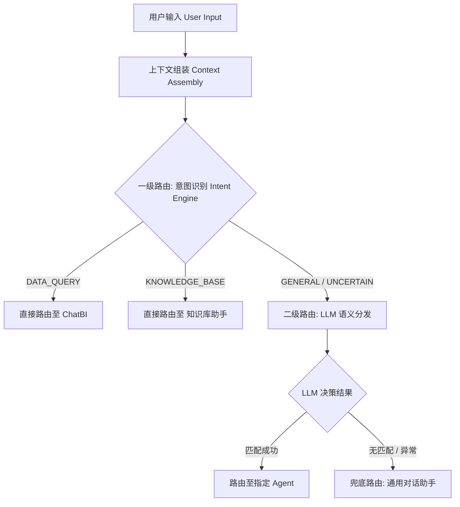

# 智能体路由分发设计 (Agent Routing Design)

本文档详细说明了云枢智能体平台如何将用户的自然语言请求分发给最合适的智能体。

## 1. 核心路由策略

平台采用 **“意图优先的混合路由机制” (Intent-First Hybrid Routing)**。该机制结合了启发式规则意图识别（快）与大语言模型语义理解（准），确保在不同场景下都能实现高效、准确的任务分发。

### 1.1 路由流程图

## 2. 逻辑详解

### 2.1 上下文感知 (Context Awareness)
- **机制**：系统在路由阶段会自动提取当前会话的最近 **6 轮** 对话历史。
- **作用**：解决多轮对话中的指代消解问题（如用户问“那里的温度呢？”中的“那里”）。
- **实现**：在 `RouterService.route_query` 接口中通过 `history` 参数接收上下文。

### 2.2 一级路由：启发式意图 (Heuristic Intent)
- **模块**：`IntentService`
- **逻辑**：通过特定的关键词和语义特征预判断。
    - **DATA_QUERY**：涉及查询、报表、统计、趋势等动作。
    - **KNOWLEDGE_BASE**：涉及如何操作、SOP、文档说明等。
- **优势**：极速响应，确定性强，节省 LLM 调用成本。

### 2.3 二级路由：LLM 语义路由 (LLM Semantic Routing)
- **模块**：`RouterService`
- **提示词**：`architech/prompts/orchestration_router.md`
- **输入数据**：
    - **Agent 列表**：从数据库 `ai_agents` 实时获取所有可用智能体的名称、描述和能力标签。
    - **会话上下文**：历史对话记录。
    - **当前 Query**：用户最新的提问。
- **决策逻辑**：LLM 扮演高级调度员角色，阅读所有智能体的“简历”后，决定哪个 Agent 的能力最能满足当前用户意图。

### 2.4 兜底机制 (Fallback Strategy)
- 当路由系统无法做出明确决策，或后端服务出现异常时，请求将统一分发至 **`general-chat` (通用对话助手)**。
- 确保系统始终有响应，不中断用户体验。

## 3. 关键组件与位置

- **路由逻辑入口**：`app/services/ai/router_service.py` -> `route_query()`
- **意图识别模块**：`app/services/ai/intent_service.py`
- **路由提示词定义**：`architech/prompts/orchestration_router.md`
- **智能体元数据**：数据库 `ai_agents` 表

## 4. 优化方向

1. **动态热更新**：支持在不重启服务的情况下，通过修改 `ai_agents` 表的描述实时影响路由倾向。
2. **多意图并行**：未来计划支持单条指令拆分为多个任务并由不同智能体协同处理（Orchestration 增强）。
