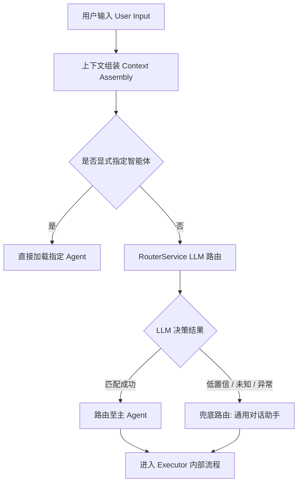

# 智能体路由分发设计 (Agent Routing Design)

本文档详细说明了云枢智能体平台如何将用户的自然语言请求分发给最合适的智能体。

## 1. 核心路由策略

平台采用 **“上下文感知的 LLM 路由机制” (Context-Aware LLM Routing)**。当请求未显式指定智能体时，路由器会结合可用智能体清单、最近多轮对话、上一轮处理智能体和当前用户输入，选择最合适的主智能体。

路由层只负责选择最合适的智能体 / 执行器，并可输出通用会话标签作为 hint；它不负责 ChatBI 内部请求类别判断。ChatBI 的「新数据查询 / 复用上一轮结果 / 上下文动作 / 技能执行」由 `DataQueryExecutor` 内部的 `DataQueryTurnClassifier` 判定。

### 1.1 路由流程图

## 2. 逻辑详解

### 2.1 上下文感知 (Context Awareness)
- **机制**：系统在路由阶段会自动提取当前会话的最近 **6 轮** 对话历史。
- **作用**：解决多轮对话中的指代消解问题（如用户问“那里的温度呢？”中的“那里”）。
- **实现**：在 `RouterService.route_query` 接口中通过 `history` 参数接收上下文。
- **边界**：多轮上下文用于避免把连续追问路由到错误智能体；进入 ChatBI 后，是否新查数、是否复用上一轮结果，由 ChatBI 执行器内部再次分析。

### 2.2 LLM 语义路由 (LLM Semantic Routing)
- **模块**：`RouterService`
- **提示词**：`app/services/ai/router_service.py` 内置 `DEFAULT_SYSTEM_PROMPT`
- **输入数据**：
    - **Agent 列表**：从数据库 `ai_agents` 实时获取所有可用智能体的名称、描述和能力标签。
    - **会话上下文**：最近历史对话记录，并带上一轮处理智能体。
    - **当前 Query**：用户最新的提问。
- **决策逻辑**：LLM 扮演高级调度员角色，阅读所有智能体的“简历”后，决定哪个 Agent 的能力最能满足当前用户意图。
- **输出结构**：
    - `agent_id`：主智能体 ID。
    - `secondary_agents`：可选辅助智能体 ID 列表，仅用于明确复合意图。
    - `confidence`：主智能体选择置信度。
    - `reasoning`：指代消解、会话连续性和命中理由。
    - `turn_labels`：通用会话标签，如 `new_business_request`、`continuation_followup`、`topic_switch`、`context_action`、`meta_action`、`business_related`、`same_topic`、`multi_intent`、`general_chat`、`ambiguous`。
    - `relation_to_previous`：与上一轮关系，如 `new_topic`、`followup`、`topic_switch`、`standalone`、`unknown`。
    - `user_action_type`：通用动作类型，如 `ask_business_data_or_task`、`ask_knowledge`、`transform_context`、`save_or_export_context`、`manage_agent_or_skill`、`chat`、`unknown`。

这些通用标签只作为后续 executor 的参考 hint。是否采用、如何采用，由各智能体 executor 自己决定：

- `GeneralChatExecutor` 会把标签注入为弱 system hint，帮助 LLM 理解本轮是否追问、是否上下文动作、是否话题切换；但不基于标签写死业务分支，最终仍由完整对话和模型判断。
- `DataQueryExecutor` 不消费这些通用标签来决定 ChatBI 查数流程。ChatBI 仍会在执行器内部执行自己的 `DataQueryTurnClassifier` 请求类别分析。
- Knowledge / General / 其他未来 executor 可以各自定义内部分类体系，不与 ChatBI 的请求类别耦合。

### 2.3 兜底机制 (Fallback Strategy)
- 当路由系统无法做出明确决策，或后端服务出现异常时，请求将统一分发至 **`general-chat` (通用对话助手)**。
- 确保系统始终有响应，不中断用户体验。

## 3. 关键组件与位置

- **路由逻辑入口**：`app/services/ai/router_service.py` -> `route_query()`
- **通用意图/追问启发式模块**：`app/services/ai/intent_service.py`
- **路由提示词定义**：`app/services/ai/router_service.py`
- **智能体元数据**：数据库 `ai_agents` 表

## 4. 优化方向

1. **动态热更新**：支持在不重启服务的情况下，通过修改 `ai_agents` 表的描述实时影响路由倾向。
2. **多意图并行**：未来计划支持单条指令拆分为多个任务并由不同智能体协同处理（Orchestration 增强）。
