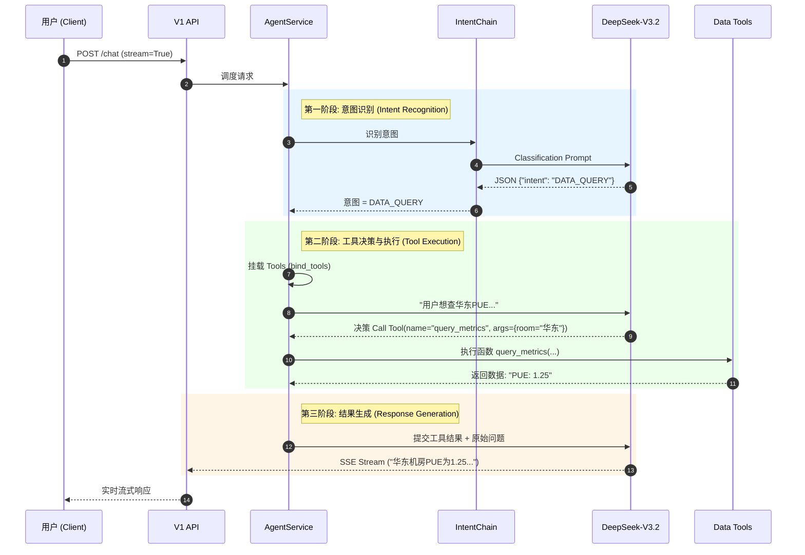

# 云枢・智维・AI 平台 - AI智能体系统设计文档

## 1. 文档信息

- **文档名称**：AI智能体系统设计文档
- **系统名称**：云枢・智能体平台（AI Agent Platform）
- **所属项目**：云枢・智维・AI
- **版本**：v1.0
- **日期**：2025-12-25
- **作者**：AI架构团队

## 2. 系统概述

### 2.1 系统目标
构建一个基于自然语言处理的智能数据查询系统，能够理解用户的自然语言查询意图，并将其转换为SQL查询语句，最终以可视化的方式展示查询结果。

### 2.2 系统范围
- 自然语言理解引擎
- NL2SQL转换引擎
- 数据查询服务
- 结果可视化服务
- AI助手集成服务

## 3. 架构设计

### 3.1 总体架构

```
┌─────────────────┐    ┌─────────────────┐    ┌─────────────────┐
│   用户界面      │    │   API网关       │    │   AI服务        │
│                 │───▶│                 │───▶│                 │
│  (Web/移动端)   │    │  (认证/限流)    │    │  (NLU/NL2SQL)   │
└─────────────────┘    └─────────────────┘    └─────────────────┘
                                                      │
                                                      ▼
┌─────────────────┐    ┌─────────────────┐    ┌─────────────────┐
│   可视化服务     │    │   查询引擎      │    │   数据源        │
│                 │───▶│                 │───▶│                 │
│  (图表渲染)     │    │  (SQL执行)      │    │  (ClickHouse,  │
└─────────────────┘    └─────────────────┘    │   HBase, etc.)  │
                                                      │
                                                      ▼
┌─────────────────┐    ┌─────────────────┐    ┌─────────────────┐
│   缓存层        │    │   模型服务       │    │   配置中心      │
│                 │    │                 │    │                 │
│  (Redis)        │    │  (模型管理)     │    │  (Consul)       │
└─────────────────┘    └─────────────────┘    └─────────────────┘
```

### 3.2 架构分层

#### 3.2.1 表现层（Presentation Layer）
- AI助手界面：集成到现有Web界面
- 移动端界面：适配移动设备
- API接口：提供标准化接口

#### 3.2.2 业务逻辑层（Business Logic Layer）
- 自然语言理解：意图识别、实体提取
- NL2SQL转换：语义解析、SQL生成
- 查询优化：SQL优化、性能提升
- 结果处理：数据格式化、图表推荐

#### 3.2.3 数据访问层（Data Access Layer）
- 查询引擎：SQL执行、结果获取
- 数据适配器：多数据源适配
- 连接池管理：数据库连接管理

#### 3.2.4 AI模型层（LangChain Core）
- **模型工厂**：统一管理 LLM Gateway，支持 OpenAI 协议适配
- **工具链 (Tools)**：ChatBI 查数工具、知识库检索工具
- **编排引擎 (LCEL)**：LangChain Expression Language 定义意图识别与执行流

### 3.3 Agent Orchestrator 层（已实现）
- **AgentService**：作为 V1 接口的核心调度中枢，负责：
  - **意图路由**：基于 `IntentChain` 将请求分发至 `GENERAL`, `DATA_QUERY`, `KNOWLEDGE_BASE`。
  - **工具调度**：在 DATA_QUERY 模式下，自主决策调用 `query_datacenter_metrics` 等工具。
  - **流式分发**：封装异步生成器，通过 SSE (Server-Sent Events) 向前端实时推送字符。
- **对外接口**：
  - `POST /api/v1/chat/completions`: 统一入口，支持 `stream=True/False`。

## 4. 技术选型 (Updated)

### 4.1 AI/ML技术栈
- **核心框架**：LangChain (Orchestration), LCEL
- **大语言模型**：内部私有化部署网关 (OpenAI Compatible)
- **工具协议**：OpenAI Function Calling / Tool Calling
- **流式协议**：Server-Sent Events (SSE)

### 4.2 后端技术栈
- **API框架**：FastAPI (Async/Await)
- **数据库**：ClickHouse (业务数据), Redis (会话缓存), MySQL (元数据)
- **运行环境**：Python 3.10+, Docker

## 5. 详细设计

### 5.1 AI服务设计 (AgentService)

#### 5.1.1 服务结构
```
app/
├── api/
│   └── v1/                 # 统一对外接口
│       └── endpoints/
│           └── chat.py     # POST /chat/completions
├── services/
│   └── ai/
│       ├── agent_service.py   # 中枢调度器 (Orchestrator)
│       ├── intent_service.py  # 意图识别链 (LCEL)
│       └── tools/             # LangChain 工具包
│           └── data_api.py    # ChatBI 查数工具
```

#### 5.1.2 核心流程
1. **统一入口**：用户调用 `/api/v1/chat/completions`。
2. **意图识别**：`IntentService` 快速判断请求类型（如查数、闲聊）。
3. **路由分发**：
   - **GENERAL**: 直接调用 LLM 进行对话。
   - **DATA_QUERY**: 激活 `model_with_tools`，模型自主决定调用 `data_api` 获取数据，并生成自然语言总结。
4. **流式响应**: 通过 `sse_generator` 将思考过程、工具结果和最终回答以 SSE 事件流形式返回。

#### 5.1.3 核心调用链路 (ChatBI 时序图)




#### 5.1.2 API路由设计
```
# ChatBI API
POST /api/v1/chatbi/query        # 自然语言查询
POST /api/v1/chatbi/chat         # 聊天接口
GET /api/v1/chatbi/history/{session_id}  # 获取历史记录

# NLP API
POST /api/v1/nlp/parse           # 语义解析
POST /api/v1/nlp/intent          # 意图识别
POST /api/v1/nlp/entity          # 实体提取

# 可视化API
POST /api/v1/visual/generate     # 生成图表
GET /api/v1/visual/types         # 获取图表类型
```

### 5.2 自然语言理解设计

#### 5.2.1 语言理解流程
```
输入: "查询华东区域最近一周的温度趋势"
   ↓
分词: ["查询", "华东区域", "最近一周", "温度", "趋势"]
   ↓
实体识别: {location: "华东区域", time: "最近一周", metric: "温度", action: "趋势"}
   ↓
意图识别: {intent: "time_series_query", action: "get_trend"}
   ↓
结构化查询: {action: "get_trend", metric: "temperature", location: "华东区域", time_range: "最近一周"}
   ↓
SQL生成: SELECT timestamp, temperature FROM temperature_data WHERE region = '华东区域' AND timestamp >= '2025-12-18' GROUP BY timestamp ORDER BY timestamp
```

#### 5.2.2 NLU服务设计
```python
class NLUService:
    def __init__(self):
        self.tokenizer = None  # 分词器
        self.ner_model = None  # 命名实体识别模型
        self.intent_model = None  # 意图识别模型
    
    async def parse_query(self, query: str) -> dict:
        """解析自然语言查询"""
        # 1. 分词
        tokens = self.tokenize(query)
        
        # 2. 实体识别
        entities = self.extract_entities(tokens)
        
        # 3. 意图识别
        intent = self.classify_intent(query)
        
        # 4. 生成结构化查询
        structured_query = self.build_structured_query(intent, entities)
        
        return structured_query
    
    def tokenize(self, text: str) -> list:
        """中文分词"""
        pass
    
    def extract_entities(self, tokens: list) -> dict:
        """实体识别"""
        pass
    
    def classify_intent(self, text: str) -> str:
        """意图分类"""
        pass
    
    def build_structured_query(self, intent: str, entities: dict) -> dict:
        """构建结构化查询"""
        pass
```

### 5.3 NL2SQL转换设计

#### 5.3.1 转换流程
```
结构化查询 → 语义映射 → SQL模板 → SQL语句
```

#### 5.3.2 SQL生成服务
```python
class NL2SQLService:
    def __init__(self):
        self.schema_mapper = None  # 模式映射器
        self.sql_template = None   # SQL模板
        self.validator = None      # SQL验证器
    
    async def generate_sql(self, structured_query: dict) -> str:
        """生成SQL查询语句"""
        # 1. 映射业务概念到数据库结构
        db_mapping = self.map_to_database(structured_query)
        
        # 2. 应用SQL模板
        sql_template = self.get_sql_template(db_mapping.intent)
        sql_query = self.apply_template(sql_template, db_mapping)
        
        # 3. 验证SQL语法
        validated_sql = self.validate_sql(sql_query)
        
        return validated_sql
    
    def map_to_database(self, structured_query: dict) -> dict:
        """映射业务概念到数据库结构"""
        # 将业务术语映射到数据库表和字段
        mapping = {
            'table': self.map_metric_to_table(structured_query.get('metric')),
            'fields': self.map_entities_to_fields(structured_query.get('entities')),
            'conditions': self.map_conditions(structured_query.get('conditions'))
        }
        return mapping
    
    def get_sql_template(self, intent: str) -> str:
        """获取SQL模板"""
        templates = {
            'get_trend': 'SELECT {fields} FROM {table} WHERE {conditions} ORDER BY {time_field}',
            'get_summary': 'SELECT {aggregation}({field}) FROM {table} WHERE {conditions}',
            'get_list': 'SELECT {fields} FROM {table} WHERE {conditions}'
        }
        return templates.get(intent, templates['get_list'])
```

### 5.4 数据查询设计

#### 5.4.1 查询服务
```python
class QueryService:
    def __init__(self):
        self.connection_pool = None  # 连接池
        self.cache_service = None    # 缓存服务
    
    async def execute_query(self, sql: str, params: dict = None) -> list:
        """执行SQL查询"""
        # 1. 检查缓存
        cache_key = self.generate_cache_key(sql, params)
        cached_result = await self.cache_service.get(cache_key)
        if cached_result:
            return cached_result
        
        # 2. 执行查询
        connection = await self.connection_pool.acquire()
        try:
            result = await connection.fetch(sql, params)
            
            # 3. 缓存结果
            await self.cache_service.set(cache_key, result, expire=300)
            
            return result
        finally:
            await self.connection_pool.release(connection)
```

### 5.5 可视化设计

#### 5.5.1 可视化服务
```python
class VisualService:
    def __init__(self):
        self.chart_recommender = None  # 图表推荐器
        self.chart_generator = None    # 图表生成器
    
    async def generate_chart(self, query_result: list, query_info: dict) -> dict:
        """生成可视化图表"""
        # 1. 分析数据特征
        data_analysis = self.analyze_data(query_result)
        
        # 2. 推荐图表类型
        chart_type = self.recommend_chart(data_analysis, query_info)
        
        # 3. 生成图表配置
        chart_config = self.generate_chart_config(chart_type, query_result, data_analysis)
        
        return {
            'chart_type': chart_type,
            'config': chart_config,
            'data': query_result
        }
    
    def analyze_data(self, data: list) -> dict:
        """分析数据特征"""
        # 分析数据类型、时间序列、数值范围等
        pass
    
    def recommend_chart(self, data_analysis: dict, query_info: dict) -> str:
        """推荐图表类型"""
        if query_info.get('action') == 'get_trend':
            return 'line'
        elif data_analysis.get('is_categorical'):
            return 'bar'
        elif data_analysis.get('is_proportional'):
            return 'pie'
        else:
            return 'bar'
```

### 5.6 ChatBI 响应结构与前端契约
- ChatBI 对外的响应统一抽象为：**主图表（primary_chart）+ Markdown 摘要（answer_markdown）+ 可选 widgets（secondary_widgets）**
- `primary_chart`：包含图表类型和图表配置，例如 ECharts `option`，用于在前端直接渲染；
- `answer_markdown`：对查询结果的自然语言总结，使用 Markdown 语法，前端负责渲染为 HTML，符合 `openspec/specs/ai-interaction.md` 对 Markdown 的要求；
- `secondary_widgets`：可扩展 Widget 列表（如 SOP 卡片、统计卡片、告警列表等），每个 Widget 至少包含 `type` 和 `payload` 字段；
- 云枢 Web 的 `AiAssistant.vue` 仅是上述通用结构的一个适配实现：
  - `primary_chart` → 映射为组件 `ChatChart` 所需的 `option`；
  - `answer_markdown` → 渲染到消息体 HTML；
  - `secondary_widgets` 中类型为 `sop_card` 的项 → 映射为 `SopCard` 的数据结构。

## 6. 数据库设计

### 6.1 AI相关表

#### 6.1.1 查询会话表 (query_sessions)
```sql
CREATE TABLE query_sessions (
    id BIGINT PRIMARY KEY AUTO_INCREMENT,
    session_id VARCHAR(64) NOT NULL UNIQUE,
    user_id BIGINT,
    created_at TIMESTAMP DEFAULT CURRENT_TIMESTAMP,
    updated_at TIMESTAMP DEFAULT CURRENT_TIMESTAMP ON UPDATE CURRENT_TIMESTAMP,
    context JSON COMMENT '对话上下文',
    INDEX idx_session_id (session_id),
    INDEX idx_user_id (user_id)
) COMMENT='查询会话表';
```

#### 6.1.2 查询记录表 (query_logs)
```sql
CREATE TABLE query_logs (
    id BIGINT PRIMARY KEY AUTO_INCREMENT,
    session_id VARCHAR(64),
    query_text TEXT,
    structured_query JSON,
    generated_sql TEXT,
    query_result JSON,
    execution_time INT,
    created_at TIMESTAMP DEFAULT CURRENT_TIMESTAMP,
    INDEX idx_session_id (session_id),
    INDEX idx_created_at (created_at)
) COMMENT='查询记录表';
```

#### 6.1.3 知识库表 (knowledge_base)
```sql
CREATE TABLE knowledge_base (
    id BIGINT PRIMARY KEY AUTO_INCREMENT,
    category VARCHAR(64),
    term VARCHAR(255),
    definition TEXT,
    synonyms JSON,
    mappings JSON,
    created_at TIMESTAMP DEFAULT CURRENT_TIMESTAMP,
    updated_at TIMESTAMP DEFAULT CURRENT_TIMESTAMP ON UPDATE CURRENT_TIMESTAMP,
    INDEX idx_category (category),
    INDEX idx_term (term)
) COMMENT='知识库表';
```

## 7. AI模型设计

### 7.1 模型架构

#### 7.1.1 自然语言理解模型
- **分词模型**：使用jieba或spaCy进行中文分词
- **实体识别模型**：基于BERT的命名实体识别
- **意图识别模型**：基于分类模型的意图识别

#### 7.1.2 NL2SQL模型
- **语义解析模型**：理解自然语言的语义结构
- **SQL生成模型**：将语义结构转换为SQL语句
- **优化模型**：优化生成的SQL语句

### 7.2 模型服务设计

#### 7.2.1 模型管理服务
```python
class ModelService:
    def __init__(self):
        self.models = {}
        self.model_registry = {}
    
    async def load_model(self, model_name: str, model_path: str):
        """加载模型"""
        if model_name not in self.models:
            model = self.load_model_from_path(model_path)
            self.models[model_name] = model
            self.model_registry[model_name] = {
                'path': model_path,
                'loaded_at': datetime.now()
            }
    
    async def predict(self, model_name: str, input_data: dict) -> dict:
        """模型预测"""
        model = self.models.get(model_name)
        if not model:
            await self.load_model(model_name, self.get_model_path(model_name))
            model = self.models[model_name]
        
        return model.predict(input_data)
```

## 8. 缓存设计

### 8.1 缓存策略
- **查询结果缓存**：缓存SQL查询结果
- **会话上下文缓存**：缓存对话上下文
- **模型预测缓存**：缓存模型预测结果

### 8.2 缓存层级
```
L1: 应用内缓存（内存）
L2: Redis缓存（分布式）
L3: 数据库缓存（ClickHouse内置）
```

## 9. 安全设计

### 9.1 数据安全
- **SQL注入防护**：参数化查询，输入验证
- **权限控制**：基于用户角色的数据访问控制
- **数据脱敏**：敏感数据脱敏处理

### 9.2 模型安全
- **模型访问控制**：限制模型API访问
- **查询审计**：记录所有查询操作
- **异常检测**：检测异常查询模式

## 10. 性能设计

### 10.1 性能优化策略
- **模型优化**：模型量化、剪枝
- **查询优化**：SQL优化、索引优化
- **缓存策略**：多级缓存、预加载
- **异步处理**：异步模型推理

### 10.2 性能指标
- **NLU响应时间**：≤ 1秒
- **SQL生成时间**：≤ 1秒
- **查询响应时间**：≤ 3秒
- **系统并发**：≥ 100 QPS

## 11. 监控设计

### 11.1 监控指标
- **模型性能**：推理时间、准确率
- **查询性能**：响应时间、成功率
- **系统资源**：CPU、内存、GPU使用率
- **业务指标**：查询量、用户满意度

### 11.2 告警机制
- **性能告警**：响应时间超阈值
- **错误告警**：错误率超阈值
- **资源告警**：资源使用率超阈值

## 12. 部署设计

### 12.1 部署架构
- **模型服务**：GPU服务器部署
- **API服务**：CPU服务器部署
- **数据库服务**：专用服务器部署
- **缓存服务**：Redis集群部署

### 12.2 容器化部署
- **模型服务容器**：包含GPU支持
- **API服务容器**：轻量级容器
- **编排管理**：Kubernetes

## 13. 扩展性设计

### 13.1 水平扩展
- **无状态服务**：API服务无状态设计
- **模型服务**：模型服务支持集群
- **数据分片**：支持数据分片

### 13.2 垂直扩展
- **模块化设计**：服务模块化
- **配置可调**：资源动态配置
- **模型热更新**：支持模型热更新

## 14. 配置管理

### 14.1 配置项
- **模型配置**：模型路径、参数
- **数据库配置**：连接信息、参数
- **缓存配置**：Redis连接、策略
- **性能配置**：超时、并发参数

### 14.2 配置管理
- **配置中心**：统一配置管理
- **动态配置**：支持运行时配置更新
- **环境隔离**：不同环境配置隔离

## 15. 测试策略

### 15.1 单元测试
- **NLU模块测试**：分词、实体识别、意图识别
- **NL2SQL模块测试**：SQL生成准确性
- **查询模块测试**：查询执行正确性
- **可视化模块测试**：图表生成正确性

### 15.2 集成测试
- **端到端测试**：完整查询流程测试
- **性能测试**：响应时间、并发测试
- **准确性测试**：SQL生成准确率测试

### 15.3 模型测试
- **模型准确性测试**：准确率、召回率
- **模型稳定性测试**：长时间运行稳定性
- **模型性能测试**：推理速度测试