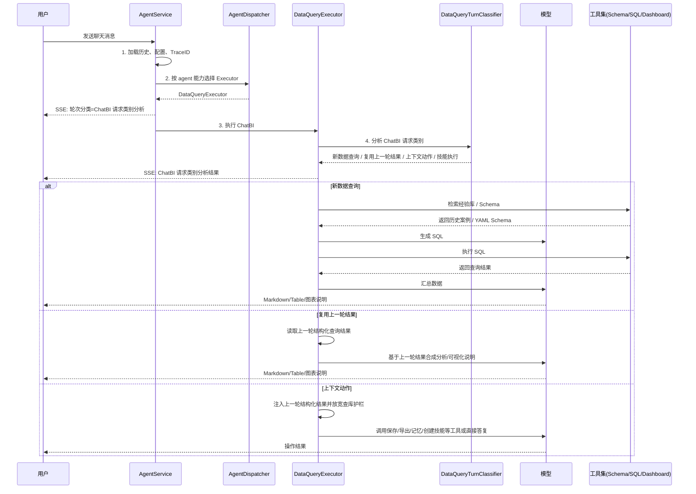

# ChatBI 智能体流程架构文档

本文档描述 ChatBI 智能体（数据查询助手）的当前执行流程、核心组件交互及关键机制。

## 1. 核心流程概览

ChatBI 当前采用“两层边界”：

1. **路由层只选智能体/执行器**：Router/Dispatcher 根据 agent 能力把请求送入 `DataQueryExecutor`，不判断 ChatBI 内部请求类别。
2. **执行器内部做 ChatBI 请求类别分析**：`DataQueryExecutor` 第一阶段调用 `DataQueryTurnClassifier`，再决定是否新查数、复用上一轮结果，或处理上下文动作。该分类以 LLM 结合上下文主判，规则只做 LLM 失败后的兜底和硬约束。



---

## 2. 请求入口与路由

### 阶段一：请求入口

- **入口组件**：`AgentService.chat_completion_stream`
- **职责**：
  - 加载会话历史、智能体配置、用户权限与 Trace ID。
  - 对 ChatBI agent 输出外层 SSE 元信息：`turn_type=data_query_request`，展示名为「ChatBI 请求类别分析」。
  - 对非 ChatBI agent 仍可调用通用 `resolve_turn_for_session`，生成 `shared_turn` 给 General/Knowledge 类 executor 复用。

### 阶段二：执行器选择

- **核心组件**：`AgentDispatcher`
- **规则**：
  - `engine_type=RAGFLOW` -> `RAGExecutor`
  - `engine_type=OPENCLAW` -> `OpenClawExecutor`
  - `TurnType=KNOWLEDGE` -> `KnowledgeExecutor`
  - agent 具备 `data_query` capability -> `DataQueryExecutor`
  - 其他本地 agent -> `AssistantExecutor`

Dispatcher 不再根据 ChatBI 内部请求类别决定是否进入 DataQueryExecutor。

---

## 3. ChatBI 请求类别分析

**核心组件**：`app/services/ai/data_query_turn_classifier.py`

分类原则：

- **LLM 主判**：优先让大模型结合最近对话、当前问题、是否存在上一轮结构化查询结果，判断本轮属于哪类。
- **规则兜底**：只有 LLM 返回无效 JSON、未知类别或调用失败时，才使用轻量规则兜底。
- **硬约束**：如果判断为复用上一轮结果但当前没有结构化结果，执行器返回「缺少可复用查询结果」，不把「柱状图显示吧」这类追问拿去检索 Schema。

| 请求类别 | 说明 | 典型用户说法 | 执行策略 |
|----------|------|--------------|----------|
| `NEW_DATA_QUERY` | 需要新查业务数据 | 「查一下用户列表」「那本月呢」 | 经验库/Schema -> SQL -> 汇总 |
| `REUSE_PREVIOUS_RESULT` | 基于上一轮结构化结果加工 | 「可视化分析一下」「画个柱状图」 | 跳过 Schema/SQL，直接复用上一轮结果合成 |
| `CONTEXT_ACTION` | 对已有结果执行动作 | 「保存这个结果」「导出上面表格」 | 注入上一轮结果，调用对应工具或直接答复 |
| `SKILL_EXECUTION` | 显式使用技能 | 「使用用户列表查询技能」 | 按技能要求加载说明并执行 |

前端 SSE 日志示例：

```text
轮次分类：ChatBI 请求类别分析
ChatBI 请求类别分析结果：复用上一轮结果。检测到对上一轮数据结果的追问...
```

---

## 4. 新数据查询流程

1. **上下文独立化**：多轮短句如「那本月呢」会结合最近对话改写为完整查数问题，用于经验库和 Schema 检索。
2. **经验库检索**：通过 `ExampleService.search_examples` 查找历史优质 SQL 案例，并注入 Few-Shot。
3. **数据集菜单与 Schema**：加载当前用户可见数据集，必要时自动兜底调用 `get_dataset_schema`。
4. **SQL 生成与执行**：模型必须先拿 Schema，再调用 `execute_sql_query`。
5. **SqlQueryBinding（执行期元数据）**：Schema 返回后平台解析为 `table_bindings`（表→数据集→列）；execute 前合并当前 SQL 构建 `SqlQueryBinding`，经 Gate 预检与 Core 校验共用；跨库升级时 binding 注入联邦 plan 并修正 subquery `dataset_name`。详见 `chatbi_sql_query_binding.py` 与 [CHATBI_GUARDS_REVIEW.md](./CHATBI_GUARDS_REVIEW.md) G3b/G12。
6. **结果保存**：SQL 成功后保存结构化结果，供下一轮「复用上一轮结果」使用。
7. **最终汇总**：合成 Markdown 表格、关键指标总结和解释。

---

## 5. 复用上一轮结果流程

当当前问题是「可视化分析一下」「总结一下」「换成折线图」等纯加工追问，并且当前会话存在上一轮结构化查询结果时：

1. `DataQueryExecutor` 读取上一轮 `last_data_result`。
2. 跳过经验库、Schema、SQL。
3. 将上一轮结构化结果与当前问题交给合成模型。
4. 输出分析、可视化说明或格式调整后的回答。

如果没有可复用结果，返回明确日志「缺少可复用查询结果」，避免凭空编造。

---

## 6. 上下文动作流程

上下文动作不是新查数，例如：

- 保存/导出上一轮结果
- 记住某项偏好
- 把当前流程沉淀成技能

这类请求会注入上一轮结构化结果并放宽“必须查库”的护栏，允许模型直接调用系统隐式工具或基于上下文答复。

---

## 7. 关键组件文件路径

| 用途 | 路径 |
|------|------|
| 编排入口 | `app/services/ai/agent_service.py` |
| 执行器选择 | `app/services/ai/dispatcher.py` |
| 通用请求分类 | `app/services/ai/turn_classifier.py` |
| ChatBI 请求类别分析 | `app/services/ai/data_query_turn_classifier.py` |
| ChatBI 执行器（薄封装） | `app/services/ai/executors/data_executor.py` |
| ChatBI Runner（薄编排 + 守卫门面） | `app/services/ai/runners/data_agent_runner.py` |
| ChatBI 域模块（守卫实现） | `app/services/ai/runners/chatbi/`（见该目录 `README.md`） |
| SqlQueryBinding（Schema/SQL/元数据绑定） | `app/services/ai/chatbi_sql_query_binding.py` |
| SQL 执行核心（权限/校验/执行） | `app/services/sql_query_execution_service.py` |
| ChatBI 专用工具集 | `app/services/ai/runtime/agentscope/data_tools.py` |
| AgentScope 事件映射 | `app/services/ai/runtime/agentscope/event_stream.py` |
| 权限挂起恢复 | `app/services/ai/runtime/agentscope/confirmations.py` |
| ChatBI 执行器提示词 | `app/services/ai/executors/prompts.py` |
| 数据工具注册 | `app/services/ai/tools/registry.py` |
| 运行时架构说明 | [AGENTSCOPE_RUNTIME.md](./AGENTSCOPE_RUNTIME.md) |
