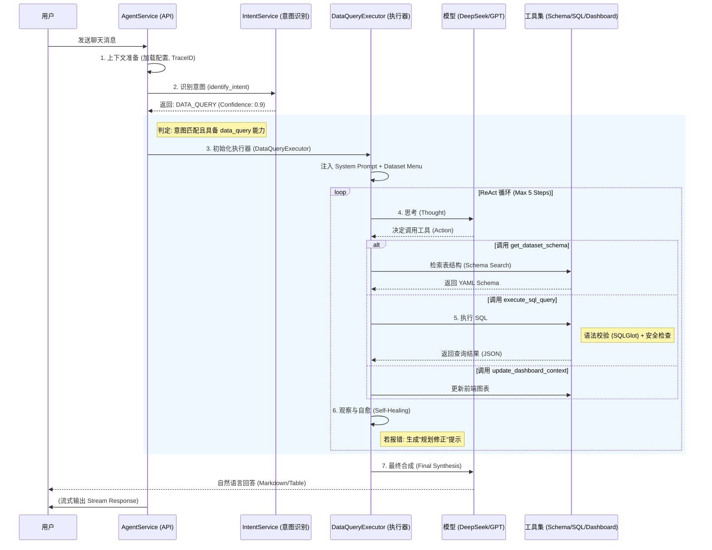

# ChatBI 智能体流程架构文档

本文档详细描述了 ChatBI 智能体（数据查询助手）在系统中的完整执行流程、核心组件交互及关键机制。

## 1. 核心流程概览

ChatBI 的核心逻辑是一个基于 **意图识别 (Intent Classification)** 分发，配合 **ReAct (Reasoning + Acting)** 循环的自主代理系统。

---

## 2. 详细执行步骤

### 阶段一：请求入口与初始化 (Request Entry)
*   **入口组件**: `AgentService.chat_completion_stream`
*   **职责**:
    *   **上下文加载**: 根据 `agent_id` 或 `version_id` 加载智能体配置 (Model, Capabilities)。
    *   **Trace ID 生成**: 为本次会话生成唯一追踪 ID，用于全链路日志审计。
    *   **审计准备**: 初始化 `trace_buffer` 记录后续所有的思考和工具调用。

### 阶段二：意图识别 (Intent Recognition)
*   **核心组件**: `IntentService`
*   **逻辑**:
    *   独立调用 LLM 分析用户输入的语义。
    *   **分类体系**:
        *   `DATA_QUERY`: 涉及查数、报表、趋势、指标记录。
        *   `KNOWLEDGE_BASE`: 涉及 SOP、操作文档、规章制度。
        *   `GENERAL`: 闲聊或通用问题。
    *   **路由决策**: 若意图为 `DATA_QUERY` **且** 智能体配置包含 `data_query` 权限，则实例化 `DataQueryExecutor`，否则回退到通用聊天。

### 阶段三：ChatBI 执行引擎 (Execution Engine)
*   **核心组件**: `DataQueryExecutor`
*   **工作模式**: ReAct (Reasoning + Acting) 多轮迭代。

#### 1. 动态提示词与上下文注入
*   系统自动从数据库获取当前可见的 **数据集菜单 (Dataset Menu)**，并注入到 System Prompt 的 `{dataset_menu}` 占位符中。
*   AI 借此获知系统中有哪些数据资产可用（如 "服务器性能表", "机房资产表"）。

#### 2. 工具调用循环 (Tool Loop)
智能体在每一步思考中可选择以下核心工具：

| 工具名称 | 作用 | 关键逻辑 |
| :--- | :--- | :--- |
| **`get_dataset_schema`** | 获取元数据 | 支持 **关键词搜索** 或 **RAG 检索**。返回标准 YAML 格式的表结构，包含字段解释和枚举值。 |
| **`execute_sql_query`** | 执行数据查询 | 1. **SQL 语法校验** (利用 `sqlglot` 库，确保符合 ClickHouse 语法)。 2. **安全风控** (正则屏蔽 DROP, DELETE 等高危指令)。 3. **执行** (调用外部 Data API 获取结果)。 |
| **`update_dashboard_context`** | 前端联动 | 向前端发送指令，更新当前页面的图表上下文 (Context)。 |

#### 3. 错误自愈机制 (Self-Healing)
*   **机制**: `DataQueryExecutor` 会捕获工具执行的异常。
*   **启发式反馈**:
    *   **未知列 (Unknown column)** -> 提示 "请重新检查 Schema，确认列名正确"。
    *   **语法错误 (Syntax Error)** -> 提示 "请注意 ClickHouse 语法特性 (如 `GLOBAL JOIN` 等)"。
    *   **无结果** -> 提示 "可能是关键词不匹配，请尝试列出所有机房..."。
*   **效果**: AI 收到报错后，会在下一次循环中自动修正 SQL，而不是直接报错给用户。

### 阶段四：最终响应 (Final Synthesis)
*   当工具返回有效数据后，LLM 结合 **用户问题** 和 **查询结果 (JSON)** 生成最终的自然语言回答。
*   回答通常包含 Markdown 表格、关键指标总结以及对数据的解释。

---

## 3. 关键组件文件路径

*   **编排入口**: `app/services/ai/agent_service.py`
*   **意图服务**: `app/services/ai/intent_service.py`
*   **执行器**: `app/services/ai/executors/data_executor.py`
*   **工具实现**: `app/services/ai/tools/data_api.py`
*   **工具定义**: `app/services/ai/tools/registry.py`
