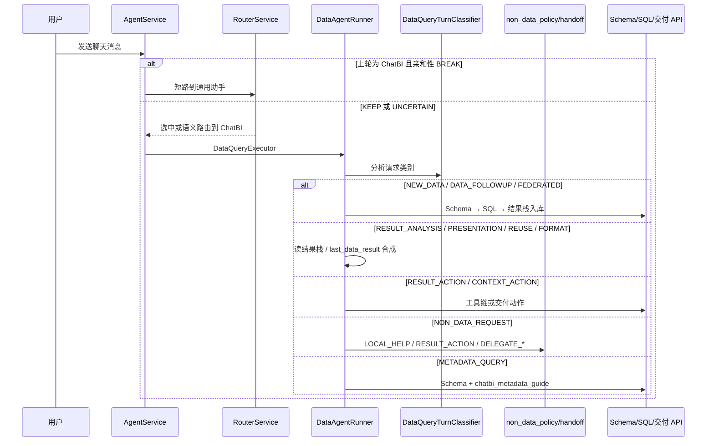

# ChatBI 智能体流程架构文档

本文档描述 ChatBI（数据查询助手）的**当前**执行边界、轮次语义、连续分析与交付能力。  
实现真相以代码与域 README 为准：`app/services/ai/runners/chatbi/README.md`。  
设计演进说明见：`docs/superpowers/specs/2026-07-19-chatbi-analysis-workflow-evolution-design.md`。

> 更新说明（2026-07）：已从「四类 turn + 单一 last_data_result + 非查数统一切换」迁到「外层粘性三态 + 内部分诊/结果栈/交付动作」。旧「只引导切换智能体、不自动委派」方案见 [2026-07-14-chatbi-non-data-routing-design.md](../../docs/superpowers/specs/2026-07-14-chatbi-non-data-routing-design.md)（已取代）。

## 1. 核心流程概览

ChatBI 采用「两层边界 + 内部分诊」：

1. **路由层只选智能体**：Router 用粘性三态决定是否打断 ChatBI 会话；灰区不直接 fallback Main，交给语义路由。
2. **执行器内部做请求类别分析**：`DataAgentRunner` 调用 `DataQueryTurnClassifier`，再决定新查数、带上下文追问、结果分析/呈现/动作、元数据探索、非查数处置或澄清。
3. **非查数不是统一拒绝**：本地帮助 / 结果动作留在 ChatBI / 无感委派 Main·Web；委派失败才降级「切换智能体」引导。

---

## 2. 请求入口与外层粘性

### 入口

- **编排**：`AgentService.chat_completion_stream`
- **执行器选择**：`AgentDispatcher` — 具备 `data_query` capability → `DataQueryExecutor` → `DataAgentRunner`
- Dispatcher **不**根据 ChatBI 内部 turn 类型决定是否进入 DataQuery；进入后再分类。

### 外层会话亲和性（三态）

实现：`intent_service.resolve_data_agent_session_affinity()` / `DataSessionAffinity`；Router 仅在 **`BREAK`** 时短路离开 ChatBI。

| 状态 | 含义 | 典型场景 | Router 行为 |
|------|------|----------|-------------|
| `KEEP` | 明确仍在数据会话 | 查数、结果追问、结果动作、元数据探索 | 倾向沿用 ChatBI |
| `BREAK` | 明确离开数据会话 | 纯问候、公网搜索、平台自助、无关通用任务 | 启发式短路到通用助手 |
| `UNCERTAIN` | 灰区 | 表述不明、可能切换也可能追问 | **不**直接 fallback；交给语义 Router |

兼容：`should_inherit_data_agent_session()` 等价于「亲和性 == KEEP」。

详见 [AGENT_ROUTING_DESIGN.md](./AGENT_ROUTING_DESIGN.md) §2.4。

---

## 3. ChatBI 请求类别分析

**组件**：`app/services/ai/data_query_turn_classifier.py`

原则：

- LLM 主判 + 规则兜底；首轮仅高置信 `NEW_DATA_QUERY` / `METADATA_QUERY` / `NON_DATA_REQUEST` 可快通道。
- 首轮灰区必须分类；分类失败时能力引导或澄清，**不**默认 Schema/SQL。
- 旧类型保留兼容映射：如 `REUSE_PREVIOUS_RESULT` / `FORMAT_CORRECTION` / `CONTEXT_ACTION` 仍可出现。

| 请求类别 | 说明 | 执行策略 |
|----------|------|----------|
| `NEW_DATA_QUERY` | 新查业务数据 | Schema → SQL → 写入结果栈 |
| `DATA_FOLLOWUP_QUERY` | 改筛选/维度/时间/指标，需再查数 | 继承上一结果 `analysis_context` 后重新过门禁查数 |
| `FEDERATED_DATA_QUERY` | 跨数据集 | 联邦升级路径 |
| `METADATA_QUERY` | 能查什么 / 指标口径 | Schema + `chatbi_metadata_guide` SSE（Markdown 回退） |
| `RESULT_ANALYSIS` | 只基于已有结果总结/排名/贡献 | 不重新 SQL |
| `RESULT_PRESENTATION` / `FORMAT_CORRECTION` | 图表样式与排版 | 不重新 SQL |
| `REUSE_PREVIOUS_RESULT` | 兼容旧「复用上一轮」 | 读结构化结果合成 |
| `RESULT_ACTION` / `CONTEXT_ACTION` | 导出、保存、订阅、发送等 | 注入结果；动作留在 ChatBI 工具链 |
| `SKILL_EXECUTION` | 显式技能 | 按技能执行 |
| `NON_DATA_REQUEST` | 非查数 | 见 §4 处置策略 |
| `CLARIFICATION_REQUIRED` | 有查数意图但缺条件 | 查数澄清（真实候选，不造字段） |
| `CLARIFICATION_OR_NON_DATA` | 兼容旧灰区 | 澄清或非查数分支 |

若误判为复用但无结构化结果：返回「缺少可复用查询结果」，禁止凭空去 Schema。

---

## 4. 非查数处置与无感委派

**组件**：`runners/chatbi/non_data_policy.py`、`handoff.py`

| Disposition | 行为 |
|-------------|------|
| `LOCAL_HELP` | 寒暄、身份、能力、BI 概念 → ChatBI 本地回答 |
| `RESULT_ACTION` | 对当前结果的导出/保存/订阅等 → **留在 ChatBI**（若被误标为 `NON_DATA`，Runner 会纠正为 `RESULT_ACTION`） |
| `DELEGATE_MAIN` | 写作、翻译、平台自助、运行诊断 → SSE `agent_handoff` 无感委派 Main |
| `DELEGATE_WEB` | 公网/动态事实 → 委派具备联网能力的 Main |

委派失败时降级为带 `/switch_to_auto` 的既有「切换智能体」引导（兼容旧客户端）。

---

## 5. 新数据查询与条件继承下钻

1. 独立问题改写 → 经验库 Few-Shot → Schema 预取 → SQL 生成与执行。
2. **SqlQueryBinding**：表→数据集→列绑定，Gate 预检与 Core 校验共用（见 [CHATBI_GUARDS_REVIEW.md](./CHATBI_GUARDS_REVIEW.md)）。
3. SQL 成功后：双写 `last_data_result`（兼容）+ **结果栈** `data_result_stack_v1`（`ChatBIResultRef`，最多约 10 节点）。
4. `DATA_FOLLOWUP_QUERY`：用 `drilldown_context.build_inherited_analysis_context` 注入上一轮 metrics/dimensions/filters/time，**禁止复制旧 SQL 字符串**；再走完整 Schema/权限/SQL Gate。  
   > 说明：设计稿中的受限 DSL（`replace_dimension` 等）尚未作为独立协议落地；当前以结构化 `analysis_context` + prompt 契约实现条件继承。

### Schema 连续未命中

达到阈值后走 `source_reclassification`：区分内部数据 / 知识 / 平台自助 / 公网 / 通用 / UNKNOWN；非数据来源委派或给出门户出口，避免死磕查库。

---

## 6. 结果栈与引用

**组件**：`app/services/ai/chatbi_result_stack.py`、`memory_service`、`followup_data.py`

- 节点含 `result_id`、`parent_result_id`、`question`、`dataset_name`、`sql`、`rows`、`analysis_context`、`trace_id`、`created_at` 等。
- 引用解析：当前结果、上一结果、描述匹配、裸 `result_id` / `result:…`；歧义时返回真实候选。
- 简报 / 监控 API 通过 `conversation_id` + 可选 `result_id` 定位节点。

---

## 7. 元数据导航与真实澄清

- `METADATA_QUERY` → `metadata_guide.py` 从**授权 Schema** 生成主题、指标、维度与 quick queries。
- SSE：`chatbi_metadata_guide`；文本客户端保留 Markdown。
- 澄清候选必须来自 Schema / 数据集目录 / 结果栈；**禁止臆造字段按钮**。

---

## 8. 分析交付（简报与监控）

| 能力 | 入口 | 说明 |
|------|------|------|
| 继续分析动作 | `insight_meta` → 前端「继续分析」 | 含本地动作 `brief` / `monitor`，携带 `result_id` |
| 业务简报 | `POST /api/portal/chatbi-briefs` | 证据化 Markdown + 可选 Word；落库 `ChatBIBrief` |
| 条件监控 | `POST /api/portal/chatbi-monitors` + 监控对话框 | 转为黄金报表订阅；支持 always / threshold / rate_of_change / no_data |
| 调度评估 | `saved_report_subscription_service.evaluate_alert_condition` | 命中才投递，并记录触发证据 |

迁移：`db-prod/V100-add-saved-report-alert-conditions.sql`、`V101-create-chatbi-briefs.sql`。

### 混合任务计划（边界）

`chatbi_task_plan.py` 可拆显式多步骤请求；**当前仅**对 `query` / `analyze` / `present` 串行执行（`is_executable`）。含 brief/monitor/action 的自然语言「先查再简报」**不会**自动拆句执行，避免被误当成 SQL；交付请用结果动作按钮 / API。

---

## 9. 关键组件路径

| 用途 | 路径 |
|------|------|
| 编排入口 | `app/services/ai/agent_service.py` |
| 路由与粘性 | `router_service.py`、`intent_service.py`（`DataSessionAffinity`） |
| 请求类别 | `data_query_turn_classifier.py` |
| Runner | `runners/data_agent_runner.py` |
| 域模块 | `runners/chatbi/`（见 `README.md`） |
| 结果栈 | `chatbi_result_stack.py` |
| 任务计划 | `chatbi_task_plan.py` |
| 简报服务 | `chatbi_brief_service.py`、`api/portal/endpoints/chatbi_briefs.py` |
| 监控 API | `api/portal/endpoints/chatbi_monitors.py` |
| SqlQueryBinding | `chatbi_sql_query_binding.py` |
| 门控契约 | [ai_agent_gating_contract.md](../../docs/md/ai_agent_gating_contract.md) |

---

## 10. 相关文档

- 域实现索引：[runners/chatbi/README.md](../../app/services/ai/runners/chatbi/README.md)
- 演进设计：[2026-07-19-chatbi-analysis-workflow-evolution-design.md](../../docs/superpowers/specs/2026-07-19-chatbi-analysis-workflow-evolution-design.md)
- 监控弹层：[2026-07-19-chatbi-monitor-dialog-design.md](../../docs/superpowers/specs/2026-07-19-chatbi-monitor-dialog-design.md)
- 可信说明与继续分析：[2026-07-15-chatbi-trust-and-followup-design.md](../../docs/superpowers/specs/2026-07-15-chatbi-trust-and-followup-design.md)
- SQL 门禁评审：[CHATBI_GUARDS_REVIEW.md](./CHATBI_GUARDS_REVIEW.md)
- 路由设计：[AGENT_ROUTING_DESIGN.md](./AGENT_ROUTING_DESIGN.md)
