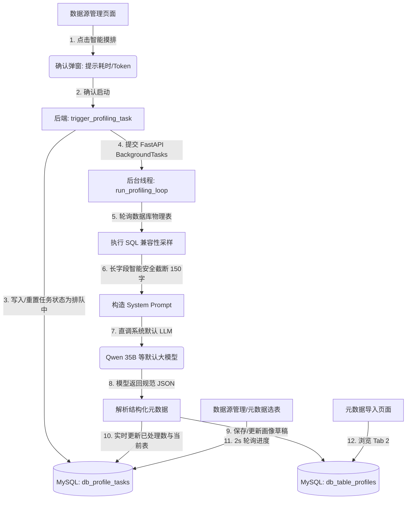

# 🤖 数据源智能摸排分析功能 (Table Profiling) 设计与技术原理解析

为了帮助 ChatBI 平台在进行元数据导入时，能更精准、高效地理解数据库中物理表与字段的真实业务用途，平台新增了数据源**智能摸排分析**（Table Profiling）功能。本文档旨在阐述该功能的设计背景、业务实现以及底层的技术原理。

---

## 1. 设计背景与痛点

在传统的元数据管理与 ChatBI 建模过程中，用户从外部数据库导入表时面临以下痛点：
* **命名晦涩，选表盲目**：生产环境中的表名和字段名（如 `ods_user_act_d`）往往非常晦涩，且数据库中往往缺失 Comment 备注，导入人员难以确定其真实含义，容易错导、漏导。
* **物理直连不精准**：直接读取系统表（如 `information_schema.tables`）虽然实时，但只能呈现粗糙 DDL 结构，没有任何上层的业务术语分类。
* **传统分析笨重**：如果每次导入都依靠全量智能体（Agent）反思，在大库（包含成百上千张表）下会因为频繁的反思循环导致极其漫长的等待与严重的 Token 损耗。

**解决方案**：本功能在数据源管理侧引入了一个**独立的、基于轻量级采样与大模型直调**的异步摸排任务，生成干净的“表资产画像草稿箱”。后续在元数据导入选表时，作为独立 Tab 供用户依据中文释义和标签快速按图索骥。

---

## 2. 功能架构与数据流向

智能摸排的核心数据流向如下，它将“后台异步分析”与“前台双 Tab 导入”完美串联：

---

## 3. 技术实现原理

### 3.1 物理存储模型 (MySQL)
设计了主子两张物理表，与数据源物理外键关联，支持级联删除：
1. **`db_profile_tasks` (任务控制表)**：
   - 维护每个数据源唯一的摸排任务；
   - 包含状态字段 `status`（0: 排队中, 1: 分析中, 2: 已完成, 3: 分析中断）；
   - 实时记录进度 `total_tables`、`processed_tables` 及当前正在处理的 `current_table`，支持高频轮询。
2. **`db_table_profiles` (表画像明细草稿表)**：
   - 存放摸排出的单表维度语义画像；
   - `ai_term`（中文业务备注名）、`ai_description`（表用途说明）、`ai_tags`（分类标签数组 JSON）；
   - `columns_profile`（字段级画像 JSON，包含每个物理字段对应的业务术语与详细释义）；
   - `confidence_score`（置信度/业务分析价值评分，0-100）；
   - `is_temporary`（是否为临时/备份/测试表标记，0或1）；
   - `is_ignored`（在后续 AI 分析中是否忽略该表，0或1）；
   - `confidence_reason`（置信度判定与扣分原因的详细文本）。

### 3.2 异步摸排与防并发限制
- **BackgroundTasks 异步流**：为防止 HTTP 请求超时，触发后立即向客户端返回“已提交”响应，并在 FastAPI 框架的 `BackgroundTasks` 后台线程中串行执行分析。
- **并发锁拦截**：每个数据源同时只能有一个处于进行中（`status=1`）的摸排任务。若重复触发，后端接口会直接拦截并抛出 `400` 错误，前端按钮也会自动置灰。

### 3.3 大模型直调技术 (No-Agent Lifecycle)
与平台日常的“对话智能体”不同，摸排是一个高密度的批处理任务。为了极致的性能与成本控制：
* **直调基础大模型**：不经过繁琐的 Agent 规划、生态工具链装载或 Redis 记忆链，直接通过 `AgentConfigProvider.get_configured_llm(streaming=False)` 唤醒当前配置的默认大模型（如 Qwen 35B）。
* **JSON Schema 约束**：通过 System Prompt 约束大模型必须输出符合 Pydantic 规范的 JSON 文本。后端提取器支持 Markdown CodeBlock 自动脱壳、容错 JSON 解析以及 JSON 校验兜底。

### 3.4 数据源资产概览面板 (Overview Stats)
在资产画像详情弹窗顶部，提供四卡片式指标看板，帮助库建模管理员在宏观上掌握该数据库的基本面：
- **摸排资产总数**：该数据库下所有摸排成功的表与视图总量。
- **物理表/虚拟视图**：按照物理表类型（Table vs View）分类汇总各自总数。
- **字段画像总数**：本库中累计有多少个底层物理字段被 AI 成功提取并赋予了中文业务备注与字段注释。

### 3.5 快速标签过滤系统 (Symmetric Tag Filtering & Collapse)
系统会动态遍历所有表画像中的 `ai_tags` 并统计其在当前库中关联的表数量，提供了极其精致对称的标签交互：
- **热度降序排列**：标签不再无序分布，而是自动根据所关联的表个数进行降序排列，保证最核心、最热门的业务标签优先显示。
- **动态数字徽章 (Badge)**：每个过滤按钮右侧带有气泡统计（如 `日志审计 (3)`、`全部 (38)`），便于全局总览。
- **自动折叠机制 (Collapse)**：默认仅渲染关联频率最高的 8 个标签，其余放入折叠库，用户点击 `更多 (N) ▾` 或 `收起 ▴` 可自由缩放。
- **反向联动与防失焦**：点击卡片底部的任意标签，过滤栏会自动联动筛选。若被点击的标签在前 8 个以外，过滤栏会自动展开，防止用户迷失选中位置。

### 3.6 库表置信度计算与低价值过滤机制 (Confidence & Low-value Filtering)
为了自动区分“具备真实分析价值的表”和“对业务取数无实际意义的低价值临时/中间映射表”，系统引入了多维共决的置信度评分（Confidence Score）与默认忽略标志：
*   **大模型语义深度识别**：升级了底层摸排时的 LLM Prompt 指引，大模型通过综合评估表结构 DDL 及采样数据样例（如数据是否全为内部关联 ID 对、字段命名及注释是否缺乏业务语义、结构是否极简等），判定 `is_temporary`（布尔值）和输入打分及扣分原因。
*   **数据样例完整性校验**：若在数据抓取阶段发现该表采样记录为空（`sample_data = '[]'`），视为缺乏实际运行和业务特征，系统在 LLM 评分基础上自动扣除 30 分。
*   **表名硬正则特征拦截**：对于表名匹配 `^tmp_`、`^temp_`、`_bak$`、`^test_` 等正则的表，系统自动扣减 40 分并将其强制判定为临时表（`is_temporary = 1`）。
*   **AI分析忽略状态（Is Ignored）**：最终置信度得分被归一化限制在 `[0, 100]` 区间内。若得分低于 60 分，或被判定属于临时表，系统在落库时会自动将 `is_ignored` 初始值置为 `1`。

### 3.7 前端互动治理（Ignore Switch & Confidence Badge）
在库表资产画像抽屉面板中，为保证管理员具有对元数据的绝对纠偏和干预权力，实现了以下交互：
*   **置信度状态可视化**：为每一张表根据置信分展示不同颜色的业务可信度徽章（绿、黄、红三色）及具体扣分原因，提供“低价值临时表”状态徽章。
*   **一键手动干预（Switch）**：在卡片头部集成了忽略控制的 Switch 滑动开关。若管理员认为某个表依然有用，可一键将其“恢复启用”，被忽略的表将以 70% 透明度置灰显示，系统自动联动 PUT 接口同步最新过滤状态。

---

## 4. 安全保护与性能防线 (Guardrails)

为防范在大数据库、海量文本下引发的性能爆仓与高额账单，设计了以下安全防线：
1. **采样限制与多数据库引擎语法兼容**：
   - 系统仅提取 3 条真实数据样本作为模型参考，不仅大幅节约网络传输，还避免了大表全量扫描的性能风险。
   - **多引擎差异化适配**：系统通过解析数据源连接 `db_type`，动态拼装对应引擎的高效限流采样语句。
     - **Oracle**：自动切换为高版本与低版本均高兼容的 `WHERE ROWNUM <= 3`。
     - **SQL Server**：自动切换为顶置 `TOP 3` 提取（如 `SELECT TOP 3 * FROM ...`）。
     - **MySQL / PostgreSQL / ClickHouse / Doris / SQLite 等**：使用通用 SQL 限制 `LIMIT 3`。
2. **字段长文本安全截断**：
   - 提取的样例数据中，若单列字段值字数超过 150 字（如存在长文章、大 JSON 或大文本），系统会在后端自动执行 `val[:150] + "..."` 的硬截断，彻底阻断大文本爆掉 LLM 上下文（Context Window）的可能。
3. **SQL 执行安全性验证**：
   - 所有的采样查询均通过平台适配器的 `DataSourceAdapter.execute_sql` 执行，系统内置的安全网关会自动拦截带有写操作或高危函数的 SQL（防御 SQL 注入及脏数据写写入）。
4. **Token 消耗警示弹窗**：
   - 前端配置点击启动确认框，让管理员明确知悉由于逐表分析，可能产生的 Token 计费，防止无感知耗尽大模型 API 额度。
5. **防幻觉污染与上下文瘦身 (AI Context Filtering)**：
   - **智能排除机制**：在数据源画像摸排中被忽略（`is_ignored = 1`）的表，后续在 ChatBI 元数据装配、意图识别与 SQL 计划自动生成时，将完全被过滤排除在外。这在根源上阻断了 AI 误用同名临时表、测试备份表而造成的“SQL 生成幻觉”，并可节省 30% - 50% 的大模型输入上下文空间，降低计算延迟。
