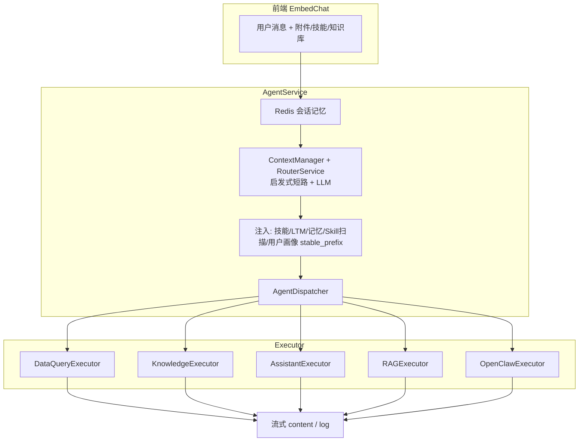
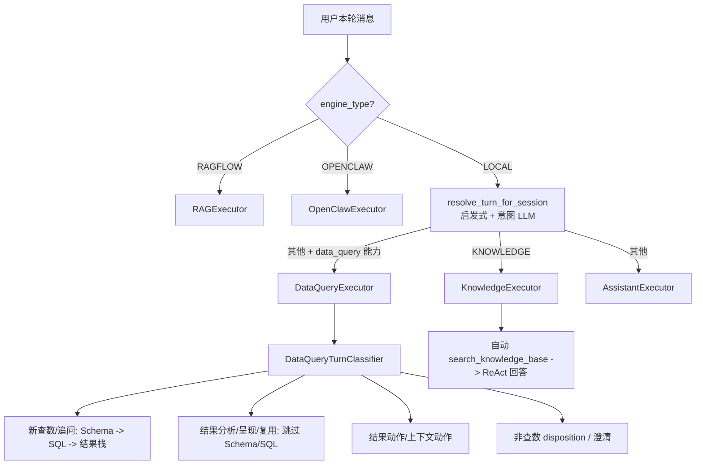

# 智能体执行流程架构评审

> 文档日期：2026-05-30（评审记录）；2026-06-01 更新 ChatBI 请求类别拆分；2026-06-02 更新路由通用 hint 消费边界；2026-06-09 更新 Assistant / Knowledge 独立 Executor；**2026-06-19 更新路由启发式、工具预检、反幻觉 Guard、Skill 自动扫描**
> 范围：EmbedChat -> AgentService -> Dispatcher -> Executors（Data / Knowledge / Assistant / RAG / OpenClaw）
> 关联改动：`turn_classifier.py` 通用化、`data_query_turn_classifier.py`、Dispatcher 只做执行器选择、DataQueryExecutor 内部请求类别分析

**规范文档（请以代码同步维护）**：

- [chat/CHAT_FLOW.md](./chat/CHAT_FLOW.md) — 端到端聊天流程
- [chat/PROMPT_LAYERS.md](./chat/PROMPT_LAYERS.md) — 提示词分层与 `PLATFORM_GLOBAL_SYSTEM_PROMPT`

本文档保留执行流评审与优化优先级，不作为唯一流程说明。当前实现已不再使用历史缩写命名；ChatBI 内部请求类别为「新数据查询 / 复用上一轮结果 / 上下文动作 / 技能执行」。

---

## 1. 智能体执行流程总览



**一轮请求的主路径**：Redis 读历史 -> 路由选智能体 -> 注入上下文 -> Dispatcher 选 Executor -> ReAct/合成 -> 写回 Redis + Trace。

当前分类边界：

- `TurnClassification` 是通用会话请求分类，只表达 `DATA_QUERY_REQUEST / CONTEXT_ACTION / SKILL_EXECUTION / META_ACTION / GENERAL / KNOWLEDGE` 等跨执行器概念。
- `shared_turn` 由 `resolve_turn_for_session` 统一产出（启发式 + 意图 LLM），供 Dispatcher 与各 Executor 复用，避免重复意图调用。
- 路由层输出的 `turn_labels / relation_to_previous / user_action_type` 是通用 hint，可被 Assistant 参考；当前仅把它注入为弱提示词，不做硬分支。
- **RouterService** 在 LLM 前尝试：问候短路、联网短路、ChatBI 亲和性 `BREAK` 打断（`resolve_data_agent_session_affinity`；`UNCERTAIN` 不短路）。
- 显式 `agent_id` / 专家模式 → `direct_agent_selection`，跳过自动路由与主助手数据反幻觉 Guard。
- ChatBI 专用请求类别由 `DataQueryTurnClassifier` 在 `DataQueryExecutor` 内部执行（新查数 / 追问 / 结果分析与呈现 / 动作 / 元数据 / 非查数处置等），详见 [CHAT_BI_DESIGN.md](./CHAT_BI_DESIGN.md)。

---

## 2. 请求类别模型

### 2.1 通用会话分类（`turn_classifier.py`）

| 类型 | 含义 | 典型用户说法 | 主要消费者 |
|------|------|--------------|------------|
| `DATA_QUERY_REQUEST` | 数据查询类请求 | 「查用户列表」「查 PUE 并可视化」 | AgentService 日志、上下文注入裁剪 |
| `CONTEXT_ACTION` | 对已有上下文做动作 | 「保存这个结果」「导出上面表格」 | Assistant / Knowledge 类执行器 |
| `SKILL_EXECUTION` | 显式使用技能 | 「使用用户列表查询技能」 | DataQuery / Assistant |
| `META_ACTION` | 创建/保存技能等元操作 | 「把流程保存为技能」 | AssistantExecutor |
| `KNOWLEDGE` | 知识库/SOP | 「处理流程是什么」 | **KnowledgeExecutor**（自动 `search_knowledge_base`） |
| `GENERAL` | 通用助手 | 「你好」、工具调用、元操作等 | **AssistantExecutor** |

### 2.2 ChatBI 专用请求类别（`data_query_turn_classifier.py`）

权威类型与处置见 [CHAT_BI_DESIGN.md](./CHAT_BI_DESIGN.md)。摘要：

| 类型 | 含义 | 典型用户说法 | 经验库 | 查库护栏 |
|------|------|--------------|--------|----------|
| `NEW_DATA_QUERY` / `DATA_FOLLOWUP_QUERY` | 新查数或带上下文追问 | 「查用户列表」「按区域再拆」 | 是 | 是 |
| `RESULT_ANALYSIS` / `RESULT_PRESENTATION` / `REUSE_PREVIOUS_RESULT` / `FORMAT_CORRECTION` | 基于结果栈分析/呈现/复用 | 「画个柱状图」「分析刚才的结果」 | 否 | 否 |
| `RESULT_ACTION` / `CONTEXT_ACTION` | 对已有结果做导出/保存/简报/监控等 | 「保存这个结果」「做成简报」 | 否 | 否 |
| `METADATA_QUERY` | 元数据/有哪些表字段 | 「有哪些数据集」 | 否 | 否 |
| `NON_DATA_REQUEST` / `CLARIFICATION_REQUIRED` | 非查数处置或查数澄清 | 「帮我写邮件」/「查销售」（缺条件） | 否 | 否 |
| `SKILL_EXECUTION` | 显式使用技能 | 「使用用户列表查询技能」 | 是 | 按技能 |

ChatBI 请求类别采用 **LLM 主判、规则兜底**：

- 主路径：LLM 结合最近对话、当前用户问题与结果栈 / `last_data_result` 状态输出上述类型之一。
- 兜底路径：仅当 LLM 返回无效内容或调用失败时，使用轻量规则判断。
- 非查数：按 `NonDataDisposition`（本地帮助 / 结果动作 / `agent_handoff` 委派），澄清仅用于缺执行条件。
- 复用保护：若判断为复用但无可引用结构化结果，直接提示缺少结果，不把展示追问当成 Schema 关键词。

### 2.3 分类流程（当前实现）



实现位置：`turn_classifier.py`、`data_query_turn_classifier.py`、`dispatcher.py`、`executors/data_executor.py`、`runners/chatbi/`。

---

## 3. Dispatcher（路由层）

Dispatcher 当前只负责选择执行器：

| 条件 | 去向 |
|------|------|
| `engine_type=RAGFLOW` | RAGExecutor |
| `engine_type=OPENCLAW` | OpenClawExecutor |
| `TurnType=KNOWLEDGE` | **KnowledgeExecutor**（优先于 ChatBI，即使 agent 有 `data_query`） |
| 具备 `data_query` 能力 | DataQueryExecutor（ChatBI 内部再分析请求类别） |
| 其余 | **AssistantExecutor**（复用 `shared_turn`，并参考路由通用 hint） |

AgentService 统一输出「轮次分类」日志；ChatBI 场景在 `DATA_QUERY_REQUEST` 时外层显示「ChatBI 请求类别分析」，DataQueryExecutor 再输出「ChatBI 请求类别分析结果」。

---

## 4. DataQueryExecutor（ChatBI 核心）

当前职责：

- 进入执行器后第一步执行 `resolve_data_query_turn_classification`。
- 新数据查询：检索经验库、加载数据集菜单、获取 Schema、生成并执行 SQL、汇总结果。
- 复用上一轮结果：读取会话最近一次结构化查询结果，跳过 Schema/SQL，直接合成分析或可视化说明。
- 上下文动作：注入上一轮结构化结果，放宽“必须查库”护栏，允许保存、导出、记忆、创建技能等动作。
- 多轮新数据查询：对「那本月呢」这类上下文依赖短句改写为独立查数问题，用于经验库和 Schema 检索。

做得好的：

- 请求类别护栏 + DB 提示词对齐
- 技能自动注入 + `MUST_LOAD_SKILL_FIRST`
- `_analyze_result` 增强，避免 SQL 报错误走 fast-path
- 复用上一轮结果 vs「查数+可视化」复合句区分
- 经验库、比率异常复核、SQL plan 等高风险保护

仍可优化：

| 问题 | 建议 |
|------|------|
| ReAct 步数 + 多层护栏叠加 | 按 `DataQueryTurnClassification` 进一步裁剪步骤上限 |
| 与 Assistant 大量重复代码 | 继续沉淀到 `executors/common.py` |
| 合成阶段与 ReAct 双 LLM | 简单新数据查询结果允许最后一轮 thought 直出（可选） |

---

## 5. KnowledgeExecutor

- 独立执行器：`KnowledgeExecutor` → `KnowledgeAgentRunner`（继承 Assistant 的 AgentScope 流式/citation 能力）。
- ReAct 开始前平台侧**自动**调用 `search_knowledge_base`，检索结果注入 system prompt（类似 ChatBI 自动 Schema）。
- 可挂载 agent 配置的业务工具，用于后续知识库相关扩展。
- 不再由 Assistant 绑定或护栏 `search_knowledge_base`。

## 6. AssistantExecutor

- 通用助手执行器：`AssistantExecutor` → `AssistantAgentRunner`。
- 系统隐式工具（create_skills、memory_search、任务等）是元操作、上下文动作、技能的正确归宿。
- 非 ChatBI / 非 Knowledge 的 `GENERAL`、`META_ACTION`、`CONTEXT_ACTION` 等轮次走此链路。
- `turn_labels / relation_to_previous / user_action_type` 会作为「路由层通用理解」注入 system prompt；仅弱 hint，不驱动硬分支。
- **工具预检**（`tool_nudge_policy` + `agent_tool_preflight_mode`）：按已绑定工具 description 相关度注入便签；`hard` 模式首步强制 ToolChoice。
- **数据反幻觉 Guard**：仅主助手 + 非 `direct_agent_selection` + 强查数信号；拦截假 ChatBI 话术或「表格+内网 IP/内部字段」类编造；可 yield `quick:/switch_agent_expert`。
- **Skill 自动扫描**（主助手）：`skill_auto_scan_*` 配置，未挂载技能时按问题扫描技能库。

---

## 7. 跨 Executor 对比

```text
┌─────────────────┬──────────────┬──────────────┬──────────────┬─────────────┐
│                 │ DataQuery    │ Knowledge    │ Assistant    │ RAG/OpenClaw│
├─────────────────┼──────────────┼──────────────┼──────────────┼─────────────┤
│ BaseExecutor    │ ✓            │ ✓            │ ✓            │ ✓           │
│ 系统隐式工具    │ ✓            │ 可选         │ ✓            │ N/A         │
│ 请求分类        │ 内部专用     │ 通用 KNOWLEDGE│ 通用其余    │ 远程/专用   │
│ 知识库检索      │ ✗            │ 自动 prefetch │ ✗            │ N/A         │
│ 工具错误分析    │ 强           │ 中           │ 弱/分散      │ 远程        │
│ 历史/附件转换   │ common       │ common       │ common       │ 简单        │
│ MAX_STEPS 默认  │ 6            │ 5            │ 5            │ -           │
└─────────────────┴──────────────┴──────────────┴──────────────┴─────────────┘
```

---

## 8. 优化优先级

### 已落地

1. 通用 `TurnClassification` 与 ChatBI `DataQueryTurnClassification` 拆分
2. Dispatcher 只按执行器能力分发，ChatBI 请求类别由 DataQueryExecutor 内部决定
3. DataQueryExecutor：非新数据查询跳过经验库检索
4. KNOWLEDGE 独立 `KnowledgeExecutor`，自动 `search_knowledge_base`
5. `GeneralChat*` 重命名为 `Assistant*`（通用助手，非闲聊专用）
6. 多智能体共享 `session_turn`（通用分类 + 意图 LLM）
7. RAGExecutor：`conversation_id` 修复
8. 路由启发式短路（问候/联网/ChatBI 亲和性三态，仅 `BREAK` 打断）与 `resolve_data_agent_session_affinity`
9. 主助手工具预检（`tool_nudge_policy`）与 Skill 自动扫描
10. 主助手数据反幻觉 Guard 收紧 + 专家直选 bypass
11. ChatBI `sql_plan` 可选门禁（`enable_sql_plan`）+ 前端 SqlPlanCard 渲染

### 后续可选

- DataExecutor 简单成功结果减少双轮 LLM
- RAG 去掉 0.5s sleep
- OpenClaw 安全审计分层

---

## 9. 总结

整体架构已收敛为：

`AgentService 编排 -> resolve_turn_for_session（启发式 + 意图 LLM）-> Dispatcher 选 Executor -> Executor 内部执行自己的工具/护栏策略`

三条 LOCAL 专属链路并列：**Knowledge**（知识库）、**DataQuery**（ChatBI）、**Assistant**（通用助手）。ChatBI 不再把内部查数请求类别塞进通用 `shared_turn`；Knowledge / Assistant 若需更细分类，应在各自 executor 内部扩展。
