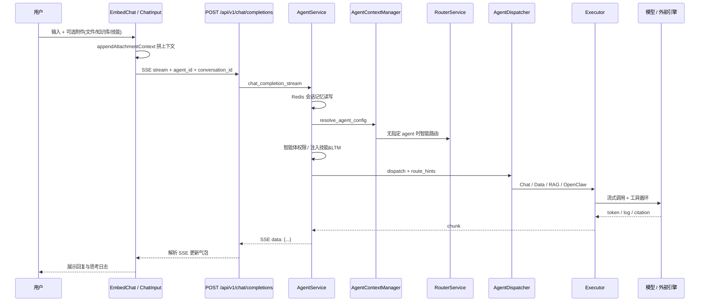
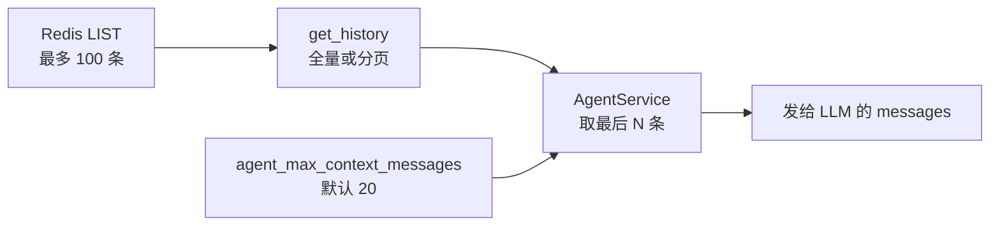
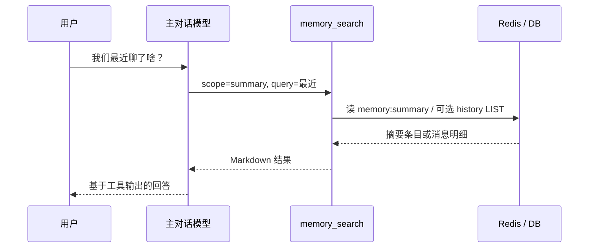

# 聊天流程说明（Chat Flow）

本文描述南孜智能体平台从用户发消息到看到回复的端到端流程。以 **Embed 对话页**（`EmbedChat.vue`）为主；**Agent 调试页**（`AgentDebug.vue`）逻辑类似，额外支持 `debug_options` 覆盖模型等调试项。

**提示词分层**（`system_prompt` 栈、全局守则、轮次裁剪）见同目录 [PROMPT_LAYERS.md](./PROMPT_LAYERS.md)。目录索引：[README.md](./README.md)。

---

## 总览



---

## 1. 前端：发消息前

**入口**：`frontend/src/views/EmbedChat.vue` → `frontend/src/components/embed/ChatInput.vue` 点击发送或快捷指令。

### 1.1 收集内容

- **文本**：`userInput`
- **附件**：`uploadedFiles`（本地文件、知识库、`type: skill` 技能工作流）

### 1.2 拼进用户消息（`appendAttachmentContext`）

| 附件类型 | 处理方式 |
|----------|----------|
| 普通文件 | 写明服务器路径 `/app/data/uploads/...` |
| 知识库 | 注入「必须调用 `search_knowledge_base`」等说明；与用户文字用 `---` 分隔 |
| 技能 | 写明技能名与 `SKILL.md` 路径（如 `/app/data/skills/{id}/SKILL.md`） |

选知识库时还可将 `routingMode` 切到 **专家模式**（`expert`），并绑定知识库专家智能体。

### 1.3 会话 ID

- 无则 `generateNewConversation()`
- 持久化：`localStorage` 键 `yovole_embed_conv_id`
- **切换 / 新建会话前**：对**即将离开**的 `conversation_id` 调用 `POST /api/v1/chat/conversation/{id}/finalize`，强制刷新跨会话摘要（跳过防抖）；实现见 `frontend/src/utils/conversationFinalize.ts`（Embed / Agent 调试均已接入）

### 1.4 鉴权

- 父页面通过 `postMessage` 注入 `token` / `api_key` / `apikey`
- 写入请求头：`Authorization: Bearer ...` 与 `X-API-Key`

### 1.5 选择智能体（请求体 `agent_id`）

| 条件 | 使用的 ID |
|------|-----------|
| `routingMode === 'expert'` 且已选专家 | `config.expertAgentId`（后端 `route_hints.direct_agent_selection=true`，跳过自动路由与主助手反幻觉 Guard） |
| 否则 | `config.overrideAgentId`（`@` 提及）或 `config.agentId`（嵌入默认） |

### 1.6 UI 反馈

- 先 push **用户消息**（含 `files` 元数据）
- 再 push 一条 **agent 占位消息**（`isThinking: true`）
- 清空输入框与 `uploadedFiles`

---

## 2. 前端：调用 API

**接口**：`POST /api/v1/chat/completions`

### 2.1 主要请求字段

| 字段 | 作用 |
|------|------|
| `messages` | 历史 + 本轮用户消息（含 `files`） |
| `stream` | `true` 时使用 SSE |
| `agent_id` | 指定或由后端路由后的智能体 |
| `conversation_id` | 服务端 Redis 会话记忆 |
| `enable_multi_agent` | 是否启用多智能体协同 |
| `debug_options.injected_context` | 页面信息、用户身份等注入上下文 |

### 2.2 流式响应解析

使用 `fetch` + `ReadableStream` 读取 `data: {...}\n\n`，按 chunk 类型更新 UI：

| SSE 字段 `type` / 形态 | 前端处理 |
|------------------------|----------|
| `trace_id` | 绑定追踪 ID |
| `content` | 追加助手正文 |
| `log` | 思考/工具步骤日志 |
| `router_log` | 智能路由决策展示，包含 `selected_agent`、`confidence`、`thought`，以及通用 hint：`turn_labels`、`relation_to_previous`、`user_action_type` |
| `citation` | 知识库引用来源 |
| `meta` | 智能体显示名等 |
| `[DONE]` | 流结束 |

路由层通用 hint 只表达“这轮像不像追问 / 上下文动作 / 切换话题”等跨智能体理解，不表达 ChatBI 内部的“新查数 / 复用结果 / 上下文动作 / 技能执行”。后端会把这些 hint 透传给 executor：

- Assistant 会把 hint 作为弱 system prompt 参考，让 LLM 结合完整上下文自行判断如何回答。
- ChatBI 不用这组 hint 决定查数流程，进入 `DataQueryExecutor` 后会再做 ChatBI 请求类别分析。

---

## 3. API 层

**文件**：`app/api/v1/endpoints/chat.py`

1. `require_api_key` 校验登录 / API Key，得到 `user_info`
2. `set_debug_context(debug_options)`（调试页可覆盖模型等）
3. **流式**：调用 `agent_service.chat_completion_stream(...)`，每块格式化为 SSE
4. **非流式**：调用 `agent_service.chat_completion(...)`，返回标准 JSON 包装

---

## 4. AgentService 编排核心

**文件**：`app/services/ai/agent_service.py` → `chat_completion_stream`

### 4.1 会话记忆（Redis）

**实现**：`app/services/ai/memory_service.py` → `MemoryService`

有 `conversation_id` 时，`AgentService` 会：

1. 从 Redis 拉取该用户、该会话的历史
2. 将本轮 user 消息**异步** `add_message` 写入 Redis
3. 用「历史 + 本轮」组成后续 `messages`（再经路由/执行器处理）

#### Redis Key 设计

**对话历史（主 Key）**

```text
conversation:{user_id}:{conversation_id}:history
```

| 段 | 含义 | 来源 |
|----|------|------|
| `conversation` | 固定前缀 | `MemoryService.KEY_PREFIX` |
| `{user_id}` | 登录用户 ID | API Key 解析的 `user_info.user_id`；缺失时 fallback 为 `anonymous` |
| `{conversation_id}` | 会话 UUID | 前端 `crypto.randomUUID()`，存 `localStorage`（`yovole_embed_conv_id`） |
| `history` | 固定后缀 | `MemoryService.HISTORY_SUFFIX` |

示例：

```text
conversation:42:a1b2c3d4-e5f6-7890-abcd-ef1234567890:history
```

**最近一次 SQL 结构化结果（兼容 Key，ChatBI 追问复用）**

```text
conversation:{user_id}:{conversation_id}:last_data_result
```

- 类型：Redis **STRING**（JSON），TTL 与历史一致（默认 7 天）
- 方法：`get_last_data_result` / `set_last_data_result`
- 说明：新链路在 SQL 成功后会**双写**本键与结果栈；纯依赖本键的旧路径仍可用

**ChatBI 结果栈（连续分析主 Key）**

```text
conversation:{user_id}:{conversation_id}:data_result_stack_v1
```

- 类型：Redis **STRING**（JSON 数组 / 栈结构），元素为 `ChatBIResultRef`
- 用途：结果引用、条件继承下钻、简报/监控绑定 `result_id`；实现见 `chatbi_result_stack.py`

**长期记忆 LTM（与会话无关，按用户维度）**

```text
nanzi:agent:ltm:{user_id}
```

- 类型：Redis **HASH**，存偏好/facts，由 `LongTermMemoryService` 管理
- 在 `AgentService` 中注入 `system_prompt`，**不**使用 `conversation_id`

#### 数据结构（history）

- **Redis 类型**：**LIST**（`RPUSH` 追加，按时间顺序从旧到新）
- **元素**：每条消息一个 JSON 字符串

```json
{
  "role": "user | assistant",
  "content": "...",
  "trace_id": "可选，关联执行追踪",
  "timestamp": "ISO8601",
  "files": [ { "type", "url", "filename", ... } ]
}
```

写入时使用 pipeline：`RPUSH` → `LTRIM`（截断）→ `EXPIRE`（刷新 TTL）。

#### 容量与 TTL

| 参数 | 默认值 | 说明 |
|------|--------|------|
| `max_history_turns` | 50 | 最多保留 50 **轮**对话 |
| `max_history_len` | 100 | LIST 最多 **100 条**消息（user + assistant 各算一条） |
| `ttl` | 604800（7 天） | 每次 `add_message` 刷新过期时间 |

#### 三层「条数」限制（勿混淆）



| 层级 | 限制 | 配置 / 代码 |
|------|------|-------------|
| Redis 存储 | 最多 100 条消息 | `MemoryService.max_history_len` |
| UI 拉历史 | 可分页 `limit` / `offset` | `GET /api/v1/conversation/{conversation_id}` |
| 发给模型 | 默认最近 20 条 + 本轮 user | `ConfigService` → `agent_max_context_messages` |

典型一轮请求顺序：

1. `get_history(user_id, conversation_id)` → 读出 Redis 中该 key 的列表（≤100 条）
2. `asyncio.create_task(add_message(...))` → 异步写入本轮 user
3. `messages = context_history[-max_context:] + [user_msg]` → 再进入路由与执行

#### 用户隔离

- 同一 `conversation_id`，不同 `user_id` → **不同 Redis key**，互不可见
- `conversation_id` 由客户端生成，安全性依赖「难以猜测的 UUID + 必须带有效 API Key 的 user_id」

#### Redis 连接

- 配置：`app/core/config.py`（`REDIS_HOST` / `REDIS_PORT` / `REDIS_DB`）
- 客户端：`app/core/redis.py`；`REDIS_ENABLE=false` 时 `get_history` / `add_message` 静默降级（返回空、不写）
- **RediSearch 向量索引**：须 **Redis Stack**（含 `search` 模块），且环境变量 **`REDIS_DB=0`**（索引只能建在 database 0）。记忆管理中心进入时会先做向量环境检测（`GET /api/portal/memory/redis-vector-test`），未通过则页内功能禁用。

#### 跨会话：摘要存储 + `memory_search`（按需检索，已实现）

**原则**：跨会话「最近聊了啥」**不**在 `AgentService` 里自动注入 `system_prompt`（与 LTM 的启动时注入不同）。用户问到时再调内置工具 **`memory_search`**，由模型主动拉取，避免每轮占 token、也避免无关旧话题干扰。



##### Redis Stack 摘要索引（写侧，与单会话 history 并列）

**明细（已有）**：`conversation:{user_id}:{conversation_id}:history`

**会话摘要（已实现）**：`memory:summary:{user_id}:{conversation_id}`（HASH + RediSearch `VECTOR`）

**每日聚合摘要（已实现）**：`memory:summary:daily:{user_id}:{yyyy-mm-dd}`（HASH + RediSearch `VECTOR`）

- 会话摘要必须含 **`conversation_id`**（与 LIST key 相同），供 `memory_search(scope=history)` 拼 key 拉明细
- 每日摘要的 `conversation_id` 约定为 `daily:{yyyy-mm-dd}`，用于「今天/昨天/最近」这类跨会话回顾；它是聚合层，不替代会话摘要
- **全局索引**：`nanzi:idx:memory:session_summary`（代码写死，`PREFIX memory:summary:`），覆盖 session + daily 两类摘要，KNN 语义检索 + `@user_id` TAG 过滤
- **完整规格**：[`docs/superpowers/specs/2026-05-27-memory-search-redis-stack-design.md`](docs/superpowers/specs/2026-05-27-memory-search-redis-stack-design.md)

会话摘要字段示例：

```json
{
  "user_id": "42",
  "conversation_id": "uuid-与-history-LIST-相同",
  "summary_type": "session",
  "memory_type": "project",
  "title": "知识库权限咨询",
  "summary": "用户问 Embed 选库与 dataset 权限…",
  "key_facts": "[\"一个 conversation_id 对应一条 session summary\"]",
  "decisions": "[\"保留 conversation_id 粒度\"]",
  "open_items": "[\"后续补管理 UI\"]",
  "entities": "[\"memory_search\", \"Redis\"]",
  "last_active": 1716800000,
  "turn_count": 6,
  "embedding": "[VECTOR 存 RediSearch 字段，非 JSON 内数组]"
}
```

每日摘要字段示例：

```json
{
  "user_id": "42",
  "conversation_id": "daily:2026-05-28",
  "summary_type": "daily",
  "date": "2026-05-28",
  "title": "今日记忆管理优化",
  "summary": "今天围绕记忆管理讨论了 session summary、daily rollup 与 RediSearch KNN 检索。",
  "topics": "[\"记忆管理\", \"Redis 向量检索\"]",
  "decisions": "[\"保留 session summary\", \"新增 daily summary 聚合层\"]",
  "open_items": "[]",
  "entities": "[\"DailySummaryService\", \"memory_search\"]",
  "last_active": 1716800000,
  "turn_count": 12,
  "embedding": "[VECTOR 存 RediSearch 字段，非 JSON 内数组]"
}
```

##### 摘要何时写入（仍需要，供工具读）

工具只读；摘要需后台异步生成（**不阻塞 SSE**）：

| 触发 | 说明 |
|------|------|
| **主** | 每轮 assistant 流结束且成功 → `finally` 里 `create_task`，合并更新该 `conversation_id` 对应 session summary（带防抖：如 3 轮一次 / 5 分钟 / 跳过过短回复） |
| **辅** | 前端新建/切换会话前 → `POST /api/v1/chat/conversation/{id}/finalize` 强制 flush（Embed / Agent 调试已接入） |
| **可选** | 会话空闲 15～30 分钟定时任务 |

session summary 写入成功后，会由 `DailySummaryService.refresh_for_date(user_id)` 读取当天该用户的 session summaries，合并刷新 `memory:summary:daily:{user_id}:{yyyy-mm-dd}`。daily summary 不直接读取原始 history，避免重复消耗长上下文。

失败只打日志，不影响当轮回复。Embedding 调用失败时仍会写入 **无向量** 的摘要（`title` / `summary` 文本），仅语义 KNN 检索变弱。

**强制刷新 API**：`POST /api/v1/chat/conversation/{conversation_id}/finalize`（`SessionSummaryService.finalize_session`，跳过防抖）。

**摘要 Prompt**：

- session summary：`ConversationSummarizer.summarize` 输出结构化 JSON：`title`、`summary`、`key_facts`、`decisions`、`open_items`、`entities`、`memory_type`
- daily summary：`ConversationSummarizer.summarize_daily` 输出结构化 JSON：`title`、`summary`、`topics`、`decisions`、`open_items`、`entities`
- embedding 文本不只使用 `title + summary`，还会拼入事实、决策、未完成事项、实体等结构化字段，提升后续语义检索命中率

##### 内置工具 `memory_search`（读侧，已实现）

**实现**：`app/services/ai/tools/memory_search_tool.py`

**注册**：`ToolRegistry.get_system_implicit_tools()`（如 `fetch_user_long_term_memory`），`AssistantExecutor` 默认可用。`search_knowledge_base` 由 `KnowledgeExecutor` 自动挂载，不再由 Assistant 绑定。

**安全**：`user_id` **仅**从 `get_current_agent_context()` 读取，**不信任**模型传入的 user_id；仅能查当前登录用户自己的数据。

**`AgentContext.conversation_id`**：在 `AgentContextManager.setup_context` 传入当前请求会话，供 `scope=history` / `both` 默认定位会话。

**工具描述（供模型）示例**：

> 检索当前用户的历史会话：跨会话摘要（最近几个会话聊了什么）或指定会话的消息明细。当用户问「我们最近聊了啥」「上次讨论的内容」「某次对话里我说了什么」时调用。

**参数（建议）**：

| 参数 | 类型 | 说明 |
|------|------|------|
| `scope` | `summary` \| `history` \| `both` | `summary`：跨会话摘要（RediSearch / 按时间）；`history`：指定会话 Redis LIST；`both`：先摘要再拉明细 |
| `query` | 可选 string | 有则对 query 做 embedding 后 **RediSearch KNN**；无则按 `last_active` 取最近 N 条摘要 |
| `conversation_id` | 可选 string | 指定会话；省略则 `summary` 返回最近 N 条会话列表 |
| `limit` | int，默认 5 | 摘要条数或 history 消息条数上限 |

**读取逻辑**：

| scope | 数据源 | 返回内容 |
|-------|--------|----------|
| `summary` | RediSearch `nanzi:idx:memory:session_summary` + `@user_id` | 有 query 时走 RediSearch KNN；返回 session / daily 摘要的 `conversation_id`、`summary_type`、`title`、`summary`、`last_active`、`score` 等；无 query 时按时间取最近 session 摘要 |
| `history` | `conversation:{uid}:{cid}:history` | 该会话最近 `limit` 条 user/assistant（脱敏后）；`cid` 必填或默认当前 `AgentContext.conversation_id` |
| `both` | 先 summary 再 history | 先列相关会话，再对最相关 1 条拉明细（控制总长度） |

**二期可选**：Redis 已过期时，从 MySQL `AgentExecutionHistory`（按 `user_id` + `conversation_id`）补 `query` / `summary` 字段，标注「来自归档，可能不完整」。

**与自动注入的对比**：

| 方式 | 行为 |
|------|------|
| ~~自动读 summary 注入 system~~ | **不做** |
| LTM `fetch_user_long_term_memory` | 模型**主动**调工具查 HASH 偏好（已有） |
| **`memory_search`** | 模型**主动**查跨会话摘要 / 会话明细（**已实现**） |
| 当前会话上下文 | 仍靠 `conversation:{uid}:{cid}:history` + `agent_max_context_messages` |

**用户问「最近聊了啥」的推荐链路**：

1. 模型识别为回顾历史 → 调用 `memory_search(scope="summary", query="最近")`
2. 若用户追问某次细节 → 再调 `memory_search(scope="history", conversation_id="...")`
3. 用工具返回组织回答，**不**编造未出现在工具输出中的内容

##### 记忆管理中心（配置与运维，非系统设置）

在 **智能体开发平台** 侧栏 **「记忆管理中心」**（`/dashboard/memory`，`MemoryManagement.vue`）。**权限按菜单控制**：`menu:memory_management` + `element:memory:*`（与知识库一致，不走系统设置）。

**进入页面前置检查**：`GET /api/portal/memory/redis-vector-test`（Redis Stack + `REDIS_DB=0` + 向量索引探针）。未通过则展示修复指引，页内配置/数据/检索测试均不可用。

| Tab | 能力 |
|-----|------|
| 服务配置 | `memory_service_configs` 分组表单（总开关 / 摘要开关、Embedding、防抖、TTL 等）；测试 Embedding；检查/创建索引 `nanzi:idx:memory:session_summary`（索引名代码写死，不可配置） |
| 记忆数据 | 默认展示 **每日摘要**，可切换到 **会话摘要**；支持用户、用户名、关键词和日期筛选；daily 详情展示主题/决策/待办/关联会话，会话详情展示结构化摘要与 Redis history；删除按钮只删除 summary，不删除 Redis history（历史由会话/聊天侧流程管理） |
| 记忆检索测试 | `POST /api/portal/memory/search-test`，与 `memory_search` 同源；支持用户 ID / 用户名 |

配置表 **`memory_service_configs`**（`MemoryConfigService`），**与 `system_configs` 分离**。Portal API：`app/api/portal/endpoints/memory.py`（挂 `/api/portal/memory`）。

数据库迁移：`db-prod/V59-memory-management-module.sql`（表 + 权限种子）；`V60-drop-memory-redis-index-config.sql`（移除已废弃的 `memory_redis_index_name` 配置项）。

规格与设计背景：[`docs/superpowers/specs/2026-05-27-memory-search-redis-stack-design.md`](docs/superpowers/specs/2026-05-27-memory-search-redis-stack-design.md)。

### 4.2 解析 @ 智能体

- 正文形如 `@某智能体名 问题`，且未传 `agent_id` 时
- 拆出 `agent_name`，按名称直接选智能体

### 4.3 解析智能体配置（路由）

**文件**：`app/services/ai/context_manager.py` → `resolve_agent_config`

| 条件 | 行为 |
|------|------|
| 传了 `version_id` | 加载指定版本配置 |
| 传了 `agent_id` / `agent_name` | 直接加载该智能体；设置 `route_hints.direct_agent_selection=True` |
| 都未传 | `RouterService.route_query`：先启发式短路（问候/联网/ChatBI 亲和性 `BREAK`），再 LLM 选型；`UNCERTAIN` 不短路 |
| 仍无配置 | 回退 **Assistant** 默认配置 |

路由结果通过 SSE 发送 `router_log`，并写入执行 trace。`turn_labels`、`relation_to_previous`、`user_action_type` 只表示路由层对当前轮次的通用理解，供 executor 参考；各 executor 是否使用这些 hint，由自身业务流程决定。

### 4.4 智能体访问权限

- 非 `admin`：检查 `permissions.agents` 是否包含当前 `agent_id`
- 无权限：直接 yield 拒绝文案，不进入执行器

### 4.5 上下文注入（`system_prompt` 与 `messages`）

详见 [PROMPT_LAYERS.md](./PROMPT_LAYERS.md)。摘要如下：

**`agent_config.system_prompt`（LOCAL）** — 在 DB 智能体专规之上 prepend；最后一步加上 **`PLATFORM_GLOBAL_SYSTEM_PROMPT`**（平台全局守则，常量见 `agent_prompts.py`）。典型栈顶→栈底：全局守则 → 预加载记忆 → 跨会话 hint → LTM → 技能发现/技能全文 → **DB system_prompt**。

**不进独立 `messages` system 行（已并入 PromptAssembler）**：

- **用户画像**（账号、部门、称呼）：由 `PromptAssembler` 写入 `stable_prefix`（与平台全局守则、DB `system_prompt` 同栈）；查数轮次可在裁剪逻辑中省略。启用 `cache_reorder` 时画像位于 cache boundary 之前，避免长对话截断丢失。
- **Embed 宿主上下文**：`debug_options.injected_context` → 仍为独立 `role: system`（设备、页面信息、移动/桌面 UI）。

跨会话「最近聊了啥」：**不**自动注入摘要全文；条件注入 `[跨会话记忆检索]` hint + 模型调用 **`memory_search`**（§4.1）。

**主助手专属编排**（`agent_service.py`）：

- **Skill 自动扫描**：未挂载/口头解析技能时，对主通用助手按用户问题扫描技能库（`skill_auto_scan_enabled` / `min_score` / `max_results`），注入 Frontmatter 摘要。
- **工具预检**：在 `AssistantAgentRunner` 内按 `agent_tool_preflight_mode`（`off` / `soft` / `hard`）注入工具促发便签，可选首步强制 `ToolChoice`（见 `tool_nudge_policy.py`）。

**调试**：`system_prompt_override` 在全部 prepend **之后**整段替换（含全局块）。

`AgentContextManager.setup_context` 将 `user_id`、`admin`、`api_key`、`conversation_id` 写入运行时上下文，供工具与 SQL 改写使用。

### 4.6 执行分支

| 条件 | 路径 |
|------|------|
| `enable_multi_agent` 且 `route_details.secondary_agents` 非空 | `_execute_multi_agent` 多智能体协同 |
| 否则 | `AgentDispatcher.dispatch` → 单执行器 `execute` 流式产出 |

### 4.7 收尾

- 将 assistant 全文异步写入 Redis（有 `conversation_id` 时）
- 审计 / trace 持久化到数据库（步骤、工具调用等）

---

## 5. AgentDispatcher：选择执行器

**文件**：`app/services/ai/dispatcher.py`

| 智能体 `engine_type` | 执行器 | 说明 |
|---------------------|--------|------|
| `RAGFLOW` | `RAGExecutor` | 走 RAGFlow 应用对话 |
| `OPENCLAW` | `OpenClawExecutor` | 走 OpenClaw 引擎 |
| `LOCAL`（默认） | Dispatcher 按 engine/capability 选择执行器 | 见下表 |

**LOCAL 分支**（`app/services/ai/dispatcher.py`）：

| 条件 | 执行器 |
|------|--------|
| `TurnType=KNOWLEDGE` | `KnowledgeExecutor`（优先，即使 agent 有 `data_query`） |
| agent 具备 `data_query` capability | `DataQueryExecutor` |
| 其他本地 agent | `AssistantExecutor` |

`resolve_turn_for_session` 对所有 LOCAL agent 统一走「启发式 + 意图 LLM」三分类（`DATA_QUERY` / `KNOWLEDGE_BASE` / `GENERAL`）。ChatBI 的「新数据查询 / 复用上一轮结果 / 上下文动作 / 技能执行」由 `DataQueryExecutor` 内部的 `DataQueryTurnClassifier` 判定。详见 [../agent_execution_flow_review.md](../agent_execution_flow_review.md) §2。

---

## 6. 本地执行器与 Runner（Knowledge / Assistant / ChatBI）

薄 Executor 仅转发到 Runner；实际 ReAct 由 **AgentScope Agent** 驱动。详见 [../AGENTSCOPE_RUNTIME.md](../AGENTSCOPE_RUNTIME.md)。

### 6.1 KnowledgeExecutor → KnowledgeAgentRunner

| 文件 | 职责 |
|------|------|
| `app/services/ai/executors/knowledge_executor.py` | 薄封装 |
| `app/services/ai/runners/knowledge_agent_runner.py` | 自动知识库检索、ReAct、citation |

1. 自动调用 `search_knowledge_base`，检索结果注入 system prompt
2. AgentScope `reply_stream()` 组织最终回答；可补充检索或调用业务工具

### 6.2 AssistantExecutor → AssistantAgentRunner

| 文件 | 职责 |
|------|------|
| `app/services/ai/executors/assistant_executor.py` | 薄封装，调用 Runner |
| `app/services/ai/runners/assistant_agent_runner.py` | 消息准备、工具解析、事件流 |

1. 按智能体配置从 `ToolRegistry.get_runtime_tools()` 加载 `RuntimeToolSpec` + 系统隐式工具
2. **工具预检**（有工具时）：相关度匹配 → system 顶部便签；`hard` 模式首步 `ToolChoice`
3. `build_messages()` 组装 `system_prompt` + 历史；`build_user_msg()` 处理多模态与附件路径
4. **无工具**：`synthesis_llm.astream()` 直出，不走 AgentScope Agent
5. **有工具**：`Agent(name, model, toolkit, react_config).reply_stream()` → `map_standard_agentscope_event()` 映射 SSE
6. **数据反幻觉 Guard**（主助手 + 自动路由）：流结束后若无工具尝试且输出像编造内部业务数据，拦截并 yield `quick:/switch_agent_expert` 切换链接
7. ASK 工具挂起：`REQUIRE_USER_CONFIRM` → 用户确认后 `UserConfirmResultEvent` 恢复

### 6.3 DataQueryExecutor → DataAgentRunner

| 文件 | 职责 |
|------|------|
| `app/services/ai/executors/data_executor.py` | 薄封装 |
| `app/services/ai/runners/data_agent_runner.py` | ChatBI 薄编排（`_execute_raw`、Runner 门面） |
| `app/services/ai/runners/chatbi/` | ChatBI 域模块（守卫、ReAct、Schema 预取等，见 `README.md`） |

在 AgentScope ReAct 之上叠加 `DataRunState`（`chatbi/run_state.py`）护栏；守卫逻辑分布在 `app/services/ai/runners/chatbi/` 各域模块，Runner 负责编排与向后兼容门面。新查数会先生成 `DataQueryIntentFrame`（`schema_prefetch`），用于 Schema keywords 派生、字段绑定自检、空结果语义修复，并通过“用户需求分析”trace 卡片展示；ReAct 主循环与修复轮在 `native_turn`，事件映射在 `react_stream`。

ChatBI 流式正文中的 `<sql_plan>{...}</sql_plan>` 由前端 `MessageRenderer.vue` + `SqlPlanCard.vue`（`sqlPlan.ts`）解析为结构化卡片，与后端 G6 门禁配合。

`RAGExecutor`、`OpenClawExecutor` 仍走 RAGFlow / OpenClaw 直连，对外同样以 chunk 流返回。

---

## 7. 权限与聊天链路

| 维度 | 是否校验 | 说明 |
|------|----------|------|
| API Key | 是 | 所有 V1 聊天必须经过 |
| 智能体 `agent` | 是（非 admin） | `permissions.agents` |
| 知识库 `dataset` | 是（工具/检索） | `permissions.datasets` + 创建人；与菜单 `element:knowledge:*` 分离 |
| 技能列表 `GET /skills` | 仅登录 | 不按用户过滤条目；返回目录全量技能 |
| 技能管理 CRUD | 是 | `menu:skills_management` |
| Embed「+」菜单入口 | 否 | 三类附件入口对登录用户均可见 |

---

## 8. 典型路径示例

### A. 嵌入页 + 自动路由

用户只输入文字 → 未传 `agent_id` → `RouterService` 选型 → `Assistant` / `Knowledge` / `Data` / `RAG` 执行 → 流式回复。

### B. 嵌入页 + 选择知识库

用户选库 → 正文带检索指令 + 可能切专家智能体 → `TurnType=KNOWLEDGE` 路由至 `KnowledgeExecutor` → 自动 `search_knowledge_base` → 再生成回答。

### C. 嵌入页 + 挂载技能

用户从弹框选技能 → `files` 含 `type: skill` → 前端拼路径说明 + 后端注入技能 **Frontmatter 摘要**（`[Active Skills Loaded]`）→ 模型须 `read_skill_instruction` 读全文后再执行。

---

## 9. 代码与文档索引

| 环节 | 路径 |
|------|------|
| 前端发送 | `frontend/src/views/EmbedChat.vue`（`sendMessage`、`appendAttachmentContext`） |
| 输入组件 | `frontend/src/components/embed/ChatInput.vue` |
| V1 聊天 API | `app/api/v1/endpoints/chat.py` |
| 编排入口 | `app/services/ai/agent_service.py` |
| 平台全局 / 编排提示词 | `app/services/ai/agent_prompts.py` |
| 提示词分层说明 | [PROMPT_LAYERS.md](./PROMPT_LAYERS.md) |
| 配置与路由 | `app/services/ai/context_manager.py`、`app/services/ai/router_service.py` |
| 通用请求分类 | `app/services/ai/turn_classifier.py` |
| ChatBI 请求类别分析 | `app/services/ai/data_query_turn_classifier.py` |
| 执行分发 | `app/services/ai/dispatcher.py` |
| 执行器（薄封装） | `app/services/ai/executors/` |
| Runner（Knowledge / Assistant / ChatBI） | `knowledge_agent_runner.py`、`assistant_agent_runner.py`、`data_agent_runner.py`；ChatBI 域模块见 `runners/chatbi/` |
| AgentScope 运行时 | `app/services/ai/runtime/agentscope/`（`event_stream.py`、`tools.py`、`confirmations.py`） |
| 执行器提示词 | `app/services/ai/executors/prompts.py` |
| AgentScope 架构说明 | [../AGENTSCOPE_RUNTIME.md](../AGENTSCOPE_RUNTIME.md) |
| 会话记忆 | `app/services/ai/memory_service.py` |
| 会话摘要 / 每日摘要 / 索引 | `session_summary_service.py`、`daily_summary_service.py`、`memory_index_service.py`、`conversation_summarizer.py` |
| 跨会话检索工具 | `app/services/ai/tools/memory_search_tool.py` |
| 记忆配置 / Portal | `memory_config_service.py`、`app/api/portal/endpoints/memory.py` |
| 前端 finalize | `frontend/src/utils/conversationFinalize.ts` |
| 记忆管理 UI | `frontend/src/views/MemoryManagement.vue` |
| 工具注册 | `app/services/ai/tools/registry.py` |
| 执行流评审 / 请求类别边界 | [../agent_execution_flow_review.md](../agent_execution_flow_review.md) |
| 智能路由设计 | [../AGENT_ROUTING_DESIGN.md](../AGENT_ROUTING_DESIGN.md) |
| Embed / V1 API 设计 | [../AGENT_APP_DESIGN.md](../AGENT_APP_DESIGN.md) |

---

## 10. 相关配置项

| 配置键 | 默认值 | 说明 |
|--------|--------|------|
| `agent_max_context_messages` | `20` | 发给 LLM 的历史消息条数上限 |
| `llm_model_name` | `DeepSeek-V3.2` | 路由日志与 Assistant 回退模型名 |
| `agent_tool_preflight_mode` | `soft` | 主助手工具预检：`off` / `soft` / `hard` |
| `skill_auto_scan_enabled` | `true` | 主助手是否自动扫描技能库 |
| `skill_auto_scan_min_score` | `0.45` | 技能扫描最低相关度 |
| `skill_auto_scan_max_results` | `1` | 每轮最多注入技能数（上限 3） |
| `SKILLS_DIR` | 见 `app/core/config.py` | 技能物理目录 |

---

*文档版本：2026-07-19。含工具预检、Skill 自动扫描、路由启发式短路、用户画像 stable_prefix、sql_plan 前端卡片、ChatBI 亲和性三态与结果栈 `data_result_stack_v1`。*
