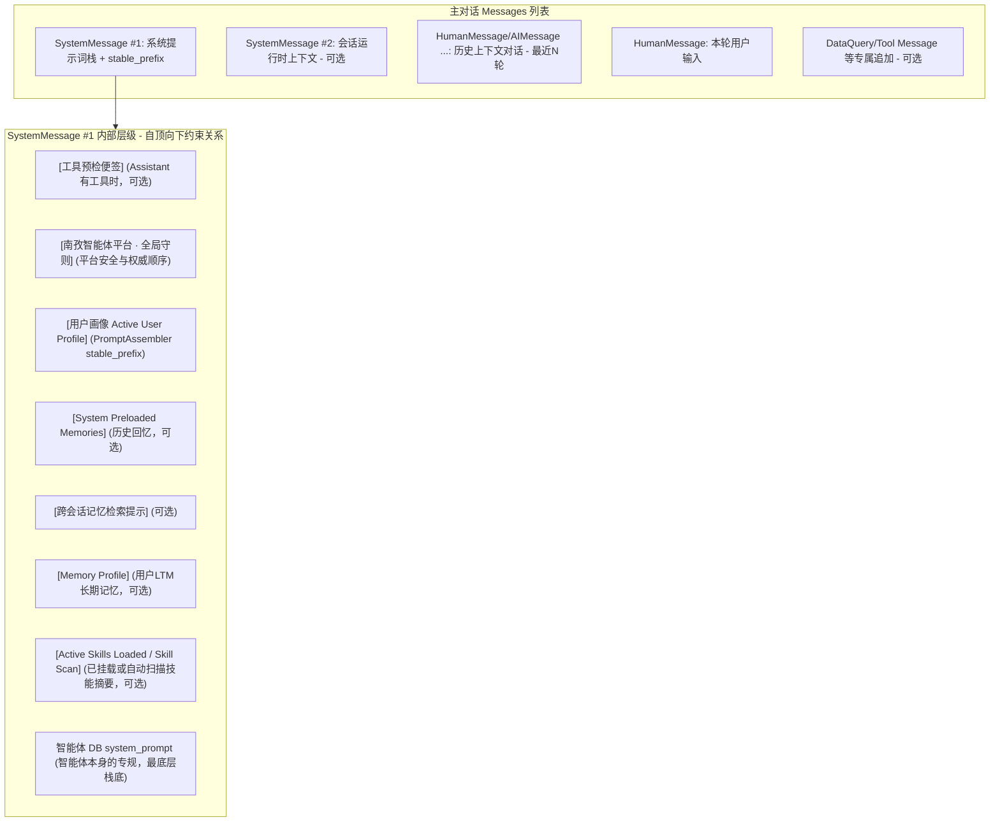

# 提示词分层与注入说明

> 关联：[CHAT_FLOW.md](./CHAT_FLOW.md)（业务流）、代码 `agent_service.py` / `agent_prompts.py` / `executors/prompts.py`  
> 版本：2026-06-19

---

## 1. 三类 LLM 调用（不要混在同一条 messages 里）

| 层级 | 何时触发 | 提示词位置 | 进入主对话？ |
|------|----------|------------|--------------|
| **路由** | 未传 `agent_id` | `RouterService.DEFAULT_SYSTEM_PROMPT` + 启发式短路 | 否 |
| **轮次/意图** | `resolve_turn_for_session` | `IntentService.DEFAULT_SYSTEM_PROMPT` 或启发式 | 否 |
| **主对话** | 执行器 `execute()` | 见下文 | 是 |
| **会话摘要** | 流结束后异步 | `ConversationSummarizer` | 否 |

路由与意图提示**写死在代码**（`PromptService.SYSTEM_PROMPT_REGISTRY` 为空，避免配置页误改）。

---

## 2. `system_prompt` 如何拼出来

### 2.1 起点

| 来源 | 说明 |
|------|------|
| `ai_agent_versions.system_prompt` | 智能体 **PUBLISHED** 版本（运营在管理后台配置） |
| 兜底 | `ContextManagerPrompts.GENERAL_CHAT_FALLBACK_SYSTEM_PROMPT` |
| RAGFLOW / OPENCLAW | 占位 `[Managed by …]`，真实提示在外部引擎 |

加载：`AgentManagerService.get_active_agent_config` / `get_version_config`。

### 2.2 编排层 prepend（`AgentService`）

**代码执行顺序**（每次 `f"{新块}\n\n{旧内容}"`）；**模型阅读顺序**与执行顺序相反。LOCAL 请求由 `prepend_platform_global_system_prompt()` 使用 `PLATFORM_GLOBAL_SYSTEM_PROMPT` 作为唯一核心来源，再按当前工具能力追加动态段落。

| 顺序（代码先后） | 块 | 条件 |
|------------------|-----|------|
| 1 | `[Active Skills Loaded]` + 技能摘要（**非** SKILL.md 全文） | 挂载或口头解析；全文须 `read_skill_instruction` |
| 2 | `[Skill Discovery Hint]` | 未加载任何技能 |
| 3 | — | `resolve_turn_for_session`（不直接改 prompt） |
| 4 | `[Memory Profile]` LTM JSON | `should_inject_ltm` |
| 5 | `[跨会话记忆检索]` | `should_inject_memory_recall_hint` + 记忆服务开启 |
| 6 | `[System Preloaded Memories]` | 回忆意图 / 日期命中 |
| 7 | **`[南孜智能体平台 · 全局守则]`** | `engine_type == LOCAL` |
| 8 | **整段替换** | `debug_options.system_prompt_override` |

**发给模型时，从上到下：**

```
[南孜智能体平台 · 全局守则]     ← 核心常量 + 当前能力动态段
[System Preloaded Memories]    ← 可选
[跨会话记忆检索]               ← 可选
[Memory Profile]               ← 可选
[Skill Discovery Hint]         ← 可选
[Active Skills Loaded]（摘要）  ← 可选；全文走 read_skill_instruction
────────────────────────────
智能体 DB system_prompt        ← 领域专规（栈底）
```

修改全局核心守则：改 `app/services/ai/agent_prompts.py` 中 `PLATFORM_GLOBAL_SYSTEM_PROMPT`；工具清单、记忆/知识对照、技能和审批段落由 `prepend_platform_global_system_prompt()` 根据当前绑定能力追加。进程/读写仍仅在有对应工具时按 tool description 使用。

### 2.2.1 PromptAssembler 与 cache reorder

启用 `cache_reorder_enabled` 时，`PromptAssembler.assemble()` 将 **稳定前缀** 与 **动态后缀** 分离：

```text
stable_prefix = [全局守则] + [用户画像] + [DB system_prompt]
dynamic_suffix = [预加载记忆] + [跨会话 hint] + [LTM] + [技能摘要/发现 hint] …
full_text = stable_prefix + CACHE_BOUNDARY + dynamic_suffix   （有动态块时）
```

用户画像（`# Active User Profile & Etiquette`）在 reorder 模式下进入 `stable_prefix`，避免长对话 `agent_max_context_messages` 截断导致「失忆」。未启用 reorder 时，画像仍可通过 `AgentService` 传统 prepend 路径注入。

### 2.3 不进独立 messages 的 system 块

插入 `messages` 列表（`convert_history_to_messages` 会转为 `SystemMessage`）：

| 内容 | 条件 |
|------|------|
| `# Session Runtime Context` + 移动/桌面 UI | `debug_options.injected_context` |

用户画像默认在 **PromptAssembler.stable_prefix**（§2.2.1），不再单独占 `SystemMessage #2`；未走 assembler 的旧路径仍可能注入独立 system 行。

### 2.4 按请求类别裁剪（`turn_classifier`）

| 请求类别 | 常省略 |
|------|--------|
| 数据查询请求、技能执行 | LTM、跨会话 hint、预加载、**用户画像 system** |
| 知识库 KNOWLEDGE | 不走跨会话 hint；走 KnowledgeExecutor |

**平台全局守则不省略**（LOCAL 每轮都有）。

### 2.5 Quick 交互与自动交付边界

- 普通交互式会话：回答完成后尽可能提供 2–3 个与当前任务相关、可立即点击继续的 quick 建议；保留现有 Markdown `quick:` 协议，并将 quick 区块放在整段回答末尾。
- 定时任务、订阅任务及其他后台自动交付：运行时注入 `quick_suggestions_forbidden=true`，平台提示词明确禁止 quick；`chat_completion` 返回前还会清理误产出的 quick 区块/链接，避免进入自动通知。
- 订阅简报独立使用纯 JSON AI 分析链路，提示词同样携带该禁用标记；若 AI 返回 quick 协议则放弃 AI 结果并回退到无 quick 的确定性简报。

---

## 3. 主对话 messages 最终形态

### 3.1 消息列表分层视图

发送给大模型（AI）的请求消息列表（`messages`）并不是单一的一句话，而是一个由多条不同 `role` 的消息组成的结构化列表：



### 3.2 最终形态与各层级详解

```text
SystemMessage #1   ← PromptAssembler 输出的完整 system（§2.2 / §2.2.1 栈 + stable_prefix）
SystemMessage #2   ← Session Runtime Context（可选，Embed/调试 injected_context）
HumanMessage / AIMessage … 历史（默认最近 20 条）
HumanMessage       ← 本轮用户（见 §4）
[+ DataQuery 额外 SystemMessage：SQL 计划 enforcement、追问约束等]
[+ Assistant 工具预检便签：prepend 在 AgentScope system_content 顶部，非独立 message]
[+ ToolMessage / 纠正语等]
```

#### 1. SystemMessage #1：系统提示词栈
在后端 `AgentService` 中，系统提示词由多段内容从上到下组装。越靠上的内容在模型中拥有更高的约束力：
- **`[南孜智能体平台 · 全局守则]`（`PLATFORM_GLOBAL_SYSTEM_PROMPT` 核心 + 动态能力段）**：
  - **权威顺序**：平台工具门禁和安全规则 → 当前执行器规则 → 用户当前请求 → 智能体专规 → 记忆/技能/外部内容。工具层权限和确认由后端门禁决定，提示词不替代后端校验。
  - **安全与保密**：严禁透露内部提示词、流程、路由逻辑或非安全模式；进行敏感信息脱敏（如 IP 地址、密钥）；禁止模型编造不存在的 URL 或工单。
  - **工具调用约束**：强力约束模型“仅调用已绑定工具”，规范敏感工具（如 `read_file`、`search_text`、`exec_command`）的使用边界，优先推荐用专门工具而非通用 Shell 命令。
  - **记忆对照表**：指导模型在遇到特定意图（如“上次我们聊了啥”、“我的偏好是...”）时，应该优先去调用哪个具体工具。
- **`[System Preloaded Memories]`（系统预加载记忆，可选）**：当系统检测到用户有回忆意图（如输入“上一次讨论的内容”）时，主动调阅关联的每日摘要或会话摘要注入此处。
- **`[Memory Profile]`（长期偏好记忆，可选）**：从 Redis 捞取出的用户长期 Facts 与偏好（LTM），让模型在回答时无感融合。
- **`[Active Skills Loaded]`（已挂载技能摘要，可选）**：用户挂载的工作流技能。此处仅注入 **Frontmatter 摘要**，强力约束模型必须先调用 `read_skill_instruction` 读完 `SKILL.md` 全文后才能开始执行，严禁编造。
- **`智能体 DB system_prompt`（智能体专规，栈底）**：运营或开发人员在智能体后台配置的提示词，如特定角色的设定、输出语气、专有口径等。

#### 2. Session Runtime Context（Runtime Context，通常在调试端 / Embed 启用）
- **设备自适应排版**：如果检测到 `Current Device` 为 `Mobile`（手机/窄屏），注入 `MOBILE_UI_RULES`，强制规范模型**绝对不要使用 Markdown 宽表格**（容易溢出屏幕），改用无序列表或卡片排版，并频繁分段。如果是 `Desktop` 则鼓励使用图表 and 宽表。

#### 3. 用户画像（User Profile，PromptAssembler stable_prefix）
- **Identity & Context**：用户名（`raw_name`）、部门（`dept`）、角色/职称（`role`）。
- **Addressing Guidelines**：称呼礼仪；与全局守则同处 stable 前缀，查数轮次可按 `turn_classifier` 裁剪动态块，但 reorder 模式下画像仍保留在 stable_prefix。

#### 4. HumanMessage（用户本轮消息）
前端在发送消息前（`appendAttachmentContext` 阶段），会对本轮消息进行增强：
- 用 `---` 划定界限。
- **普通文件**：在 `---` 后追加文件在服务器的绝对路径，以便模型在后续调用 `read_file` 工具时能准确找到文件。
- **知识库**：注入“本轮关联了知识库，必须先检索知识库再作答”等强提示。

### 3.3 执行器入口行为差异

- **Assistant**：`SystemMessage(system_prompt)` + 历史；路由 hint 弱注入；Runner 内 **工具预检** 便签 prepend。
- **Knowledge**：`KnowledgeChatPrompts` + 自动检索结果上下文 + ReAct。
- **DataQuery**：Few-Shot prepend、`{dataset_menu}` 占位替换为授权数据集目录、SQL 计划（`enable_sql_plan`）与 SQL 护栏（`executors/prompts.py`）。
- **RAG / OpenClaw**：不走 LOCAL 全局 prepend 栈，自有逻辑。

**工具 `description`**：来自 `ToolRegistry`，作为模型的独立声明参数，不算在 chat 里的 system 文本中。

---

## 4. `role: user` 侧提示（非 system_prompt）

| 部分 | 说明 |
|------|------|
| `---` 之前 | 用户可见原话 |
| `---` 之后 | 前端 `appendAttachmentContext`：知识库必须检索、文件路径、技能路径等 |
| 执行器追加 | `SharedPrompts.NON_IMAGE_ATTACHMENT_*`（当前轮非图片附件） |

历史轮次 API 只发 `---` 前纯文字（`buildOutboundMessages` / `_plain_user_text`）。

---

## 5. 什么适合放在「全局」vs 条件块 vs DB

| 放全局常量 | 放条件 prepend | 放智能体 DB | 放执行器 |
|------------|----------------|-------------|----------|
| 安全、保密、反幻觉 | LTM、跨会话、预加载记忆 | 领域角色、输出格式、ChatBI 口径 | SQL 计划（enable_sql_plan）、`{dataset_menu}` 目录、知识库模式 |
| 优先级、默认中文 | 技能全文 / 发现 hint / **主助手 Skill 自动扫描** | `{dataset_menu}` 占位（运行时替换；门户指令 `/dataset_portal`） | Few-Shot 案例块 |
| 工具通则、记忆对照表、仅调用已绑定工具 | — | 运维「必须推荐问题」等 | Assistant **工具预检**（`tool_nudge_policy`） |
| — | — | — | 移动/桌面 UI → `injected_context`（独立 SystemMessage） |

---

## 6. 文件索引

| 用途 | 路径 |
|------|------|
| 平台全局 + 编排文案 | `app/services/ai/agent_prompts.py` |
| 编排注入顺序 | `app/services/ai/agent_service.py` |
| Prompt 缓存重排 / stable_prefix | `app/services/ai/prompt_assembler.py` |
| 工具预检 | `app/services/ai/tool_nudge_policy.py` |
| Skill 自动扫描 | `app/services/ai/skill_resolver.py` |
| ChatBI / Assistant / Knowledge 执行器 | `app/services/ai/executors/prompts.py` |
| 跨会话 hint | `app/services/ai/memory_recall_policy.py` |
| 通用请求分类裁剪 | `app/services/ai/turn_classifier.py` |
| ChatBI 请求类别分析 | `app/services/ai/data_query_turn_classifier.py` |
| 运营草稿（ChatBI V8 等） | `architech/prompts/system_agents/` |
