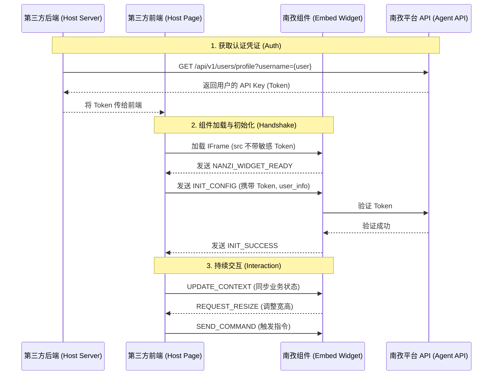

# 南孜智能体平台嵌入式组件集成指南

本文档旨在指导第三方业务系统如何快速、安全地集成南孜 AI Agent 聊天组件（EmbedChat）。

## 交互流程概览 (Integration Flow)



## 0. 获取认证 Token (Authentication)

在集成组件前，您需要获取一个有效的认证 Token（即系统中的 **API Key**）。根据集成场景不同，有以下几种获取方式：

### 方式一：管理后台手动获取 (个人集成)
1. 登录南孜智能体平台管理后台。
2. 进入 **“个人中心”**。
3. 在 “API Key” 栏位点击查看并复制。

### 方式二：通过登录接口获取 (自动集成)
如果您的系统需要模拟用户登录来获取 Token：
- **Endpoint**: `POST /api/portal/auth/login`
- **Payload**: `{"username": "...", "password": "..."}`
- **Response**: `data.api_key` 即为 Token。

### 方式三：系统间集成获取 (Server-to-Server)
**推荐用于第三方门户系统集成**。如果您的系统已经过认证（持有具备权限的 API Key），可以代表目标用户获取其 Token：
- **Endpoint**: `GET /api/v1/users/profile?username={target_username}`
- **鉴权**: 请求头需携带调用方系统的 `X-API-Key` 或 `Authorization`。
- **权限要求**: 调用者必须具备 `api:GET:/api/v1/users/profile` 权限。
- **Response**: `data.data.api_key` 即为该目标用户的 Token。

> **注意**：API Key 是持久有效的（除非手动重置），非常适合作为 IFrame 嵌入的凭证。

## 1. 快速开始 (Quick Start)

### 方式一：直接 IFrame 嵌入 (MVP)

在您的 HTML 页面中插入以下代码即可快速预览。此方式通过 URL 参数直接传递配置：

```html
<iframe 
  src="http://yunshu-aigent.yovole.net/embed/chat?token=YOUR_TOKEN&agent_id=sys-agent-chatbi&theme=light"
  width="100%" 
  height="600" 
  frameborder="0"
  style="border-radius: 12px; box-shadow: 0 4px 12px rgba(0,0,0,0.1);"
></iframe>
```

**支持的 URL 参数：**

| 参数名 | 必填 | 说明 |
|---|---|---|
| `token` | 是 | 用于鉴权的 JWT Token 或 API Key。 |
| `agent_id` | 否 | 指定对话的智能体 ID，默认使用系统内置助手。 |
| `theme` | 否 | 主题模式：`light` (默认) 或 `dark`。 |
| `instance_id` | 否 | 多实例标识符。若页面嵌入多个组件，需以此区分消息来源。 |
| `routing_mode` | 否 | 路由模式配置（如强制开启多智能体模式等）。 |

> **注意**：URL 参数传递 Token 仅建议用于测试或内网低风险环境。生产环境推荐使用 `postMessage` 方式动态传递 Token。


---

## 2. 样式定制 (Theming)

组件支持灵活的样式配置，主要分为 **主题模式 (Theme)** 和 **品牌色 (Primary Color)**：

### 2.1 Theme vs Primary Color
*   **Theme (主题模式)**
    *   **作用**：控制整体界面的明暗风格（背景色、文字颜色）。
    *   **选项**：`light` (浅色 / 默认), `dark` (深色)。
    *   **适用场景**：根据宿主系统的日间/夜间模式进行切换。

*   **Primary Color (品牌色)**
    *   **作用**：控制界面中强调元素的颜色（按钮、消息气泡、聚焦光晕等）。
    *   **配置方式**：在 `INIT_CONFIG` 或 `SET_THEME` 指令中通过 `styleVars` 传递。
    *   **变量名**：主要影响 `--primary-color`（默认 `#1677ff`）。

---

## 3. 高级集成 (PostMessage 协议)

为了更安全地传递鉴权信息，以及实现宿主与组件的深度交互，推荐使用 HTML5 `postMessage` 通信。

### 3.1 安全协议规范

所有的双向通信消息均遵循以下格式：
*   **组件发出**：消息对象中固定包含 `{ source: "nanzi-agent-embed" }`。
*   **宿主发出**：若初始化时指定了 `instance_id`，后续所有指令必须携带该 ID。

### 3.2 初始化流程

1. 宿主加载 IFrame（src 不带敏感 token）。
2. 组件加载完成，向父窗口发送 `NANZI_WIDGET_READY`。
3. 宿主收到就绪信号，发送 `INIT_CONFIG`（携带 Token、用户信息、业务上下文等）。
4. 组件鉴权成功并完成初始化，返回 `INIT_SUCCESS`。

### 3.3 协议详解

#### 下行指令 (Host -> Widget)

| 指令类型 (Type) | 关键参数 | 说明 |
|---|---|---|
| `INIT_CONFIG` | `token`, `agent_id`, `user_info`, `page_info`, `styleVars`, `welcome_message_override` | **核心初始化指令**。<br>1. `token`: 支持 `token`/`api_key`/`apikey` 三种键名。<br>2. `user_info`: 注入用户信息（如 `real_name`, `role`），让 AI 感知用户身份。<br>3. `page_info`: 注入当前页面元数据。<br>4. `user_avatar`: 自定义用户头像 URL。 |
| `UPDATE_CONTEXT`| `payload` (Object) | 实时更新业务上下文。常用于同步当前用户正在操作的数据对象。 |
| `SYNC_STATE` | `payload` (Object) | 实时同步页面状态，逻辑同 `UPDATE_CONTEXT`。 |
| `SET_THEME` | `theme`, `styleVars` | 动态切换主题颜色，无需重新加载页面。 |
| `STOP_GENERATION` | - | 强制停止 AI 正在生成的回复。 |
| `CLEAR_SESSION` | - | 清空当前对话记录，开启新会话。 |
| `RESET_SESSION` | `new_token` (可选) | 重置会话，并允许更新鉴权 Token。 |
| `SEND_COMMAND` | `command` | 触发组件内部指令，如 `/new`（新会话）或 `/history`。 |

#### 上行事件 (Widget -> Host)

| 事件类型 (Type) | 关键参数 | 说明 |
|---|---|---|
| `NANZI_WIDGET_READY` | - | 组件代码加载完成，等待初始化配置。 |
| `INIT_SUCCESS` | - | 组件已成功完成 Token 校验和资源加载。 |
| `CONNECTION_STATUS` | `status` | 网络连接状态通知（`connected` / `disconnected` / `reconnecting`）。 |
| `REQUEST_RESIZE` | `width`, `height`, `expanded` | 组件请求调整容器大小（通常由内部的展开/收起按钮触发）。 |
| `GENERATION_STOPPED` | - | 确认已响应停止生成指令。 |
| `TOKEN_EXPIRED` | - | Token 过期提醒，宿主应重新获取 Token 并发送 `RESET_SESSION`。 |

---

## 4. 集成示例 (Host Side)

```javascript
/* 宿主系统逻辑示例 */
const widgetFrame = document.getElementById('ai-widget-frame');

window.addEventListener('message', (event) => {
  const data = event.data;
  
  // 必须通过 source 标识进行过滤
  if (data.source !== 'nanzi-agent-embed') return;

  switch (data.type) {
    case 'NANZI_WIDGET_READY':
      // 发送初始化配置
      widgetFrame.contentWindow.postMessage({
        type: 'INIT_CONFIG',
        token: 'YOUR_JWT_TOKEN',
        agent_id: 'sys-agent-chatbi',
        user_info: {
          user_id: 'U123',
          real_name: '张三',
          role: 'admin'
        },
        page_info: {
          current_page: '销售看板',
          report_id: 'REP_001'
        },
        styleVars: {
          '--primary-color': '#ff4d4f' // 使用红色品牌色
        }
      }, '*');
      break;
      
    case 'INIT_SUCCESS':
      console.log('南孜智能体已就绪');
      break;
      
    case 'REQUEST_RESIZE':
      // 宿主控制组件容器的展开/收起
      widgetFrame.style.width = data.expanded ? '400px' : '60px';
      widgetFrame.style.height = data.expanded ? '600px' : '60px';
      break;
  }
});
```

---

## 5. 最佳实践

### 用户身份感知
通过 `INIT_CONFIG` 中的 `user_info` 注入用户真实姓名后，AI 的欢迎语会自动调整（例如：“您好，张三，我是您的销售数据助手...”），且在多轮对话中 AI 将始终知晓对话者的身份和权限。

### Z-Index 与全屏管理
*   **悬浮模式**：建议 `z-index` 设置为 `9999`。
*   **移动端**：捕获 `REQUEST_RESIZE` 事件，当 `expanded` 为 true 时，将 IFrame 设置为 `fixed`顶层全屏覆盖，以获得最佳交互体验。

### 多实例隔离
如果页面上有多个助手（例如“全局助手”和“代码助手”），请务必在 URL 和所有指令中保持 `instance_id` 一致，否则指令可能会被错误的组件实例接收。
