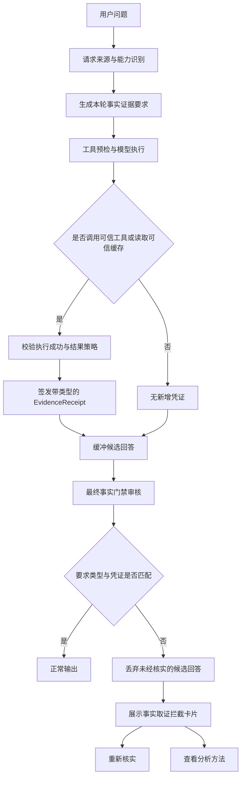

# 平台级事实取证与反幻觉门禁

## 1. 目标

平台级事实取证门禁（Platform Grounding Gate）用于约束智能体回答外部事实：当问题依赖业务数据、知识库、联网信息、服务器状态、用户文件或历史记忆时，模型必须先取得匹配类型的可信凭证，不能仅凭提示词或模型自身知识编造具体数据、状态和结论。

这套机制是模型之外的运行时门禁。提示词负责引导模型主动调用工具，门禁负责在最终输出前做独立校验；即使模型没有遵守提示词，缺少匹配凭证的事实回答仍会被拦截。

## 2. 核心原则

1. **事实回答必须有证据**：事实类型与凭证类型必须匹配，仅仅“调用过某个工具”不算通过。
2. **凭证只能由可信执行产生**：成功工具结果、可信结构化缓存等平台运行时数据才能签发凭证，模型文本不能自行声明凭证。
3. **按轮隔离**：默认每轮建立新的证据账本，避免上一轮不相关工具调用为本轮回答背书。
4. **委派共享**：Main 委派子智能体时共享当前轮账本，子智能体的工具凭证能够回流到 Main 的最终审核。
5. **失败关闭**：需要事实证据但凭证缺失或类型不匹配时，停止输出具体结论并展示安全提示卡片。
6. **方法类回答可继续**：被拦截后仍允许用户选择只查看查询方法或分析方案，但不得包含未经核实的具体事实。

## 3. 证据类型

| 证据类型 | 含义 | 典型来源 |
| --- | --- | --- |
| `internal_data` | 内部结构化业务数据 | Schema 查询、SQL 查询、上一轮可信结构化结果 |
| `internal_knowledge` | 内部知识和制度文档 | 知识库、Jira 等内部检索 |
| `public_web` | 外部公开信息 | 联网搜索、网页抓取、外部 HTTP 请求 |
| `runtime_state` | 当前运行时或服务器状态 | Bash、进程查询、系统时间、任务状态 |
| `user_file` | 用户授权文件内容 | 文件读取、文本搜索、Word/Excel 读取 |
| `conversation_memory` | 跨会话历史和长期记忆 | 记忆搜索、长期记忆读取 |

凭证 `EvidenceReceipt` 记录以下信息：

- 工具调用或派生动作 ID；
- 证据生产者；
- 抽象证据类型；
- 结果内容的 SHA-256 摘要；
- 用户 ID、会话 ID 和签发时间。

账本只保存摘要和元数据，不把完整工具结果复制进凭证。

## 4. 完整执行流程

### 4.1 请求分类与证据要求

请求决策首先识别事实来源，并映射到所需证据：

| 请求来源 | 必需凭证 |
| --- | --- |
| `internal_structured_data` | `internal_data` |
| `internal_docs` | `internal_knowledge` |
| `public_web` | `public_web` |
| `runtime_diagnostic` | `runtime_state` |
| `unknown` | 根据最终回答中的事实信号进行严格复核 |

用户明确引用附件、文件页码或工作表时，会补充要求 `user_file`；跨会话回忆类请求会要求 `conversation_memory`。

### 4.2 工具预检

在模型执行前，系统会根据所需证据类型寻找具备相应能力的工具，并向模型注入事实取证要求。用户点击“重新核实”时，前端会把缺失的证据类型作为结构化动作回传，后端优先选择能够产生匹配凭证的工具。

预检用于提高一次成功率，但它不是最终安全边界；真正的安全边界仍是输出后的独立审核。

### 4.3 工具凭证签发

运行时工具规格包含 `evidence_types` 和 `evidence_policy`。工具成功返回后，包装器将结果交给当前轮 `EvidenceLedger`：

- 工具没有声明证据类型：不签发凭证；
- 工具执行失败、超时、拒绝或返回错误结构：不签发凭证；
- 默认 `non_empty`：成功且结果非空才签发；
- `allow_empty_success`：成功执行但结果为空也可签发，用于支持“查询成功但暂无数据”“检索成功但未找到”等真实结论。

空结果策略不会把异常当成功。`success=false`、HTTP/业务错误码、错误状态、权限拒绝和错误消息均不会产生凭证。

### 4.4 工具别名泛化

工具证据类型通过规范名称、AgentScope 原生名称及反向别名统一解析。例如：

| 配置名或别名 | 原生工具 | 证据类型 |
| --- | --- | --- |
| `bash` / `Bash` / `exec_command` | `Bash` | `runtime_state` |
| `grep` / `Grep` / `search_text` | `Grep` | `user_file` |
| `read` / `Read` / `read_file` | `Read` | `user_file` |

新增同类别名不需要在门禁策略中逐个硬编码；它们会继承规范工具的证据元数据。

### 4.5 最终输出审核

需要门禁的回答会先在后端缓冲，不立即推送正文。模型结束后，系统用候选回答和当前轮证据账本进行审核：

1. 有明确证据要求且存在匹配类型凭证：通过；
2. 有明确证据要求但没有匹配凭证：拦截；
3. `UNKNOWN` 请求没有外部事实信号：通过；
4. `UNKNOWN` 请求输出动态事实、执行声明、带数值表格或一般事实断言：按每段事实推断证据类型；
5. `UNKNOWN` 中每组事实都有匹配类型凭证：通过，否则拦截。

因此，“调用了 Bash”不能为业务销售排名背书，“执行了 SQL”也不能为服务器 CPU 状态背书。

## 5. UNKNOWN 类型策略

`UNKNOWN` 不能简单地“一律通过”或“一律拦截”。当前采用候选输出审查：

- 假设、示例、虚构、模拟数据等明确非真实内容不作为外部事实；
- 普通解释、方案和方法类内容没有外部事实信号时正常通过；
- 当前、最新、今天、排名、金额、百分比、数值表格、执行成功声明等会触发事实审核；
- 根据业务数据、运行状态、网页、文件、知识库、记忆等文本信号匹配凭证；
- 同一回答包含多类事实时，每一类事实都必须有相应凭证。

这一策略减少了 UNKNOWN 的误拦截，同时保留“无法确定来源时不允许编造事实”的失败关闭原则。

## 6. 跨轮数据复用

### 场景

第一轮用户查询数据，第二轮说“可视化分析一下”“换成柱状图”或“总结一下”。第二轮不应重复查询数据库，也不能仅凭上一轮聊天文本绕过门禁。

### 当前逻辑

1. ChatBI 将第二轮识别为 `reuse_previous_result` 或 `format_correction`；
2. 按用户 ID 和会话 ID 读取上一轮可信结构化结果缓存；
3. 缓存命中后，在当前轮账本签发 `internal_data` 派生凭证；
4. 凭证生产者为 `chatbi_previous_result`，结果摘要绑定上一轮结构化数据；
5. 模型只基于该结构化结果生成新增分析或图表，不重新执行 SQL；
6. 缓存缺失时，普通历史对话文本不会被提升为可信 `internal_data` 凭证。

此外，派生凭证要求账本的用户 ID、会话 ID与当前 ChatBI runner 一致，避免跨用户或跨会话误签。

## 7. 拦截后的用户体验

门禁拦截后，后端发送独立的 `grounding_blocked` 事件，前端渲染黄色警示卡片，而不是把固定提示混在普通 Markdown 回答中。

卡片默认内容：

- 标题：`暂时无法验证事实`；
- 提示：`本次未取得可验证的数据来源，已停止输出未经核实的结论。`；
- 动作一：`重新核实`；
- 动作二：`查看分析方法`。

“重新核实”会携带原问题和缺失的证据类型重新执行，后端优先选择匹配工具；“查看分析方法”只输出可执行的查询或分析步骤，不给出未经核实的具体事实。

## 8. 泛化接入规范

新增工具时，不应修改某个场景的关键词规则来“放行”，而应声明抽象证据元数据：

1. 判断工具读取的事实来源属于哪一种 `EvidenceType`；
2. 在工具注册层配置 `evidence_types`；
3. 根据业务语义选择 `non_empty` 或 `allow_empty_success`；
4. 确保错误、权限拒绝和失败结构不会伪装成成功结果；
5. 若工具有多个别名，只维护一个规范映射，并通过别名解析继承；
6. 增加“成功签发、失败不签发、类型不匹配仍拦截”的测试。

写操作工具通常不应签发读取型事实凭证。MCP、动态数据库或第三方工具若未声明证据类型，即使执行成功也不会自动成为事实依据。

## 9. 延迟影响

门禁本身主要增加本地计算：结果摘要、正则信号识别、账本匹配和必要回答缓冲，通常远小于一次模型或外部工具调用的耗时。

可能明显增加延迟的是“原本模型准备直接回答，但门禁要求先调用工具”的场景。这部分延迟来自真实取证，是反幻觉目标所需成本。跨轮可视化使用派生凭证，不重复执行 SQL，因此只增加很小的本地处理开销。

## 10. 已知边界

当前机制已经是独立运行时门禁，但仍需准确理解其保障范围：

1. **当前是类型级取证，不是逐句引用校验**：它能证明本轮取得了匹配类型的可信结果，但尚未逐个验证回答中的每个数字都能在工具结果中找到。
2. **UNKNOWN 仍包含启发式识别**：极端措辞可能漏判或误判，需要通过真实案例持续补充通用信号，而不是增加单场景特判。
3. **工具元数据完整性很重要**：新增工具未注册 `evidence_types` 会导致有结果但无凭证，从而被拦截。
4. **可信缓存需要生命周期治理**：跨轮派生凭证依赖上一轮结构化缓存，应继续关注缓存过期、数据新鲜度和结果截断信息。
5. **历史文本不是强证据**：仅从对话历史恢复的表格或结论不会自动签发 `internal_data`，避免把模型此前可能生成的内容循环强化为“事实”。
6. **门禁不是业务正确性验证器**：SQL 执行成功只能证明结果来自数据库，指标口径、过滤条件和业务解释仍需要 ChatBI 的 Schema、权限、SQL 预检及分析链路共同保障。

## 11. 关键代码位置

| 组件 | 文件 |
| --- | --- |
| 证据类型与凭证模型 | `app/services/ai/grounding/models.py` |
| 证据账本与成功结果判断 | `app/services/ai/grounding/ledger.py` |
| 请求事实要求与最终审核策略 | `app/services/ai/grounding/policy.py` |
| Main 门禁编排、缓冲、拦截事件和重试动作 | `app/services/ai/runners/assistant_agent_runner.py` |
| 工具证据类型、空结果策略和别名解析 | `app/services/ai/tools/registry.py` |
| AgentScope 工具执行后签发凭证 | `app/services/ai/runtime/agentscope/tools.py` |
| Main 与子智能体共享账本 | `app/services/ai/tools/agent_delegate_tool.py` |
| ChatBI 跨轮派生凭证 | `app/services/ai/runners/chatbi/turn_handlers.py` |
| 前端 SSE 事件解析 | `frontend/src/utils/agentscopeSseHandlers.ts` |
| 拦截提示卡片 | `frontend/src/components/GroundingBlockedCard.vue` |
| 卡片动作处理 | `frontend/src/views/EmbedChat.vue`、`frontend/src/views/AgentDebug.vue` |

## 12. 验证重点

建议持续覆盖以下回归场景：

- 未调用工具却生成业务排名或金额表格：拦截；
- Bash 成功但回答业务数据：类型不匹配，拦截；
- SQL 成功并回答查询结果：通过；
- SQL 成功但空结果，回答“暂无数据”：通过；
- SQL 失败或权限拒绝后声称“暂无数据”：拦截；
- 知识库、联网、服务器、文件和记忆分别取得匹配凭证：通过；
- 同一回答混合两类事实但只有一类凭证：拦截；
- UNKNOWN 仅输出方法或假设示例：通过；
- 第一轮查数、第二轮可视化：复用可信缓存并签发派生凭证，不重复 SQL；
- 第二轮只有历史文本、结构化缓存缺失：不签发派生数据凭证；
- 用户或会话不匹配：不签发派生凭证。
