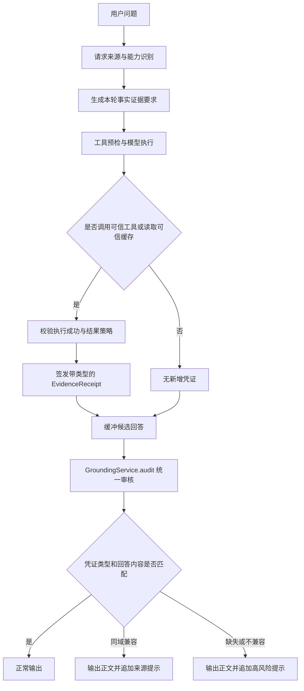

# 平台级事实取证与反幻觉门禁

## 1. 目标

平台级事实取证门禁（Platform Grounding Gate）用于约束智能体回答外部事实：当问题依赖业务数据、知识库、联网信息、服务器状态、用户文件或历史记忆时，模型必须先取得匹配类型的可信凭证，不能仅凭提示词或模型自身知识编造具体数据、状态和结论。

这套机制是模型之外的运行时审核。提示词负责引导模型主动调用工具，门禁负责在最终输出前做独立校验；即使模型没有遵守提示词，系统仍会识别缺失或不匹配的事实凭证，并在保留正文的同时追加风险提示。

## 2. 核心原则

1. **事实回答必须有证据**：事实类型与凭证类型必须匹配，具体事实还必须与工具结果存在内容关联；仅仅“调用过某个工具”不算通过。
2. **凭证只能由可信执行产生**：成功工具结果、可信结构化缓存等平台运行时数据才能签发凭证，模型文本不能自行声明凭证。
3. **按轮隔离**：默认每轮建立新的证据账本，避免上一轮不相关工具调用为本轮回答背书。
4. **委派共享**：Main 委派子智能体时共享当前轮账本，子智能体的工具凭证能够回流到 Main 的最终审核。
5. **柔性提示**：需要事实证据但凭证缺失或类型不匹配时，保留回答正文并追加服务端风险提示，不再展示阻断卡片。
6. **安全边界独立**：权限、SQL 安全、敏感操作确认、文件授权等真正的安全门禁仍保持硬阻断。

## 3. 证据类型

| 证据类型 | 含义 | 典型来源 |
| --- | --- | --- |
| `internal_data` | 内部结构化业务数据 | Schema 查询、SQL 查询、上一轮可信结构化结果 |
| `internal_knowledge` | 内部知识和制度文档 | 知识库、Jira 等内部检索 |
| `public_web` | 外部公开信息 | 联网搜索、网页抓取、外部 HTTP 请求 |
| `runtime_state` | 当前运行时或服务器状态 | Bash、进程查询、系统时间、任务状态 |
| `user_file` | 用户授权文件内容 | 文件读取、文本搜索、Word/Excel 读取 |
| `conversation_memory` | 跨会话历史和长期记忆 | 记忆搜索、长期记忆读取 |
| `external_tool` | 动态外部工具本轮成功返回的结果 | 只读 MCP 查询、检索、获取、查看类工具 |

凭证 `EvidenceReceipt` 记录以下信息：

- 工具调用或派生动作 ID；
- 证据生产者；
- 抽象证据类型；
- 结果内容的 SHA-256 摘要；
- 从结果中提取的普通/强标记不可逆摘要，用于核对答案中的车次号、日期、金额等是否确实出现在工具结果中；
- 是否为成功空结果；
- 用户 ID、会话 ID 和签发时间。

账本只保存摘要和元数据，不把完整工具结果复制进凭证。

## 4. 完整执行流程

### 4.1 请求分类与证据要求

请求决策首先识别事实来源，并映射到所需证据：

| 请求来源 | 必需凭证 |
| --- | --- |
| `internal_structured_data` | `internal_data` |
| `internal_docs` | `internal_knowledge` |
| `public_web` | `public_web` |
| `runtime_diagnostic` | `runtime_state` |
| `unknown` | 根据最终回答中的事实信号进行严格复核 |

用户明确引用附件、文件页码或工作表时，会补充要求 `user_file`；跨会话回忆类请求会要求 `conversation_memory`。

### 4.2 工具预检

在模型执行前，系统会根据所需证据类型寻找具备相应能力的工具，并向模型注入事实取证要求。工具预检仍会优先选择能够产生匹配凭证的工具。

预检用于提高一次成功率，但它不是最终安全边界；真正的安全边界仍是输出后的独立审核。

### 4.3 工具凭证签发

运行时工具规格包含 `evidence_types` 和 `evidence_policy`。工具成功返回后，包装器将结果交给当前轮 `EvidenceLedger`：

- 工具没有声明证据类型：不签发凭证；
- 动态 MCP 没有显式类型但名称或描述以查询、检索、获取、读取、查看等只读动作开头：签发 `external_tool`；
- MCP 标准 `annotations.readOnlyHint=true` 会在同步时持久化并优先作为只读依据；
- MCP 或 Generic API 可在参数 Schema 中用 `x-yunshu-evidence-types` 和 `x-yunshu-evidence-policy` 声明精确来源；
- 创建、更新、删除、写入、发送、预订、执行等动作型 MCP 不自动签发读取型事实凭证；
- 工具执行失败、超时、拒绝或返回错误结构：不签发凭证；
- MCP `isError`、SDK 异常、Generic API HTTP 4xx/5xx、`[MCP Error]` 和 `[Execution Error]` 均按失败处理；
- 字典或对象中的 `isError/is_error`、失败 `state/status`、非空 `error` 统一按失败处理；
- MCP 文本 `content` 与 `structuredContent` 都会保留；只有两者都为空时才记为空成功；
- 默认 `non_empty`：成功且结果非空才签发；
- `allow_empty_success`：成功执行但结果为空也可签发，用于支持“查询成功但暂无数据”“检索成功但未找到”等真实结论。

空结果策略不会把异常当成功。`success=false`、HTTP/业务错误码、错误状态、权限拒绝和错误消息均不会产生凭证。

### 4.4 工具别名泛化

工具证据类型通过规范名称、AgentScope 原生名称及反向别名统一解析。例如：

| 配置名或别名 | 原生工具 | 证据类型 |
| --- | --- | --- |
| `bash` / `Bash` / `exec_command` | `Bash` | `runtime_state` |
| `grep` / `Grep` / `search_text` | `Grep` | `user_file` |
| `read` / `Read` / `read_file` | `Read` | `user_file` |

新增同类别名不需要在门禁策略中逐个硬编码；它们会继承规范工具的证据元数据。

### 4.5 最终输出审核

Main 和 ChatBI 统一通过 `GroundingService.audit()` 将候选回答、事实要求和当前轮证据账本转换为审核结论及可选风险提示。KnowledgeAgent 的独立 NLI 反思结论继续由知识库流程产生，但最终提示也通过 `GroundingService.warning_chunk()` 统一生成。`policy.py` 只维护纯判断规则，Runner 继续拥有流式、反思重试以及 SQL/Schema 门禁等业务编排。

聊天“界面设置”和 AgentDebug 右侧“调试配置”均提供会话级“反幻觉校验”总开关，通过 `debug_options.grounding_enabled` 显式传递。该开关默认关闭；字段缺失、`false` 或字符串真值都按关闭处理。关闭时 Main 不缓存正文或强制 Grounding 取证，ChatBI 不追加 Grounding 风险提示，KnowledgeAgent 不执行幻觉评估和反思重试。模型生成、常规工具预检、工具权限、知识库检索、ChatBI SQL/Schema 安全门禁均不受影响。两个页面输入框中的模型选择保留，设置面板内不再重复提供模型覆盖。开启后才执行下述审核策略。

统一服务不消费异步流、不发送 SSE、不调用工具，也不修改已输出正文。开关开启时，普通 GENERAL 仍直接流式输出，不再在结束后扫描动态关键词；用户问题被统一请求决策识别为公网、运行状态或其他需证据来源时，才升级为完整审核。ChatBI 仍先流式输出正文并在结束后追加可选提示；KnowledgeAgent 维持原反思循环。

模型结束后，系统用候选回答和当前轮证据账本进行审核：

1. 有明确证据要求、存在匹配类型凭证，且事实型回答与结果内容相关：通过；
2. 公开信息或运行状态请求取得只读 MCP `external_tool` 回执，且答案与结果内容指纹重合：作为兼容外部来源通过；
3. 有明确证据要求但没有匹配凭证：保留正文并追加风险提示；
4. `UNKNOWN` 请求没有外部事实信号：通过；
5. `UNKNOWN` 请求输出动态事实、执行声明、带数值表格或一般事实断言：按每段事实推断证据类型；
6. `UNKNOWN` 本轮已取得成功的只读 MCP `external_tool` 回执、回答不是内部业务数据表且内容指纹重合：通过；
7. 其余 `UNKNOWN` 中每组事实都有匹配类型且内容相关的凭证：通过，否则追加风险提示；
8. `GENERAL` 不根据模型输出中的“当前、最新、实时”等词单独启动审核；如果用户问题本身明确需要动态公网或运行状态，统一请求决策会先将其升级为相应证据要求。

非空结果的内容关联采用保守阈值：车次、订单号等强标识命中一个即可；普通地点、名称等弱标记至少命中两个，避免仅因“上海”这样的单个词重合而放行无关结论。空成功凭证只能支撑纯“暂无/未找到”表述，回答同时包含金额、数量、时间、标识符或事实表格时仍需非空证据。

UNKNOWN 和明确证据来源的回答仍按句段识别动态事实。“今天有什么可以帮您”“当前有什么问题”等问候、疑问或邀请交互表达不会作为事实陈述；用户明确询问服务器告警、当前汇率等动态事实时，则由请求意图先建立证据要求。逗号后的追问不会掩盖逗号前已经出现的动态事实。

因此，“调用了 Bash”不能为业务销售排名背书，“执行了 SQL”也不能为服务器 CPU 状态背书。

## 5. UNKNOWN 类型策略

`UNKNOWN` 不能简单地“一律通过”或“一律拦截”。当前采用候选输出审查：

- 假设、示例、虚构、模拟数据等明确非真实内容不作为外部事实；
- 普通解释、方案和方法类内容没有外部事实信号时正常通过；
- 当前、最新、今天、排名、金额、百分比、数值表格、执行成功声明等会触发事实审核；
- 根据业务数据、运行状态、网页、文件、知识库、记忆等文本信号匹配凭证；
- 本轮只读 MCP 成功返回非空结果时，以 `external_tool` 证明回答经过了真实工具取证；未知路由下疑似内部业务数据表仍要求精确内部来源；
- 同一回答包含多类事实时，每一类事实都必须有相应凭证。

这一策略不会阻断 UNKNOWN 回答；无法确定来源时通过高风险提示表达不确定性，普通解释、方案和方法类内容不提示。

## 6. 跨轮数据复用

### 场景

第一轮用户查询数据，第二轮说“可视化分析一下”“换成柱状图”或“总结一下”。第二轮不应重复查询数据库，也不能仅凭上一轮聊天文本绕过门禁。

### 当前逻辑

1. ChatBI 将第二轮识别为 `reuse_previous_result` 或 `format_correction`；
2. 按用户 ID 和会话 ID 读取上一轮可信结构化结果缓存；
3. 缓存命中后，在当前轮账本签发 `internal_data` 派生凭证；
4. 凭证生产者为 `chatbi_previous_result`，结果摘要绑定上一轮结构化数据；
5. 模型只基于该结构化结果生成新增分析或图表，不重新执行 SQL；
6. 缓存缺失时，普通历史对话文本不会被提升为可信 `internal_data` 凭证。

此外，派生凭证要求账本的用户 ID、会话 ID与当前 ChatBI runner 一致，避免跨用户或跨会话误签。

## 7. 风险提示体验

Main、KnowledgeAgent 和 ChatBI 的事实取证失败均不发送新的用户可见 `grounding_blocked` 事件，不丢弃模型正文，也不展示黄色阻断卡片。KnowledgeAgent 保留反思重写，但耗尽后保留最后回答并追加风险提示；ChatBI 保留 Schema、SQL、权限和修复硬门禁，只在最终回答超出成功查询结果时追加软提示。同一回答最多追加一次提示。

前端继续保留旧 `grounding_blocked` 事件解析，仅用于兼容历史会话和旧后端。

## 8. 泛化接入规范

新增工具时，不应修改某个场景的关键词规则来“放行”，而应声明抽象证据元数据：

1. 判断工具读取的事实来源属于哪一种 `EvidenceType`；
2. 在工具注册层配置 `evidence_types`；
3. 根据业务语义选择 `non_empty` 或 `allow_empty_success`；
4. 确保错误、权限拒绝和失败结构不会伪装成成功结果；
5. 若工具有多个别名，只维护一个规范映射，并通过别名解析继承；
6. 增加“成功签发、失败不签发、类型不匹配追加风险提示”的测试。

写操作工具通常不应签发读取型事实凭证。动态 MCP 未显式声明来源类型时，系统仅对名称或描述明确为查询、检索、获取、读取、查看等只读动作的工具签发 `external_tool`；创建、更新、删除、写入、发送、预订和执行类工具不会自动获得事实背书。

AgentScope 原生 Bash、Read、Grep、Glob 与普通 RuntimeToolSpec 共享同一证据签发入口；Main、KnowledgeAgent、ChatBI 的隐式工具也统一经过注册层补齐证据元数据。permission/external execution 挂起时会把当前回执随快照保存，跨进程恢复后按用户和会话范围恢复；客户端提交的外部执行成功结果会按服务端工具元数据补签凭证，错误或拒绝结果不补签。

## 9. 延迟影响

门禁本身主要增加本地计算：结果摘要、正则信号识别、账本匹配和必要回答缓冲，通常远小于一次模型或外部工具调用的耗时。

可能明显增加延迟的是“原本模型准备直接回答，但门禁要求先调用工具”的场景。这部分延迟来自真实取证，是反幻觉目标所需成本。跨轮可视化使用派生凭证，不重复执行 SQL，因此只增加很小的本地处理开销。

## 10. 已知边界

当前机制已经是独立运行时门禁，但仍需准确理解其保障范围：

1. **当前是类型加内容指纹取证，不是完整逐句引用校验**：事实型回答要求强标记命中或多个普通标记重合，可阻止明显无关工具给整段回答背书；但尚未实现自然语言逐句蕴含验证。
2. **UNKNOWN 仍包含启发式识别**：极端措辞可能漏判或误判，需要通过真实案例持续补充通用信号，而不是增加单场景特判。
3. **工具元数据完整性很重要**：内置、数据和知识工具仍应注册精确 `evidence_types`；动态只读 MCP 可回退为 `external_tool`，但不会被冒充为内部数据库、知识库或公开网页的精确来源。
4. **可信缓存需要生命周期治理**：跨轮派生凭证依赖上一轮结构化缓存，应继续关注缓存过期、数据新鲜度和结果截断信息。
5. **历史文本不是强证据**：仅从对话历史恢复的表格或结论不会自动签发 `internal_data`，避免把模型此前可能生成的内容循环强化为“事实”。
6. **门禁不是业务正确性验证器**：SQL 执行成功只能证明结果来自数据库，指标口径、过滤条件和业务解释仍需要 ChatBI 的 Schema、权限、SQL 预检及分析链路共同保障。

## 11. 关键代码位置

| 组件 | 文件 |
| --- | --- |
| 证据类型与凭证模型 | `app/services/ai/grounding/models.py` |
| 证据账本与成功结果判断 | `app/services/ai/grounding/ledger.py` |
| 请求事实要求与最终审核策略 | `app/services/ai/grounding/policy.py` |
| Main 门禁编排、缓冲和风险提示 | `app/services/ai/runners/assistant_agent_runner.py` |
| 工具证据类型、空结果策略和别名解析 | `app/services/ai/tools/registry.py` |
| AgentScope 工具执行后签发凭证 | `app/services/ai/runtime/agentscope/tools.py` |
| Main 与子智能体共享账本 | `app/services/ai/tools/agent_delegate_tool.py` |
| ChatBI 跨轮派生凭证 | `app/services/ai/runners/chatbi/turn_handlers.py` |
| 前端 SSE 事件解析 | `frontend/src/utils/agentscopeSseHandlers.ts` |
| 旧阻断事件兼容卡片 | `frontend/src/components/GroundingBlockedCard.vue` |

## 12. 验证重点

建议持续覆盖以下回归场景：

- 未调用工具却生成业务排名或金额表格：保留正文并追加高风险提示；
- Bash 成功但回答业务数据：类型不匹配，保留正文并追加高风险提示；
- SQL 成功并回答查询结果：通过；
- SQL 成功但空结果，回答“暂无数据”：通过；
- SQL 失败或权限拒绝后声称“暂无数据”：保留正文并追加高风险提示；
- 知识库、联网、服务器、文件和记忆分别取得匹配凭证：通过；
- 动态只读 MCP 查询成功并据此输出车次、天气等事实：通过，不追加风险提示；
- MCP 返回 `isError`、SDK 异常或 Generic API 返回 HTTP 4xx/5xx：不签发回执；
- 只调用日期 MCP 却输出无关天气数据：内容指纹不匹配，追加风险提示；
- MCP 查询成功但结果为空并回答“暂无符合条件的数据”：通过；
- MCP 查询为空但回答又给出车次、金额或数量：追加风险提示；
- MCP 仅返回 `structuredContent`：保留结构化结果并签发凭证；
- 车票结果仅与天气回答共享“上海”：内容关联不足，追加风险提示；
- Bash、Read、Grep 原生工具成功：签发对应运行状态或文件证据；
- permission/external execution 跨进程恢复：恢复挂起前已签发的回执；
- external execution 客户端提交成功结果：按挂起工具元数据补签；错误结果不签；
- KnowledgeAgent 反思耗尽：保留最后回答并追加风险提示，不最终阻断；
- ChatBI 最终回答与 SQL 结果相关：通过；超出结果：保留正文并追加风险提示；
- MCP 创建、删除、预订等动作工具不自动签发读取型事实凭证；
- 同一回答混合两类事实但只有一类凭证：保留正文并追加风险提示；
- UNKNOWN 仅输出方法或假设示例：通过；
- 第一轮查数、第二轮可视化：复用可信缓存并签发派生凭证，不重复 SQL；
- 第二轮只有历史文本、结构化缓存缺失：不签发派生数据凭证；
- 用户或会话不匹配：不签发派生凭证。
