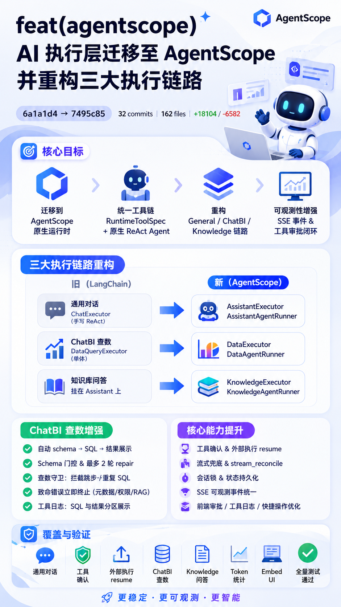

# 🎉 Yunshu AI Agent Platform v1.0.1 Release Notes

**GitHub Repository**: [RandyChen1985/yunshu-ai-agent-platform](https://github.com/RandyChen1985/yunshu-ai-agent-platform)

v1.0.1 是一次**架构级升级版本**，将 AI 执行层从 LangChain 全面迁移至 [AgentScope](https://github.com/modelscope/agentscope) 原生运行时，并重构 General / ChatBI / Knowledge 三条执行链路。本次变更合并自 [PR #1](https://github.com/RandyChen1985/yunshu-ai-agent-platform/pull/1)（`6a1a1d4` → `40b0c57`），共 **32 个提交**，**162 个文件**，+18104 / -6582 行。

---



## 🚀 Key Features

### 1. ⚙️ AgentScope 运行时基建（核心迁移）

* **原生 AgentScope 运行时层**：新增 `app/services/ai/runtime/agentscope/`，涵盖 `chat`、`tools`、`event_stream`、`state_store`、`pending_store`、`session_lock`、`workspace`、`stream_reconcile` 等模块。
* **统一工具链**：工具注册中心切换为 `RuntimeToolSpec` + 原生 ReAct Agent，新增 `tool_compat` 兼容层，LLM 工厂切换为 AgentScope `ChatModelBase`。
* **状态持久化与会话锁**：持久化 AgentScope runtime state，支持 Redis 分布式会话锁，保障多实例部署下的会话一致性。
* **工具确认与恢复闭环**：支持 ASK 权限挂起、external execution 挂起、HTTP resume 端点及链式 permission 恢复。
* **统一可观测事件流**：SSE 事件标准化输出 `model_call`、`tool_result_data`、`thinking` 等，便于前端实时渲染与 Trace 审计。

### 2. 🔀 执行层重构：Executor → Runner

| 场景 | v1.0.0 | v1.0.1 |
| :--- | :--- | :--- |
| 通用对话 | `ChatExecutor` / 手写 ReAct | `AssistantExecutor` → `AssistantAgentRunner` |
| ChatBI 查数 | `DataQueryExecutor` 单体 | `DataExecutor` → `DataAgentRunner` |
| 知识库问答 | 挂在 Assistant 上 | `KnowledgeExecutor` → `KnowledgeAgentRunner` |

* **移除旧路径**：删除 `ChatExecutor` 及 General 旧 ReAct 路径，仅保留 AgentScope 原生 Agent 执行链路。
* **路由兜底**：Router 支持 `assistant` / `main` / `general-chat` 多名称匹配（DB 迁移 V72 将 slug 统一为 `main`）。

### 3. 📊 ChatBI 查数增强

* **Schema 自动门控**：ReAct 前自动 invoke `get_dataset_schema`；Runner 仅挂载 agent 配置工具，schema 未完成前拦截 SQL 并触发 repair。
* **Repair 重试机制**：最多 2 轮 repair，按场景强制 `tool_choice`；拦截重复 `execute_sql_query` 调用。
* **致命错误立即终止**：元数据服务不可用（502/超时）、无授权数据集、RAG 未同步等场景返回明确提示并终止查数，不再让模型臆造结果。
* **工具日志优化**：`execute_sql_query` 的 SQL 与结果/错误分区展示；输出截断 1000 字符，避免日志膨胀。
* **追问复用优化**：基于上一轮结果分析/可视化时，修复 synthesis 重复输出问题。

### 4. 💬 General / Assistant 流式与兜底

* **流式 reconcile**：工具链结束后通过 `stream_reconcile` 判定是否需要 synthesis 补全。
* **思考型模型兜底**：无 `TEXT_BLOCK_DELTA` 时从 AgentState 恢复或 synthesis 兜底，避免空回复。
* **流式正文清洗**：剥离 `think` / `function_calls` 标签，避免整段内容被误丢弃。
* **工具确认闭环**：ASK 事件挂起 → 前端确认/拒绝 → resume 流恢复（含链式二次 permission 弹框）。

### 5. 📚 Knowledge 知识库独立链路

* **自动预检索**：平台在 ReAct 前自动 `search_knowledge_base` 并将检索结果注入上下文。
* **服务不可用终止**：RAGFlow 502/超时等故障返回 `[知识库服务不可用]` 标记，Runner 立即终止并提示用户，对齐 data/schema 侧处理。
* **误判修复**：仅识别显式错误标记（`[知识库服务不可用]`、`[Tool Error]`），避免检索正文中 `503`/`timeout` 等子串被误匹配。

### 6. 🖥️ 前端接入 AgentScope 可观测 UI

* **SSE 事件统一处理**：新增 `agentscopeSseHandlers.ts`，统一解析 AgentScope 可观测事件。
* **工具审批与恢复**：支持外部工具结果提交、resume 流、审批模式选择（ask / allow / deny）。
* **工具日志分区渲染**：SQL / 结果 / 错误分区展示；`quickButtons` 抽取与特殊字符链接修复。
* **交互优化**：`/clear` 改为 `/new`；`ConfirmModal` 支持 Enter 确认 / Esc 取消。

---

## 🛠 Improvements & Stability

* **Token 统计修复**：修复 AgentScope 路径下 Token 未入库问题，统一 trace 聚合口径。
* **ChatBI 查数守卫**：修复模型跳步直接回答、过渡语后继续查数被误拦截、FunctionTool 重复最终回答等边界问题。
* **工具输出截断**：修复工具输出截断与 SQL 误判，修正模型调用日志计时。
* **架构文档对齐**：新增 `architech/design/AGENTSCOPE_RUNTIME.md`，更新 Chat 流程、Prompt 分层、工具调用等架构文档；OpenSpec 规格归档。

---

## ⚠️ Breaking Changes & Migration Notes

> 从 v1.0.0 升级至 v1.0.1 时，请特别注意以下变更：

| 项目 | 说明 |
| :--- | :--- |
| **Python 版本** | 需 **Python 3.11+** |
| **依赖** | 新增 `agentscope` 相关包，请重新执行 `pip install -r requirements.txt` |
| **通用助手 slug** | DB 迁移 V72 将 `general-chat` 等统一为 `main` |
| **工具挂载** | General / ChatBI 不再通过 workspace 自动注入 Grep / Read / Bash，完全依赖 agent 后端配置 |
| **旧执行路径** | `ChatExecutor` 已删除，General 旧 ReAct 路径已移除 |

---

## 📋 Commit Log

| Hash | 描述 |
| :--- | :--- |
| `bf048df` | refactor(agentscope): 将 AI 执行层运行时从 LangChain 迁移至 AgentScope |
| `50aa219` | refactor(agentscope): 补齐运行时错误与工具审计边界 |
| `a81d197` | refactor(agentscope): 抽出通用对话 runner |
| `6b5bf2a` | refactor(agentscope): 通用对话工具链切到 runtime spec |
| `ed41afb` | refactor(agentscope): General 接入原生 Agent 工具执行 |
| `fadf460` | refactor(agentscope): 增加工具权限与 ASK 事件 |
| `26d9a6b` | refactor(agentscope): 完成工具确认闭环并移除 General 旧 ReAct 路径 |
| `5a7f4a8` | refactor: persist agentscope runtime state |
| `fe39f9c` | test: cover agentscope general resume paths |
| `d89b1db` | refactor(agentscope): ChatBI 迁移至 DataAgentRunner 原生 Agent 路径 |
| `9dc7479` | refactor(agentscope): ChatBI 对齐 General 并抽取公共事件流 |
| `73e74ad` | fix(frontend): 修复工具确认恢复流中链式 permission_required 未处理 |
| `40fdb44` | fix(chatbi): 修复 FunctionTool 调用与重复最终回答输出 |
| `ba97951` | feat(agentscope): 补齐 external resume、可观测事件与分布式会话锁 |
| `f8511eb` | feat(frontend): 接入 AgentScope 可观测事件与外部执行恢复 UI |
| `5785677` | fix(chatbi): schema 门控、挂起快照同步与 SSE 类型修复 |
| `cdd90de` | refactor(chatbi): 统一事件流并支持运行时工具审批模式 |
| `ea4c31d` | fix(chatbi): 修复过渡语后继续查数时最终回答被误拦截 |
| `f22c053` | docs: 更新架构文档以对齐 AgentScope 迁移 |
| `d991994` | fix(general): 修复工具链后空回复并统一流式正文清洗 |
| `7f1de33` | fix(general): 通用流式 reconcile 与工具后 synthesis 兜底 |
| `fa39f42` | fix(chatbi): 工具输出截断与 SQL 误判修复，修正模型调用日志计时 |
| `faba050` | feat(chatbi): 优化 execute_sql_query 工具日志 SQL 与结果分区展示 |
| `90c4c8c` | fix(chatbi): 模型跳步直接回答时触发一次 repair 重试查数 |
| `990cd0e` | feat(chatbi): 优化查数 repair 重试并拦截重复 SQL，修复 Quick 按钮解析 |
| `f8f14cd` | fix(ai): 修复 AgentScope 路径 Token 未入库，统一 trace 聚合口径 |
| `f81d806` | fix(chatbi): 修复复用上一轮结果时 synthesis 重复输出 |
| `1665860` | fix(agent): ChatBI 自动 invoke Schema，Runner 仅挂载配置工具 |
| `764a1bb` | refactor(ai): 统一 Assistant/Knowledge 执行层命名并支持 main 路由兜底 |
| `4e20f13` | fix(ai): Schema 致命错误时终止查数流程并返回明确提示 |
| `b22afb7` | fix(ui): 确认弹框支持回车确认与 Esc 取消 |
| `f37eb38` | fix(ai): 知识库检索服务不可用时终止问答并返回明确提示 |
| `7495c85` | fix(ai): 修复知识库检索成功却被误判为服务不可用 |

---

## 📦 Upgrade Guide

### 从 v1.0.0 升级

```bash
# 1. 拉取最新代码
git fetch origin && git checkout main && git pull

# 2. 确认 Python 版本 >= 3.11
python3 --version

# 3. 更新依赖
source venv/bin/activate
pip install -r requirements.txt

# 4. 执行数据库迁移（含 V72 slug 统一）
./db-prod/apply-sql-native.sh

# 5. 重新编译前端并启动
cd frontend && npm install && cd ..
./dev.sh
```

完整部署说明请参考 [HOW_TO_INSTALL.md](https://github.com/RandyChen1985/yunshu-ai-agent-platform/blob/main/HOW_TO_INSTALL.md)。

---

## ✅ Test Checklist

升级后建议验证以下核心场景：

- [ ] **General 对话**：普通问答、多轮上下文、工具调用后 synthesis 兜底
- [ ] **工具确认**：ASK 挂起 → 确认/拒绝 → resume；链式二次 permission 弹框
- [ ] **外部执行**：external_execution 挂起 → 提交结果 → resume 继续
- [ ] **ChatBI 新查数**：自动 schema → SQL → 结果展示；schema 未完成时 SQL 被拦截
- [ ] **ChatBI repair**：模型跳步、过渡语后继续查数、重复 SQL 拦截
- [ ] **ChatBI 致命错误**：元数据 502、无授权数据集、RAG 未同步 → 明确提示并终止
- [ ] **ChatBI 追问复用**：基于上一轮结果分析/可视化，无 synthesis 重复输出
- [ ] **Knowledge 问答**：自动检索成功 → 正常回答；RAGFlow 不可用 → 终止；正文含 503 不误判
- [ ] **Token 统计**：对话结束后历史记录 Token 数与 trace 一致
- [ ] **Embed UI**：`/new` 弹框 Enter/Esc；工具日志 SQL/结果分区；审批模式切换
- [ ] **回归测试**：`pytest tests/ai/` 全量通过

完整测试清单见 [tests/CHECKLIST.md](https://github.com/RandyChen1985/yunshu-ai-agent-platform/blob/main/tests/CHECKLIST.md)。

---

## 💾 Downloads / Assets

本项目 v1.0.1 发布版本关联的源码、Docker 镜像资产归档包及配置文件如下：

* 📦 **Source Code (zip)**: `yunshu-ai-agent-platform-1.0.1.zip`
* 📦 **Source Code (tar.gz)**: `yunshu-ai-agent-platform-1.0.1.tar.gz`
* 🐳 **Docker Image for Linux amd64 (x86_64)**: `yunshu-ai-agent_1.0.1_linux-amd64_*.tar`
* 🐳 **Docker Image for Linux arm64 (aarch64)**: `yunshu-ai-agent_1.0.1_linux-arm64_*.tar`
* ⚙️ **Docker Compose YAML file**: `docker-compose.yml`

🔗 **下载地址**: [GitHub Releases v1.0.1](https://github.com/RandyChen1985/yunshu-ai-agent-platform/releases/tag/1.0.1)

### 🐳 离线/内网环境加载 Docker 镜像

```bash
# 1. 加载本地镜像归档
docker load -i yunshu-ai-agent_1.0.1_linux-amd64_*.tar

# 2. 检查是否加载成功
docker images | grep yunshu-ai-agent

# 3. 利用 docker-compose 快速拉起服务
docker-compose up -d
```

---

## 🤝 Contributors

感谢所有参与 AgentScope 迁移与 v1.0.1 发布的开发者！
