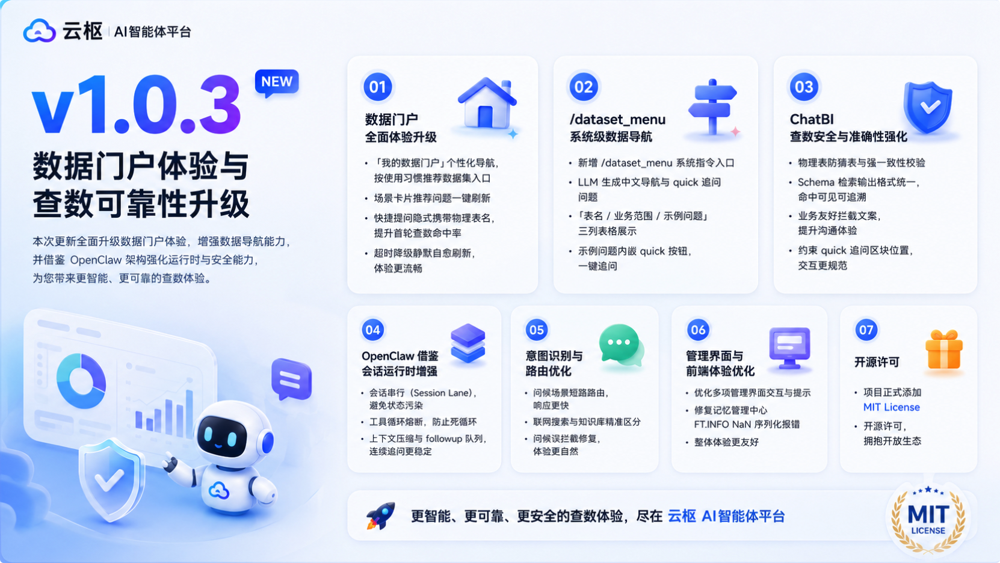

# 🎉 Yunshu AI Agent Platform v1.0.3 Release Notes

**GitHub Repository**: [RandyChen1985/yunshu-ai-agent-platform](https://github.com/RandyChen1985/yunshu-ai-agent-platform)

> **文档同步说明**：v1.0.3 发布时使用门户指令 **`/dataset_menu`**；当前主指令为 **`/dataset_portal`**（旧指令仍兼容）。下文保留当时发布表述。

v1.0.3 版本是一次**数据门户体验与查数可靠性升级**。在本次更新中，平台全新推出「我的数据门户」个性化导航与场景推荐能力，并上线 `/dataset_menu` 系统级数据能力导航；同时借鉴 OpenClaw 架构引入会话串行、工具循环熔断与上下文压缩等运行时增强，大幅强化 ChatBI 物理表防猜表与数据集归属强一致性校验，修复问候误拦截、联网搜索与知识库路由混淆等关键问题。

本次变更合并了自 v1.0.2（从 `2b6be3b` 至今）共 **25 个提交**，涉及 64 个文件、约 9,000 行新增代码。



---

## 🚀 Key Features

### 1. 🏠 数据门户（Data Portal）全面体验升级
* **「我的数据门户」个性化导航**：记录用户点击偏好，按使用习惯排序展示数据集入口；全面美化 UI/UX，解决气泡复制按钮与刷新按钮重合冲突。
* **场景卡片推荐问题换一批**：支持场景卡片推荐问题实时刷新，并优化兜底条数，让快捷提问更贴近当前数据上下文。
* **快捷提问隐式携带物理表名**：数据门户快捷提问自动附带物理表名上下文，优化 AI 提问 Prompt 与类型定义，提升首轮查数命中率。
* **超时降级静默自愈刷新**：数据门户在超时降级后自动静默刷新恢复；调试页 SSE 内容撤回防重复，避免流式输出闪烁。
* **指令交互与刷新体验优化**：优化 `/dataset_menu` 等数据门户指令交互、刷新遮罩逻辑；刷新成功后 Toast 提示，输入框释放时序更自然；支持大模型动态解析生成与放行元数据探索查询。
* **加载态优化**：首次加载提供温馨提示轮播，精简加载动效，减少等待焦虑。

### 2. 🧭 `/dataset_menu` 系统级数据能力导航
* **系统指令入口**：新增 `/dataset_menu` 系统级数据能力导航，基于与 ChatBI 一致的 `dataset_menu` 目录，由 LLM 按数据集生成中文导航与 quick 追问按钮。
* **引用块 + 表格样式**：整体概要与每个数据集介绍改用 Markdown 引用块呈现；表名信息以「表名 / 业务范围 / 示例问题」三列表格展示，示例问题列内嵌可点击 quick 追问按钮。
* **系统身份明确展示**：EmbedChat 与 AgentDebug 支持系统指令，并明确展示「系统 · 数据导航」身份；前端增加加载态防重复点击与思考计时。

### 3. 🛡️ ChatBI 查数安全与准确性强化
* **物理表防猜表与强一致性校验**：新增物理表防猜表机制与数据集表归属强一致性拦截校验，防止模型将业务术语、指标块或中文表名误当作物理表名执行 SQL。
* **精准纠正与 Guardrail 硬规则**：校验失败时精准识别误用术语并给出对应物理表名，统一引导回 `get_dataset_schema`；DataExecutor Guardrail 强制 `FROM/JOIN` 仅可使用 `table_name` 物理表名。
* **Schema 检索输出格式统一**：统一 `get_dataset_schema` 的单表 YAML 字段名与 `--- [Schema:n] ---` 分隔头，对齐向量检索、MySQL 兜底、RAGFlow 与 HTTP API；工具日志在截断前显示命中条数与 token 估算。
* **业务友好拦截文案**：将 final guard 中 SQL/JOIN/诊断等技术术语改为业务友好提示与可操作排查建议。
* **追问复用与 quick 按钮排版**：修复「可视化分析一下」在有数据时仍要求澄清的问题；增加历史数据检测与规则快路径；约束 quick 追问区块必须位于图表之后，通过后处理自动纠正顺序。
* **异步加载修复**：修复异步延迟加载引起的 `MissingGreenlet` 异常。

### 4. ⚙️ OpenClaw 借鉴：会话运行时增强
* **会话串行（Session Lane）**：落地 OpenClaw Phase 1 运行时能力，防止同一会话并发请求互相干扰；修复 `wait_seconds=0` 时会话锁不尝试 acquire 的问题。
* **工具循环熔断（Tool Loop Detector）**：新增 ping-pong / 全局熔断检测并接入 ChatBI，防止 Assistant / Knowledge 工具调用陷入死循环。
* **Prompt 组装与全局增强**：引入 Prompt Assembler 抽取（默认保持 legacy 顺序）；增强平台全局 prompt（执行倾向、工具风格、动态工具清单等），并在有文件工具时注入 Workspace / 路径沙箱说明。
* **上下文压缩与会话 followup 队列**：超长历史注入确定性摘录避免断档；空响应兜底与 followup 有界等待改善连续追问体验。
* **受控重试与内容撤回**：补充 `data_agent_runner` 临时内容撤回与受控重试机制，优化 EmbedChat 思考状态判定。

### 5. 🎯 意图识别与路由优化
* **问候场景短路路由**：纯寒暄直接走通用助手并跳过两次分类 LLM，复合业务句不受影响，显著降低响应延迟。
* **联网搜索与知识库区分**：外部公网 / 实时信息检索改由通用助手处理，在意图 LLM 误判时兜底纠正，防止未绑定知识库时因缺少 dataset 直接失败。
* **问候误拦截修复**：通用助手反幻觉门控改为按意图 / 查数诉求触发，避免「你好」带表格被误杀；前端恢复 Markdown 有序列表序号渲染。
* **Schema 弱命中兜底**：ChatBI 对齐 `ragflow_similarity_threshold` 识别弱命中，放宽强置信阈值，修复受控重试与日志关键词展示，未命中时返回友好终止文案。
* **轮次分类与向量检索优化**：优化轮次分类与本地向量检索及降级机制，提升分类准确率与检索容错。

### 6. 🎨 管理界面与前端体验优化
* **Agent 管理页**：将 Agent 托管说明横幅替换为「?」帮助按钮，点击弹窗展示，节省页面空间。
* **元数据管理页**：重命名「检索测试」为「测试」、「设计规范」为「规范」；本地模式下支持 Top K 和相似度阈值配置，Tooltip 补充后端配置键名；对齐头部按钮高度与字重风格。
* **系统参数配置页**：统一优化常规知识库与经验案例库混合检索使用建议；滑块下侧新增「(无门槛)」「(只看关键词)」等简要标签；修复参数说明 Modal 内容过长导致页面溢出的问题。
* **记忆管理中心**：修复 `FT.INFO` 结果中包含 `NaN` 导致的 JSON 序列化报错。

### 7. 📄 开源许可
* **MIT License**：项目正式添加 MIT 开源许可证。

---

## ⚠️ Breaking Changes & Migration Notes

> 从 v1.0.2 升级至 v1.0.3 时，请特别注意以下变更：

| 项目 | 说明 |
| :--- | :--- |
| **数据库变更** | 升级前须执行 `db-prod/V78-chatbi_quick_suggestions_placement.sql`，同步更新 ChatBI V8 提示词中 quick 追问按钮排版约束。 |
| **元数据重新同步** | `_metrics.txt` 顶部新增注释声明指标块仅为计算口径参考、不含表结构；建议对受影响数据集重新执行元数据同步。 |
| **会话串行行为** | 同一会话的并发请求将按 Session Lane 串行执行，避免状态污染；高频并发场景下响应可能略有排队。 |
| **查数拦截更严格** | 物理表防猜表与强一致性校验上线后，使用业务术语或中文表名直接写 SQL 将被拦截并引导回 Schema 检索，属预期行为。 |

---

## 🗄️ Database Incremental Upgrades (数据库增量升级说明)

从 v1.0.2 升级至 v1.0.3 期间，平台数据库共引入了 **1 个**增量 SQL 升级脚本（存放于 [db-prod/](file:///Users/chenxiaolong/workspace/yovole-yunshu-ai-agent-platform/db-prod/) 目录下）：

| 脚本文件 | 核心变更内容 |
| :--- | :--- |
| **[V78-chatbi_quick_suggestions_placement.sql](file:///Users/chenxiaolong/workspace/yovole-yunshu-ai-agent-platform/db-prod/V78-chatbi_quick_suggestions_placement.sql)** | 更新 ChatBI V8 系统提示词，约束 quick 追问建议区块必须位于全文最末尾（图表与数据来源说明之后），并补充自检清单项。 |

> [!WARNING]
> 请在升级后通过执行 `./db-prod/apply-sql-native.sh` 脚本，将增量 SQL 自动、安全地导入到目标 MySQL 数据库中。

---

## 📦 Upgrade Guide

### 从 v1.0.2 升级

```bash
# 1. 拉取最新代码
git fetch origin && git checkout dev && git pull origin dev

# 2. 更新依赖
source venv/bin/activate
pip install -r requirements.txt

# 3. 执行数据库迁移（V78 ChatBI quick 排版约束）
./db-prod/apply-sql-native.sh

# 4. 重新编译前端并启动
cd frontend && npm install && npm run build && cd ..
./dev.sh
```

> [!TIP]
> 升级后建议对核心数据集重新执行一次元数据同步，以确保 `_metrics.txt` 顶部注释与物理表归属信息生效。

---

## ✅ Test Checklist

升级后建议验证以下核心场景：

- [ ] **数据门户导航**：进入「我的数据门户」，验证点击偏好后排序变化；测试场景卡片「换一批」推荐问题刷新；快捷提问能否正确携带物理表名上下文。
- [ ] **`/dataset_portal` 导航**（v1.0.3 时为 `/dataset_menu`）：在 EmbedChat 输入指令，验证引用块 + 表格样式导航、quick 追问按钮可点击；确认加载态防重复点击。
- [ ] **物理表防猜表**：故意使用中文表名或业务术语写 SQL，确认系统拦截并引导回 `get_dataset_schema`；验证强一致性校验失败时的精准纠正文案。
- [ ] **问候短路路由**：发送纯寒暄（如「你好」），确认快速响应且不触发查数或防幻觉误拦截；发送复合业务句确认正常路由。
- [ ] **联网搜索 vs 知识库**：测试实时信息查询走通用助手；测试知识库问答不走联网搜索路径。
- [ ] **工具循环熔断**：构造易陷入工具 ping-pong 的连续追问，确认熔断机制生效。
- [ ] **quick 按钮排版**：查数返回图表后，确认 quick 追问按钮位于图表之后而非之前。
- [ ] **管理界面**：验证 Agent 帮助弹窗、元数据本地模式 Top K 配置、系统参数 Modal 滚动正常。
- [ ] **回归测试**：运行自动化测试套件 `pytest tests/`，确保整体功能无回归。

完整测试清单见 [tests/CHECKLIST.md](file:///Users/chenxiaolong/workspace/yovole-yunshu-ai-agent-platform/tests/CHECKLIST.md)。

---

## 💾 Downloads / Assets

本项目 v1.0.3 发布版本关联的源码、Docker 镜像资产归档包及配置文件如下：

* 📦 **Source Code (zip)**: `yunshu-ai-agent-platform-1.0.3.zip`
* 📦 **Source Code (tar.gz)**: `yunshu-ai-agent-platform-1.0.3.tar.gz`
* 🐳 **Docker Image for Linux amd64 (x86_64)**: `yunshu-ai-agent_1.0.3_linux-amd64_*.tar`
* 🐳 **Docker Image for Linux arm64 (aarch64)**: `yunshu-ai-agent_1.0.3_linux-arm64_*.tar`
* ⚙️ **Docker Compose YAML file**: `docker-compose.yml`

🔗 **下载地址**: [GitHub Releases v1.0.3](https://github.com/RandyChen1985/yunshu-ai-agent-platform/releases/tag/1.0.3)

---

## 📋 Commit Log

| Hash | 描述 |
| :--- | :--- |
| `b50a56b` | refactor(chatbi): 统一 Schema 检索输出格式并补充工具日志命中摘要 |
| `e93808c` | fix(chatbi): 防止模型把业务术语/指标块当作物理表名 |
| `9cdcc63` | fix(chatbi): 优化查数拦截文案并精简数据门户加载态 |
| `9bc8cbc` | feat(portal): 新增数据门户首次加载 ASCII 动画与温馨提示轮播，优化等待体验 |
| `e897aee` | fix(chatbi): 修复异步延迟加载引起的 MissingGreenlet 异常并优化测试 Mock |
| `eb0ba61` | feat(chatbi): 新增物理表防猜表与数据集表归属强一致性拦截校验 |
| `7784ef6` | feat: 实现数据门户场景卡片推荐问题换一批实时刷新功能并优化兜底条数 |
| `324d09c` | feat(dataset): 数据门户超时降级兜底的静默自愈刷新与调试页SSE内容撤回防重复修复 |
| `45a4abd` | feat(dataset): 数据门户快捷提问隐式携带物理表名，优化AI提问Prompt与类型定义 |
| `9806e27` | feat(dataset-menu): 优化数据门户指令交互、刷新遮罩逻辑，并支持大模型动态解析生成与放行元数据探索查询 |
| `cd42546` | style(frontend): 优化数据门户刷新时的输入框释放时序，并添加刷新成功 Toast 提示 |
| `fc832f5` | feat: 实现「我的数据门户」导航偏好点击记录与 UI/UX 体验全面美化，并解决气泡复制与刷新按钮重合冲突 |
| `e2461f5` | Add MIT License to the project |
| `05bde29` | feat(chatbi): 数据能力导航改为引用块+表格样式 |
| `818ee3e` | feat(chatbi): 新增 /dataset_menu 系统级数据能力导航 |
| `5f13b5c` | fix(chatbi): 优化追问复用、上下文澄清与 quick 按钮排版 |
| `2020cea` | perf: 问候场景短路路由与意图 LLM，并放宽 ChatBI schema 强置信阈值 |
| `1d4c4ef` | feat: 借鉴 OpenClaw 增强工具循环熔断、上下文压缩与会话 followup 队列 |
| `148413b` | fix: 区分联网搜索与内部知识库，避免通用助手误走知识库终止 |
| `bba16a4` | fix: 修复问候误拦截与 ChatBI schema 检索弱命中兜底 |
| `75740c7` | feat: 引入会话串行、工具循环熔断与 Prompt 组装/全局增强 |
| `68f8480` | feat: 补充 data_agent_runner 临时内容撤回与受控重试机制，优化 EmbedChat 思考状态判定及相关单元测试 |
| `4c4da91` | feat: 优化轮次分类与本地向量检索及降级机制，更新相关单测与文档 |
| `3662fca` | fix: 修复记忆管理中心FT.INFO结果中包含NaN导致的JSON序列化报错，并对齐元数据管理页头部按钮的高度与字重风格 |
| `7eef8eb` | style(frontend): 优化Agent、数据集和系统参数配置相关界面的交互与提示信息 |

---

## 🤝 Contributors

感谢所有参与 v1.0.3 版本发布的开发者！
