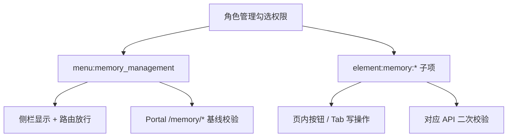

# 跨会话记忆与 memory_search 设计规格

**状态**：已确认（未实现）  
**日期**：2026-05-27  
**关联**：`ChatFlow.md` §4.1、`MemoryService`、`ToolRegistry`、`MemoryManagement.vue`（待建）

---

## 1. 目标

1. 用户在新会话中问「我们最近聊了啥」时，模型通过内置工具 **`memory_search`** 按需检索，**不**自动注入 `system_prompt`。
2. 跨会话索引保存 **`conversation_id`**（与 Redis LIST 明细 key 一致），便于 `scope=history` 拉取原文。
3. 使用现有 **Redis Stack（RediSearch + VECTOR）** 对会话摘要做 **语义检索**。
4. 在 **智能体开发平台** 下新增独立菜单 **「记忆管理中心」**，集中做服务配置、记忆数据管理与检索测试（**不**放在系统设置里）。

---

## 2. 非目标（YAGNI）

- 不把会话消息逐条向量化（一期仅 **会话级 summary** 入索引）。
- 不把摘要同步进 RAGFlow 知识库。
- 不自动把检索结果注入每轮对话。

---

## 3. 数据模型

### 3.1 会话明细（已有）

```text
conversation:{user_id}:{conversation_id}:history   → LIST<JSON message>
conversation:{user_id}:{conversation_id}:last_data_result   → STRING (ChatBI)
```

### 3.2 会话摘要文档（新增）

```text
memory:summary:{user_id}:{conversation_id}   → HASH（或 RedisJSON，与索引字段一致）
```

| 字段 | RediSearch 类型 | 说明 |
|------|-----------------|------|
| `user_id` | TAG | 过滤 `@user_id:{uid}` |
| `conversation_id` | TAG | **外键**，对应 LIST key |
| `title` | TEXT | 短标题 |
| `summary` | TEXT | 摘要正文（嵌入源文本） |
| `last_active` | NUMERIC SORTABLE | Unix 秒或毫秒（统一即可） |
| `turn_count` | NUMERIC | 可选 |
| `embedding` | VECTOR | 对 `summary`（或 `title\nsummary`）的向量 |

### 3.3 RediSearch 索引（全局一次）

```text
索引名：`yunshu:idx:memory:session_summary`（代码写死，不可配置）
PREFIX：memory:summary:
```

- 距离：COSINE  
- 维度：`memory_embedding_dimensions`（与所选 embedding 模型一致）  
- 创建时机：应用启动或迁移脚本；维度变更需 **DROP + CREATE**（运维说明写入配置页帮助文案）

### 3.4 可选：会话 id 有序列表

```text
conversation:{user_id}:summary_ids   → LIST<conversation_id>（最近 N 个）
```

仅用于「无 query 时按时间列出最近会话」的辅助；**语义检索以 FT.SEARCH KNN 为主**。

---

## 4. 写入流程（摘要 + 向量）

**触发**（异步，不阻塞 SSE）：

| 优先级 | 事件 |
|--------|------|
| 主 | `AgentService.chat_completion_stream` 的 `finally`：成功且有 `conversation_id`、assistant 内容 |
| 辅 | `POST /api/v1/conversation/{conversation_id}/finalize`（切换/新建会话前） |
| 可选 | 空闲超时任务 |

**防抖**（读配置）：

- `memory_summarize_debounce_turns`（默认 3）
- `memory_summarize_debounce_seconds`（默认 300）
- 跳过过短 assistant 回复

**步骤**：

1. `memory_service_enabled` / `memory_summary_enabled` 为真  
2. `LRANGE` 当前 `conversation:{uid}:{cid}:history` 最近 M 条  
3. LLM 合并生成 `title`、`summary`（可用便宜模型，配置可二期复用 `llm_*`）  
4. **Embedding**：`EmbeddingClient` 读 **`memory_service_configs` 表**（见 §6.4，经 `MemoryConfigService`）  
5. `HSET memory:summary:{uid}:{cid}` + 索引更新  
6. 超出 `memory_summary_max_sessions` 时删除最旧文档（按 `last_active`）

---

## 5. memory_search 工具

**路径**：`app/services/ai/tools/memory_search_tool.py`  
**注册**：`ToolRegistry.get_system_implicit_tools()`

**安全**：

- `user_id` 仅来自 `get_current_agent_context()`  
- RediSearch 查询 **必须** 带 `@user_id:{uid}`

**参数**：

| 参数 | 说明 |
|------|------|
| `scope` | `summary` \| `history` \| `both` |
| `query` | 可选；有则对 query 做 embedding 后 KNN |
| `conversation_id` | `history` / `both` 时指定；默认可用上下文当前会话 |
| `limit` | 默认读 `memory_search_knn_top_k` |

**行为**：

| scope | 行为 |
|-------|------|
| `summary` | `FT.SEARCH` KNN + TAG 过滤；无 query 则 SORTBY `last_active` DESC |
| `history` | `LRANGE conversation:{uid}:{cid}:history` |
| `both` | 先 summary 取 top1 `conversation_id`，再 history |

**AgentContext 扩展**：增加 `conversation_id: Optional[str]`，在 `setup_context` 时传入。

---

## 6. 记忆管理中心（菜单与页面）

### 6.1 权限模型：按菜单控制（与平台 RBAC 一致）

记忆能力**完全走菜单/元素权限体系**，与「知识库管理」「技能管理」相同；**不**使用 `menu:system:config` / `element:system:config_save`。



#### 6.1.1 菜单权限（入口）

| 项 | 值 |
|----|-----|
| 资源类型 | `menu` |
| 资源 ID | **`menu:memory_management`** |
| 菜单位置 | `Dashboard.vue` → **智能体开发平台**（与智能体管理、技能管理中心同级） |
| 菜单文案 | **记忆管理中心** |
| 路由 | `/dashboard/memory`，`meta.perm = 'menu:memory_management'` |
| 组件 | `MemoryManagement.vue` |

**无此菜单时**：

- 侧栏不展示（`hasMenuPerm` / `permissions.menus`）
- 路由守卫拒绝访问（与 `menu:knowledge_management` 相同）
- 所有 `GET/PUT/POST/DELETE /api/portal/memory/*` 返回 **403**

**管理员**：`role === 'admin'` 时前端 `hasMenuPerm` / `hasPermission` 与后端 `require_permission` **均 bypass**（与现有逻辑一致）。

#### 6.1.2 元素权限（页内细粒度，挂在该菜单下）

在 `frontend/src/constants/permissions.ts` 的 `MENU_TREE` 中注册为**一个菜单节点 + children**（角色管理、用户权限树中可勾选）：

```typescript
{
    id: 'menu:memory_management',
    label: '记忆管理中心',
    children: [
        { id: 'element:memory:config_save', label: '保存服务配置' },
        { id: 'element:memory:config_index', label: '索引检查与重建' },
        { id: 'element:memory:view_data', label: '查看记忆数据' },
        { id: 'element:memory:delete', label: '删除记忆' },
        { id: 'element:memory:view_all_users', label: '按任意用户筛选' },
        { id: 'element:memory:test_search', label: '记忆检索测试' },
    ]
}
```

| 元素权限 | 控制范围 |
|----------|----------|
| `element:memory:config_save` | Tab「服务配置」保存、`PUT /configs`、测试 Embedding |
| `element:memory:config_index` | 索引状态、`POST /index/rebuild` |
| `element:memory:view_data` | Tab「记忆数据」列表与详情（**只读**）；`GET /summaries*` |
| `element:memory:delete` | 删除单会话、批量删、按用户清空 |
| `element:memory:view_all_users` | 筛选/检索他人 `user_id`；无此项时 **强制** `user_id = 当前登录用户` |
| `element:memory:test_search` | Tab「记忆检索测试」；`POST /search-test` |

**默认策略（角色模板建议）**：

| 角色类型 | 建议勾选 |
|----------|----------|
| 平台管理员 | 菜单 + 全部子元素 |
| 智能体开发/运维 | 菜单 + `view_data` + `test_search` + `view_all_users`（按需） |
| 普通业务用户 | 仅 `menu` + `view_data` + `test_search`（仅自己的数据） |

仅勾选 **菜单**、不勾任何子元素：可进入页面，但保存/删除/检索测试等按钮 **隐藏或禁用**（与知识库「有菜单无 element:knowledge:create」行为一致）。

#### 6.1.3 后端 API 与权限依赖

Router：`app/api/portal/endpoints/memory.py`，挂到 `portal_router`，**统一** `Depends(require_api_key)`。

| API | 菜单 | 额外元素 |
|-----|------|----------|
| `GET /configs`、`GET /index/status` | `menu:memory_management` | — |
| `PUT /configs`、`POST /test-embedding` | `menu:memory_management` | `element:memory:config_save` |
| `POST /index/rebuild` | `menu:memory_management` | `element:memory:config_index` |
| `GET /summaries`、`GET .../detail` | `menu:memory_management` | `element:memory:view_data` |
| `DELETE ...` | `menu:memory_management` | `element:memory:delete` |
| `POST /search-test` | `menu:memory_management` | `element:memory:test_search` |

凡请求带 `user_id` 且 `user_id != 当前用户`：须具备 `element:memory:view_all_users`（admin 除外）。

#### 6.1.4 数据库与展示名

| 脚本 | 内容 |
|------|------|
| `V59-memory-management-module.sql` | `memory_service_configs` 表与种子数据 + `menu:memory_management` 及 `element:memory:*` 权限 |

`permission_service.py` 资源展示名增加：`memory_management` →「记忆管理中心」。

#### 6.1.5 明确不做

- **不**在 `SystemConfig.vue` / `menu:system:config` 下配置记忆服务  
- **不**用独立 API Key 或硬编码角色名判断（除 admin bypass 外一律 `check_permission`）

### 6.2 页面入口（摘要）

| 项 | 值 |
|----|-----|
| 路由 | `/dashboard/memory` |
| 组件 | `MemoryManagement.vue` |

### 6.3 页面结构（Tab）

单页三 Tab，参考「知识库管理 + 检索测试」的组合方式：

```text
┌─────────────────────────────────────────────────────────┐
│  记忆管理中心                                              │
├──────────────┬──────────────────┬───────────────────────┤
│ 服务配置      │ 记忆数据          │ 记忆检索测试            │
└──────────────┴──────────────────┴───────────────────────┘
```

#### Tab A — 服务配置

- 仅展示/编辑 **`memory_service_configs` 表**（见 §6.4），**不**出现在系统设置
- 保存：`PUT /api/portal/memory/configs`（`element:memory:config_save`）
- 无 `config_save` 时表单只读
- 操作按钮：
  - **测试 Embedding 连接**（维度、延迟）
  - **检查 RediSearch 索引**（索引是否存在、文档数、维度是否匹配）
  - **重建索引**（高危，二次确认；`element:memory:config_index`）

#### Tab B — 记忆数据

管理员/授权用户运维 Redis 中的会话记忆：

| 功能 | 说明 |
|------|------|
| **筛选** | `user_id`（须 `element:memory:view_all_users` 可选他人，否则锁定当前用户）、`conversation_id`、`keyword` |
| **可见性** | 须 `element:memory:view_data` 才展示本 Tab |
| **列表** | 会话摘要：`conversation_id`、`title`、`summary` 摘要、`last_active`、`turn_count`、是否有 history LIST、是否有向量 |
| **详情抽屉** | 查看完整 summary；查看该会话 `history` 最近 N 条（只读） |
| **删除** | 须 `element:memory:delete`；单条/批量删 summary，可选连删 history LIST |
| **按用户清空** | 删除该用户全部 summary 文档 + 其下所有 `conversation:*:history`（扫描 `PREFIX`，需二次确认） |

列表 API：`GET /api/portal/memory/summaries`（分页，服务端 RediSearch `FT.SEARCH` 或 `SCAN memory:summary:{uid}:*`）。

#### Tab C — 记忆检索测试

对标 `KnowledgeRetrievalTest.vue`，验证与线上一致的检索逻辑：

| 表单项 | 说明 |
|--------|------|
| 目标用户 | `user_id`（管理员可选；普通用户固定自己） |
| 检索问题 `query` | 可选；空则按时间取最近 |
| `scope` | `summary` / `history` / `both` |
| `conversation_id` | `history`/`both` 时必填或从结果点选 |
| `limit` | 默认读配置 `memory_search_knn_top_k` |

- 执行：`POST /api/portal/memory/search-test`（内部复用 `MemoryIndexService` + `MemoryService.get_history`，与 `memory_search` 工具同源）
- 结果：相似度、`conversation_id`、title、summary 片段；`both` 时展示拉取的 history 预览
- 无 `element:memory:test_search` 时不展示本 Tab 或禁用「执行检索」

### 6.4 配置项存储（独立表，非 system_configs）

使用专用表 **`memory_service_configs`**（结构与 `system_configs` 类似，但**无 category 字段、不混入系统配置**）。

- 读写：`app/services/memory_config_service.py` → `MemoryConfigService`
- API：仅 `GET/PUT /api/portal/memory/configs`（记忆管理中心）
- **禁止**写入 `system_configs`；`GET /api/portal/system/configs` **不包含**记忆项

| key | 默认值 | is_secret | 说明 |
|-----|--------|-----------|------|
| `memory_service_enabled` | `true` | 0 | 总开关：摘要写入 + memory_search；关则工具返回「记忆服务未启用」 |
| `memory_summary_enabled` | `true` | 0 | 仅控制摘要/向量写入；关则只读已有索引、不再更新 |
| `memory_embedding_base_url` | `` | 0 | Embedding API Base URL（OpenAI 兼容 `/v1/embeddings`）；空则回退 `llm_base_url` |
| `memory_embedding_api_key` | `` | **1** | Embedding API Key；空则回退 `llm_api_key` |
| `memory_embedding_model` | `text-embedding-3-small` | 0 | 模型名称（请求体 `model` 字段） |
| `memory_embedding_dimensions` | `1536` | 0 | 向量维度；须与模型一致；变更后需重建 RediSearch 索引 |
| `memory_summary_max_sessions` | `50` | 0 | 每用户最多保留会话摘要条数 |
| `memory_summary_ttl_days` | `30` | 0 | 摘要文档 TTL（天） |
| `memory_history_ttl_days` | `7` | 0 | 与 LIST 一致说明（若实现 CONFIG 驱动 MemoryService.ttl） |
| `memory_summarize_debounce_turns` | `3` | 0 | 累计多少轮后触发摘要 |
| `memory_summarize_debounce_seconds` | `300` | 0 | 同会话最短摘要间隔（秒） |
| `memory_search_knn_top_k` | `5` | 0 | memory_search 默认返回条数 |
| `memory_summarize_min_assistant_chars` | `30` | 0 | assistant 低于该长度跳过摘要 |

**说明**：

- Embedding **不强制**走 `AIModel` 注册表一期；与 LLM 相同「URL + Key + model 名」三件套，运维最简单。  
- **二期可选**：`memory_embedding_model_id` 下拉关联 `type=embedding` 的 `AIModel`，保存时解析为 url/key/model/dimensions。

### 6.5 Portal API（`/api/portal/memory`）

见 §6.1.3 API 与权限依赖表；所有接口在 `require_permission("menu", "menu:memory_management")` 基线之上叠加元素校验。

### 6.6 前端实现要点

- 新建 `MemoryManagement.vue` + 子组件（可选 `MemoryConfigPanel.vue`、`MemoryDataTable.vue`、`MemorySearchTest.vue`）
- `Dashboard.vue` 侧栏、`router/index.ts`、`permissions.ts` 注册
- 用户下拉：`GET /api/portal/management/users` 或现有用户列表 API（仅 `view_all_users` 展示）
- UI 风格与 `KnowledgeBaseManagement` / `KnowledgeRetrievalTest` 保持一致（Tailwind、axios、`useToast`、`useUser`）

### 6.7 后端读取（运行时）

- 统一经 `MemoryConfigService.get("memory_*")`  
- `EmbeddingClient`：`memory_embedding_*` 优先，空则 fallback `llm_base_url` / `llm_api_key`  
- 启动时若 `memory_service_enabled` 且索引不存在则尝试 `FT.CREATE`（失败打日志，不阻塞启动）

### 6.8 数据库迁移

| 脚本 | 内容 |
|------|------|
| `V59-memory-management-module.sql` | 见 §6.8 表（配置表 + 权限种子，单文件） |

---

## 7. 架构组件

| 组件 | 职责 |
|------|------|
| `MemoryService` | LIST 读写（已有）；扩展 summary 文档 CRUD |
| `MemoryIndexService` | FT.CREATE / upsert / KNN search / delete / list |
| `EmbeddingClient` | 调用配置的 embedding API |
| `ConversationSummarizer` | LLM 生成 title/summary |
| `memory_search` tool | 对话内工具入口（与 search-test 同源） |
| `app/api/portal/endpoints/memory.py` | 记忆管理中心 API |
| `MemoryManagement.vue` | 配置 + 数据 + 检索测试 UI |
| `ConfigService` | 配置读写（存储层，无独立 UI） |

---

## 8. 错误处理

| 场景 | 行为 |
|------|------|
| 记忆服务关闭 | 工具明确提示；不写摘要 |
| Redis/索引不可用 | 工具失败信息；摘要任务记日志 |
| Embedding 失败 | 摘要仍可写 TEXT 字段但无 VECTOR；语义搜索降级为 TEXT 包含或按时间排序 |
| LIST 过期、摘要仍在 | `history` 返回「明细已过期」+ summary |
| 跨用户 | 禁止（TAG 强制过滤） |

---

## 9. 测试建议

- 单元：`MemoryIndexService` mock Redis；`memory_search` 过滤 user_id  
- 集成：写入 2 个 `conversation_id` 摘要 → KNN 查询 → `history` 拉 LIST  
- 配置：修改 `memory_embedding_dimensions` 文档化需重建索引  

---

## 10. 实现顺序（供 writing-plans）

1. `V59-memory-management-module.sql` 迁移（配置表 + 菜单权限）  
2. `EmbeddingClient` + `MemoryIndexService` + `memory.py` Portal API  
3. `MemoryManagement.vue`（三 Tab：配置 / 数据 / 检索测试）+ 路由与侧栏  
4. `MemoryService` 摘要写入 + `AgentService` 触发  
5. `memory_search` + `AgentContext.conversation_id`  
6. **二期**：`finalize` API + Embed 切换会话调用  

---

## 11. 已确认决策（2026-05-27）

产品确认：**按现规格默认**，无额外变更。

| # | 议题 | 结论 |
|---|------|------|
| 1 | 权限粒度 | **菜单 + 子元素**（`menu:memory_management` + `element:memory:*`） |
| 2 | 非管理员数据范围 | 无 `element:memory:view_all_users` 时 **仅本人** `user_id`（后端强制） |
| 3 | 列表展示 | 一期以 **`user_id` + `conversation_id`** 为主；用户名展示为增强项（API 可 JOIN 用户表，非阻塞） |
| 4 | 摘要 LLM | **复用**系统 `llm_base_url` / `llm_model_name`（不单独配 `memory_summarize_*`） |
| 5 | finalize | **二期**；一期仅 assistant 结束 + 防抖写摘要 |
| 6 | 对话内 `memory_search` | **不校验**记忆菜单权限；登录用户 + 上下文 `user_id` 隔离即可 |

---

## 12. 评审检查

- [x] `conversation_id` 与 LIST key 一致  
- [x] 不自动注入；仅工具读取  
- [x] Redis Stack 向量索引  
- [x] 配置存 **`memory_service_configs` 专用表**，UI 仅在 **记忆管理中心**  
- [x] **按菜单控制**：`menu:memory_management` 控制入口；子元素 `element:memory:*` 控制页内能力与 API  
- [x] 与 `menu:system:config` **解耦**  
- [x] 角色管理 `MENU_TREE` 可勾选；支持检索测试、按用户过滤、记忆删除  
- [x] 与 `agent_max_context_messages` 职责分离（agent 类保留原 key）

---

*实现计划：[`docs/superpowers/plans/2026-05-27-memory-search-redis-stack.md`](../plans/2026-05-27-memory-search-redis-stack.md)*
