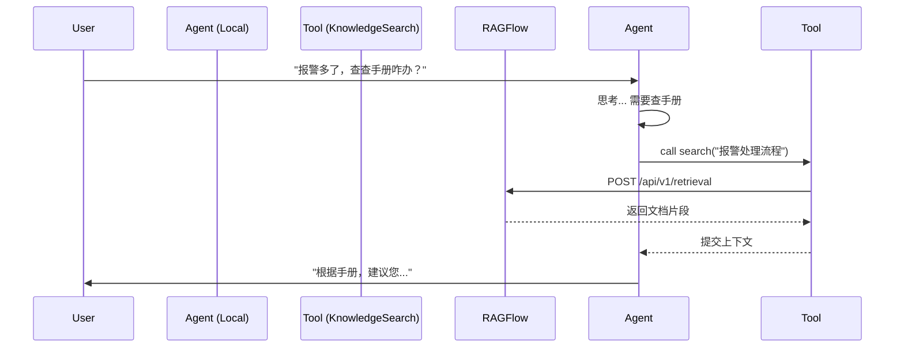
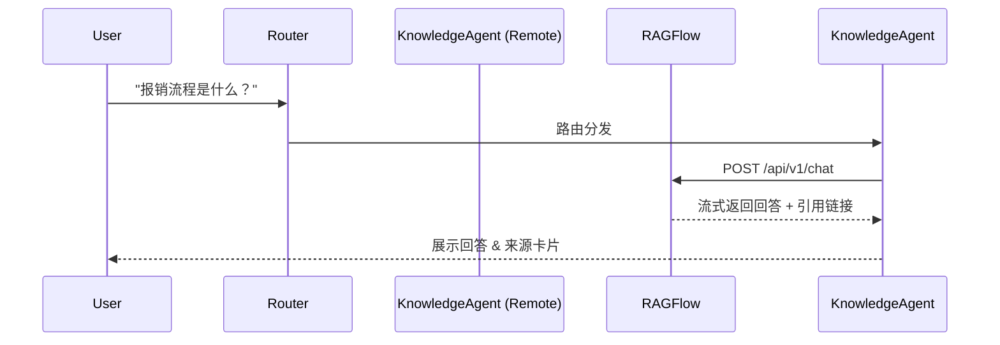

# 提案：集成 RAGFlow 双模支持 (Integrate RAGFlow Dual-Mode Support)

## 1. 背景与目标 (Context & Goals)
**现状**：目前云枢智能体平台主要侧重于基于 SQL 的结构化数据查询与分析。对于非结构化数据（如文档、手册、制度），缺乏原生的支持能力。
**目标**：通过集成 RAGFlow（外部知识库引擎），赋予平台处理非结构化数据的能力。
**核心要求**：
1.  **双模支持**：同时支持 **Tool 模式**（作为现有 Agent 的工具）和 **Agent 模式**（作为独立的知识库智能体）。
2.  **非侵入性**：严格遵守开闭原则（Open-Closed Principle），扩展新能力但不修改现有核心流程，确保现有业务逻辑的稳定性。

## 2. 架构设计 (Architecture)

### 2.1 核心层 (Core Layer)
新增 `RagFlowClient` 适配器，统一管理与 RAGFlow OpenAPI 的通信。

*   **位置**: `app/services/data_adapter/ragflow_client.py`
*   **职责**:
    *   鉴权管理 (API Key)。
    *   会话管理 (Conversation ID)。
    *   API 封装: `retrieve` (检索片段) 和 `chat` (完整对话)。

### 2.2 模式一：Tool 模式 (The "Plugin" Way)
将 RAGFlow 封装为一个标准工具，供现有的通用智能体（如“数据分析师”）按需调用。

*   **场景**: "查询 A 机房的报警，并参考《故障手册》给出建议。"
*   **实现**:
    *   新增工具: `app/services/ai/tools/knowledge_search_tool.py`。
    *   **输入**: `query` (搜索关键词), `top_k` (返回数量)。
    *   **输出**: 包含来源引用的纯文本片段 (Snippets)。
    *   **配置**: 在现有 Tool 管理界面中注册该工具，配置默认的 Dataset IDs。

### 2.3 模式二：Agent 模式 (The "Proxy" Way)
引入一种新的 Agent 执行策略，使其直接代理 RAGFlow 的对话能力。

*   **场景**: "公司差旅报销标准是什么？"
*   **实现**:
    *   **数据模型变更**: `Agent` 表新增 `engine_type` 字段 (Enum: `LOCAL`, `RAGFLOW`)。
    *   **执行策略**: 在 `AgentExecutor` 中新增分支。如果 `engine_type == RAGFLOW`，则跳过本地 Prompt 组装，直接调用 `RagFlowClient.chat`。
    *   **前端适配**: 接收 RAGFlow 返回的 `citation` 字段，在聊天气泡下展示可点击的“📚 参考来源”。

## 3. 详细设计 (Detailed Design)

### 3.1 数据库变更 (Database Changes)
无需破坏现有表结构，仅做增量扩展。

```sql
-- 1. 扩展 agent 表，增加引擎配置
ALTER TABLE agents 
ADD COLUMN engine_type VARCHAR(20) DEFAULT 'LOCAL' COMMENT '执行引擎类型: LOCAL, RAGFLOW',
ADD COLUMN extra_config JSON NULL COMMENT '引擎专用配置(如 ragflow_conversation_id, dataset_ids)';

-- 2. 确保系统配置表中有 RAGFlow 的全局连接信息 (已在 V6 迁移中完成)
-- key: ragflow_api_url, ragflow_api_key
```

### 3.2 接口变更 (API Changes)
*   **Tool 模式**: 无需 API 变更，复用现有的 `/api/v1/chat/completions`，Router 自动决策调用 Tool。
*   **Agent 模式**: 复用现有的 `/api/v1/chat/completions`。后端根据 `agent_id` 查到的 `engine_type` 自动切换处理逻辑。

### 3.3 交互流程 (Sequence Diagram)

#### 流程 A: Tool 模式 (混合任务)


#### 流程 B: Agent 模式 (纯知识问答)


## 4. 实施计划 (Implementation Plan)

### Phase 1: 基础建设
1.  实现 `RagFlowClient` (Python)。
2.  实现 `KnowledgeSearchTool` 并注册到系统工具库。
3.  更新 `Agent` 数据模型 (SQL Migration)。

### Phase 2: 核心逻辑
1.  改造 `AgentExecutor`，支持 `RAGFLOW` 引擎类型的分支处理。
2.  更新 `Router` 的 Prompt，支持识别知识库意图。

### Phase 3: 前端展示
1.  `AgentDebug.vue` 和 `ChatWindow` 支持渲染 `citations` (引用来源)。
2.  后台管理界面支持选择 "Agent 引擎类型" 并填写 RAGFlow 相关 ID。

## 5. 风险控制 (Risk Management)
*   **回退机制**: 新增的 `engine_type` 默认为 `LOCAL`，确保旧数据完全不受影响。
*   **异常处理**: 如果 RAGFlow 服务不可用，Tool 模式下应返回“知识库暂时无法访问”，而不应导致整个对话崩溃。