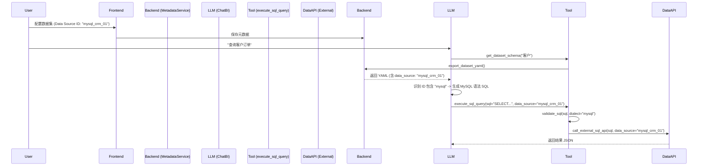

# 设计文档：动态数据源路由 (Dynamic Data Source Routing)

## 1. 架构流程 (Architecture Flow)



## 2. 关键技术决策 (Key Technical Decisions)

### 2.1 数据源 ID 命名约定 (Naming Convention)
为了简化系统复杂性，不引入额外的 `db_type` 字段，而是利用 **Convention over Configuration**（约定优于配置）原则：
*   **MySQL 数据源**：ID 必须包含字符串 `"mysql"` (不区分大小写)，例如 `mysql_oa`, `prod_mysql_db`。
*   **ClickHouse 数据源**：ID 包含 `"ck"` 或 `"clickhouse"`，或作为默认值。
*   **逻辑兜底**：如果无法识别或字段为空，默认回退到 ClickHouse 处理逻辑。

### 2.2 工具参数透传 (Tool Argument Passthrough)
*   `execute_sql_query` 工具签名将显式增加 `data_source` 参数。
*   虽然底层 API 已经支持该参数，但中间层（Tool）目前是阻断的，需要打通。

### 2.3 SQL 语法校验 (Dialect Validation)
使用 `sqlglot` 库进行校验时，动态指定 `read` 参数：
```python
dialect = "mysql" if "mysql" in data_source.lower() else "clickhouse"
sqlglot.parse(sql, read=dialect)
```
这解决了 MySQL 语法（如反引号、特定函数）在 ClickHouse 校验器中报错的问题。

## 3. 兜底策略 (Fallback Strategy)
为了兼容旧数据和简化配置：
1.  **YAML 导出时**：如果数据集未配置 `data_source`，代码中自动读取系统配置 `external_sql_data_source` 的值填入 YAML。这样 LLM 总是能看到一个有效的 ID。
2.  **工具执行时**：如果 LLM 幻觉未传 `data_source`，工具层再次读取系统默认配置进行兜底。
