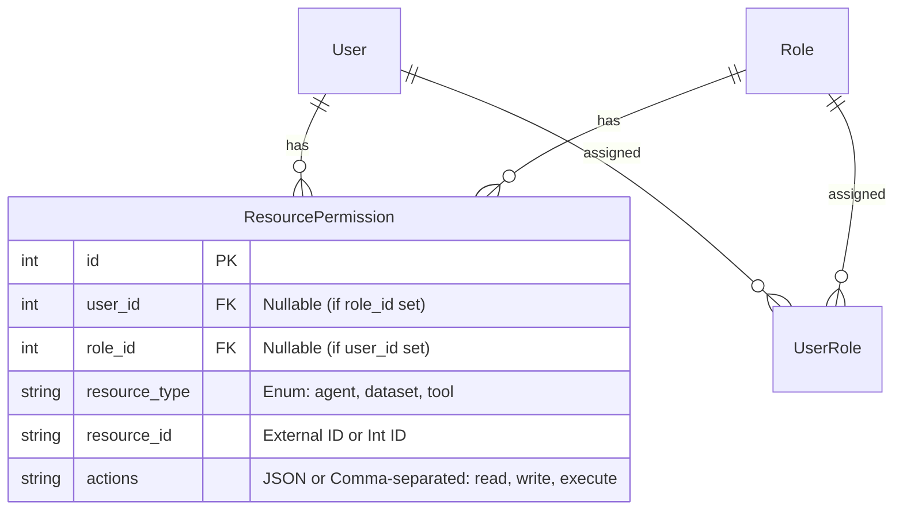

# 设计文档：用户权限管理

## 1. 数据库设计

### 1.1 实体关系图 (ERD 概念)



### 1.2 具体的表结构 (Schema)
**脚本位置**: `db-prod/V26-create_user_permission_tables.sql`

**1. `ai_agent_roles` (角色表 - 预留)**
- `id`: INT, PK
- `code`: VARCHAR(50), UNIQUE (e.g., 'admin', 'editor')
- `name`: VARCHAR(50)
- `description`: VARCHAR(255)

**2. `ai_agent_resource_permissions` (统一权限表)**
- `id`: INT, PK
- `user_id`: INT, NULLABLE (关联用户)
- `role_id`: INT, NULLABLE (关联角色 - 预留)
- `resource_type`: VARCHAR(20) (Enum: 'agent', 'dataset', 'api')
- `resource_id`: VARCHAR(100) (关联 `ai_agent_metadata.id` 或 API Route Key 如 'v1.chat')
- `enabled`: BOOLEAN, Default 1

## 2. 接口设计 (Internal API)
**Base Path**: `/api/portal/management` (扩充现有的 user management)

### 2.1 获取用户权限
- `GET /api/portal/management/users/{user_id}/permissions`
- **Response**:
  ```json
  {
    "roles": [],
    "permissions": {
      "agents": ["agent_id_1"],
      "datasets": ["dataset_id_1"],
      "apis": ["v1.chat", "v1.dataset.list"]
    }
  }
  ```

### 2.2 更新用户权限
- `PUT /api/portal/management/users/{user_id}/permissions`
- **Request**:
  ```json
  {
    "agents": ["agent_id_1"],
    "datasets": ["dataset_id_1"],
    "apis": ["v1.chat"]
  }
  ```

## 3. 业务逻辑与鉴权 (Enforcement)

### 3.1 核心服务 `PermissionService`
- `get_user_permissions(user_id)`: 返回 cached 权限列表。
- `check_permission(user_id, resource_type, resource_id)`: 
  - Admin (role='admin') -> True
  - 否则检查 Cache 中的 Allow List。

### 3.2 场景 A: 数据集获取 (Filter)
- **位置**: `app/services/ai/ragflow_service.py` (或 Dataset 相关 Service)
- **逻辑**: 
  - 获取全量/分页数据集时，调用 `PermissionService`。
  - 如果不是 Admin，过滤列表，仅返回 `id` 在 `permissions.datasets` 中的条目。

### 3.3 场景 B: 智能体回答 (Guard)
- **位置**: `app/api/v1/endpoints/chat.py` 或 `app/services/ai/agent_service.py`
- **逻辑**:
  - 用户发起对话 (Chat) 时。
  - 解析目标 `agent_id`。
  - 调用 `PermissionService.check_permission(user.id, 'agent', agent_id)`。

### 3.4 场景 C: 对外接口鉴权 (API Gatekeeper)
- **位置**: `app/api/v1` 的依赖项或 Middleware。
- **范围**: 仅针对 `/api/v1/**` 路径。
- **逻辑**:
  - 识别当前 Route (e.g., `POST /api/v1/chat/completions` -> `v1.chat`).
  - 调用 `PermissionService.check_permission(user.id, 'api', 'v1.chat')`.
  - 若无权限，返回 `403 Forbidden`.
  - 内部 `portal` 接口不走此校验。

## 4. 缓存策略 (Caching)

- **Key**: `sys:auth:permissions:user:{user_id}`
- **Value**: JSON `{ "agents": [...], "datasets": [...], "apis": [...] }`
- **Update**: `PUT` 接口调用成功后 `DEL` Key。
