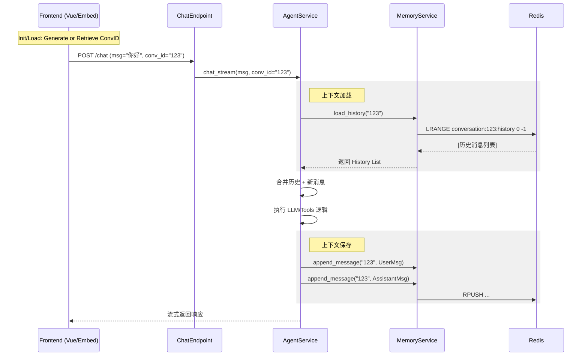

# 架构设计：服务端记忆 (Server-Side Memory)

## 1. 数据模型 (Redis)

使用 Redis 的 `LIST` 数据结构存储对话历史。

-   **Key 模式**: `conversation:{conversation_id}:history`
-   **Value**: 消息对象的 JSON 序列化字符串。
-   **TTL**: 7 天。

## 2. 组件交互图

## 3. 前端交互设计

### Dashboard / AgentDebug
-   **状态**: 在 Pinia 或组件 State 中维护 `currentConversationId`。
-   **初始化**: 页面加载时，检查 URL 参数或 LocalStorage，若无则生成新的 UUID。
-   **重置**: 提供“新会话 (New Chat)”按钮，点击后生成新 UUID 并清空当前界面显示的消息列表。
-   **发送**: 调用 `chatApi.completions` 时传入 `conversationId`。

### EmbedChat
-   **存储**: 使用 `localStorage.getItem('yovole_embed_chat_id')`。
-   **逻辑**: 如果本地有 ID，则复用；否则生成新 ID 并存入本地。

## 4. 滑动窗口策略 (Sliding Window)

-   **配置**: `MAX_HISTORY_TURNS` (默认 20 轮)。
-   **动作**: 加载上下文时，如果列表长度超限，则切片保留最近 N 条。
