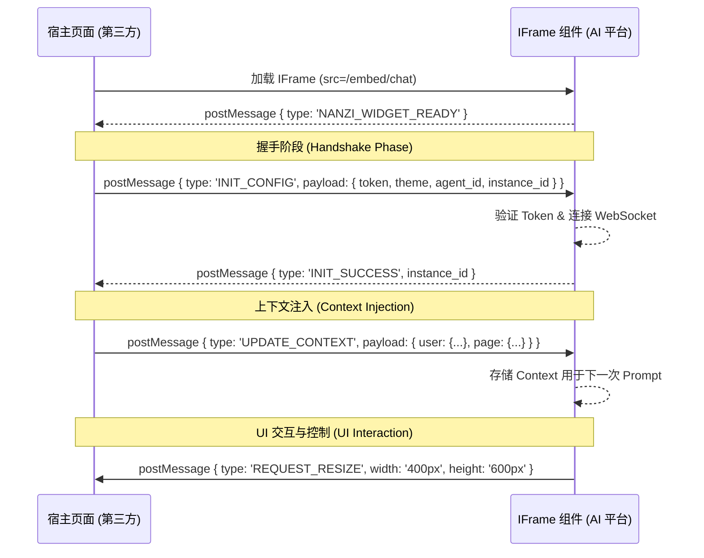

# 设计：嵌入式聊天组件协议 (Design: Embedded Chat Widget Protocol)

## 1. 架构概览 (Architecture Overview)

## 2. 通信协议 (Communication Protocol)

所有消息必须包含 `type` 字段，且建议包含 `source: 'nanzi-agent-embed'` 以便区分。
**重要**：所有消息推荐携带 `instance_id`（如果在 URL 或 初始化时提供了），以支持多实例场景。

### 2.1 宿主发送给组件 (Host to Widget - Downstream)

| 类型 (Type) | 载荷 (Payload) | 说明 (Description) |
|---|---|---|
| `INIT_CONFIG` | `{ token, agent_id, theme: 'light'\|'dark'\|'custom', styleVars: { '--primary-color': '#ff0000' } }` | 初始化配置。`styleVars` 可覆盖 CSS 变量以实现自定义主题。 |
| `UPDATE_CONTEXT` | `{ [key: string]: any }` | 注入业务上下文数据。这些数据将作为 `injected_context` 发送给后端。 |
| `SET_THEME` | `{ theme: 'light'\|'dark', styleVars: {} }` | 动态切换主题或更新样式变量。 |
| `SEND_COMMAND` | `{ command: string }` | 宿主直接触发快捷指令（如 `/clear`）。 |
| `RESET_SESSION` | `{ new_token?: string }` | 强制清空会话历史与上下文。可选传递新 Token 进行无缝切换。 |

### 2.2 组件发送给宿主 (Widget to Host - Upstream)

| 类型 (Type) | 载荷 (Payload) | 说明 (Description) |
|---|---|---|
| `NANZI_WIDGET_READY` | - | IFrame JS 加载完毕，等待初始化。 |
| `INIT_SUCCESS` | - | 鉴权成功，连接建立。 |
| `INIT_FAILED` | `{ error: string }` | 鉴权失败。 |
| `REQUEST_RESIZE` | `{ width: string, height: string, expanded: boolean }` | 请求宿主调整 IFrame 容器大小。 |
| `TOKEN_EXPIRED` | - | Token 过期，宿主应刷新 Token 并重新 INIT。 |
| `CONNECTION_STATUS` | `{ status: 'connected'\|'disconnected'\|'reconnecting' }` | 网络连接状态变更通知。 |

### 2.3 主题策略 (Theming Strategy)

前端将支持两层主题配置：
1.  **预置主题 (Preset Themes)**: `light` (明亮), `dark` (暗黑), 及其他预置主题（如 `ocean`, `forest`）。
2.  **自定义变量 (Custom Variables)**: 宿主可传递 `styleVars` 对象，直接覆盖 CSS 变量。
    - `--primary-color`: 主色调
    - `--bg-color`: 背景色
    - `--text-color`: 文字颜色
    - `--border-radius`: 圆角大小

### 2.4 快捷指令支持 (Slash Commands)

嵌入式组件将复用 `SlashCommand` 逻辑。
- 快捷指令菜单（输入 `/` 时弹出）需适配小屏幕，避免被键盘遮挡。
- 支持宿主通过 `SEND_COMMAND` 消息直接触发指令。

### 2.5 健壮性与状态管理 (Resiliency & State Management)

- **断线重连 (Heartbeat/Reconnect)**: Widget 内部负责 WebSocket/SSE 断线重连。若 Token 过期，向上层发送 `TOKEN_EXPIRED`。连接状态变化时发送 `CONNECTION_STATUS`。
- **隔离 (Isolation)**: 所有 `postMessage` 通信应包含 `instance_id` (如果 URL 参数中提供了)，并在回包时带回，以支持多实例场景。

## 3. 上下文注入机制 (Context Injection Mechanism)

前端 `EmbedChat.vue` 将维护一个 `context` 响应式对象。
当收到 `UPDATE_CONTEXT` 消息时，合并数据。
在发送 `api/chat` 请求时，将此对象放入 `injected_context` 字段传递给后端。
后端 `AgentService` 或 `PromptManager` 需支持将此 Context 渲染进 System Prompt。

- **推荐的标准上下文键 (Standard Context Keys)**:
  - `user_name`: 当前用户显示名
  - `user_dept`: 部门
  - `current_url`: 来源页面 URL
  - `business_id`: 关联的业务 ID

## 4. 移动端适配 (Mobile Adaptation)

对于 `/embed/chat` 页面：
- **输入区域 (Input Area)**: 在移动端应固定在底部，避免键盘弹起遮挡。
- **布局 (Layout)**: 移除所有 margin/padding，铺满视口。
- **字体 (Font Size)**: 适当增大点击区域。

当宿主检测到移动端环境（屏幕宽度 < 768px）时，建议将 IFrame设置为 `position: fixed; top: 0; left: 0; width: 100%; height: 100%` 以获得最佳体验。Widget 自身不控制宿主的 CSS，只负责内容的响应式。
